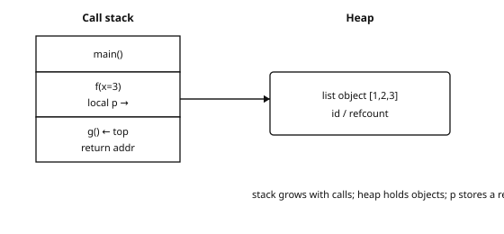
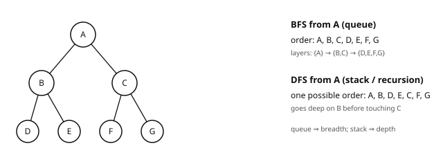
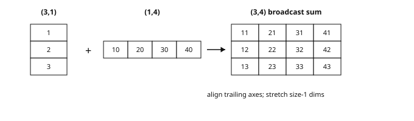

## Contents

-   [Introduction and overview](#intro)
-   [1. Python for data science](#ch1)
-   [2. Complexity analysis](#ch2)
-   [3. Fundamental data structures](#ch3)
-   [4. Sorting, search, recursion](#ch4)
-   [5. Graph algorithms](#ch5)
-   [6. NumPy: numerical linear algebra](#ch6)
-   [7. Minimal software engineering (OOP, tests, git)](#ch7)
-   [8. Geometric algorithms and the instructor's research](#ch8)
-   [Exercises](#ex)
-   [References](#refs)

## Introduction and overview {#intro}

  ----------------------- ----------------------------------------------------------------------------------------------------------------------------------------------------------------------------------------------------------------------------------------------------------------------------------------------------------------------------------------------------------------------------------------------------------------------------
  Module                  Refresher in Computer Science (SynapseS 2026-2027 sheet: "Scientific courses — Refresher in computer science")
  Code                    CSC_51440_EP
  Team and workload       Course coordinator: Amal Dev Parakkat (Télécom Paris) · workload displayed in the catalog: 12 h of lectures-tutorials (CTD), total volume and ECTS not displayed on the sheet — reference supervision of the track: 36 h · 4.5 ECTS · language of instruction: English · advanced Python, data structures, complexity, graph algorithms and software tooling — the computing foundation of all the modules of the program.
  Status in the program   [L3 refresher]{.badge .refresher}[Master prerequisite]{.badge .mandatory} M1 · S1 / period 1 (fall semester, from 17/09/26 to 18/12/26)
  ----------------------- ----------------------------------------------------------------------------------------------------------------------------------------------------------------------------------------------------------------------------------------------------------------------------------------------------------------------------------------------------------------------------------------------------------------------------

**Audience**: engineer who already writes production or scripting Python, and wants data/ML fluency (vectorized NumPy, mental complexity, graphs) without restarting from a first-year course. **Empirical first**: time a loop vs a `@`, blow up a poorly hashed `dict`, trace BFS on a toy graph — then formalize.

Computing foundation of the program: data Python, structures, complexity, graphs, tooling (tests, git). Catalog: 12 h CTD; here \~36 h independent work. A Deep Learning lab spent fighting NumPy is not a learning lab. Graph algorithms open the Graph ML / GNN track of LLGA.

### What you will be able to do

-   Write idiomatic Python for data (numpy, native structures, functions, exceptions) rather than "first-year Python".
-   Predict the time and memory cost of an algorithm (big O notation) and choose accordingly.
-   Select the right data structure — arrays, linked lists, stacks, queues, hash tables, trees — according to the dominant operations of the problem.
-   Implement sorting, search and recursion, and reason about their correctness by induction.
-   Program the fundamental graph algorithms: BFS/DFS traversals, shortest paths, connected components, spanning trees.
-   Vectorize numerical computation with NumPy (linear algebra, broadcasting) instead of costly loops.
-   Structure a small project: classes, tests, git — the reflexes expected in all the projects and internships of the program.

### Official objectives and syllabus (2026-2027 catalog)

The official sheet of the course unit (`CSC_51440_EP`) on SynapseS publishes **neither objectives, nor a description, nor a detailed syllabus** for the 2026-2027 academic year: these fields are "not disclosed". The officially published information is the following.

  Official field      Published value (SynapseS 2026-2027)                                                                                                          In our materials
  ------------------- --------------------------------------------------------------------------------------------------------------------------------------------- -----------------------------------------------------------------------------------------------
  Official title      Refresher in computer science (scientific course, field "Computer Science")                                                                   Used as the module title
  Coordinator         Amal Dev Parakkat                                                                                                                             Instructor of the module, author of ch. 8 (geometric algorithms)
  Workload            12 h of lectures-tutorials (CTD); total volume not displayed                                                                                  Complete 36 h path including guided coding work
  Period / language   Fall semester, period 1 (17/09/26 – 18/12/26); teaching in English                                                                            Materials in English; code and terminology in English
  Objectives          Not disclosed                                                                                                                                 Target skills listed in "What you will be able to do" above
  Detailed syllabus   Not disclosed                                                                                                                                 8-chapter outline covering the standard core of a computer-science refresher for data science
  Prerequisites       Not disclosed                                                                                                                                 No prerequisites in computer science
  Assessment          Numerical grade out of 20; resit allowed (max of the two grades); course unit acquired if final grade ≥ 10; the grade counts toward the GPA   Exercises and labs with solutions for self-assessment

The "official theme ↔ chapter" mapping table cannot be filled honestly as long as the official syllabus is not published: no official theme is therefore flagged as missing. One contribution of our materials nevertheless goes beyond the usual core of a refresher and belongs to our pedagogical choices: ch. 8, which connects geometric algorithms to the research work of the instructor.

### Where this course fits in the program

Refresher module of the core curriculum, in Year 1 · Period 1, with **no prerequisites** — the official 2026-2027 sheet lists no prerequisites anyway (field "not disclosed"). The course unit is shared with the MScT tracks Visual Computing and Creative AI and Trust and Responsible AI. Note: semester 1 includes a third refresher course, `CSC_51438_EP` "Refresher in Computer Graphics" (coordinators Marie-Paule Cani and Pascal Guehl), dedicated to computer graphics; distinct from this course unit, it is not covered by these materials. This module is taken in parallel with the [Refresher in Statistics](../m1p1-refresher-statistics/index.html) module: one provides the mathematical language of the program, the other its computing language. Together, they gate entry into the [Machine Learning](../m1p1-machine-learning/index.html) module.

The graph algorithms of chapter 5 are the anchor of the [Graph Machine and Deep Learning for Generative AI](../m1p2-graph-ml/index.html) module (Period 2): the vocabulary of traversals, shortest paths and connectivity is assumed acquired from the graph theory review onward. Mastery of NumPy and of software tooling immediately serves [Machine Learning](../m1p1-machine-learning/index.html) and [Deep Learning](../m1p1-deep-learning/index.html), whose labs are code-intensive.

Finally, the complexity analysis and data structures chapter is the declared prerequisite of the [DataBase Management System](../m1p1-dbms/index.html) module, where indexes, external sorting and query optimization are reasoned about in algorithmic cost.

### Course outline

-   **Python for data science**: the language, its idioms and its ecosystem, brought up to standard from the start.
-   **Complexity analysis**: counting operations, comparing algorithms, reasoning in big O.
-   **Fundamental data structures**: which structure for which operations — the most frequent architecture decision.
-   **Sorting, search, recursion**: the classics, with proofs and complexities.
-   **Graph algorithms**: traversals, shortest paths, connectivity — the foundation of the future Graph ML module.
-   **NumPy: numerical linear algebra**: vectorization, broadcasting, stability — the daily tool of every lab.
-   **Minimal software engineering (OOP, tests, git)**: writing code a colleague can rerun a year from now.
-   **Geometric algorithms and the instructor's research**: a bridge toward computational geometry and the research of Amal Dev Parakkat.

### How to study this module

-   Type all the code yourself: Python fluency is acquired at the keyboard, not by reading — it is the implicit grading criterion of all subsequent labs.
-   Follow the chapter order: complexity and structures gate the graph algorithms, which in turn gate part of Period 2.
-   For each algorithm, know its complexity by heart: "which structure? what cost?" is the question you will ask a hundred times in the program.
-   Push your labs to git with passing tests: chapter 7 is learned by practicing it on the previous chapters.
-   Redo the graph exercises until you can rewrite a BFS from memory: the [Graph ML](../m1p2-graph-ml/index.html) module starts from there.
-   If in doubt about the mathematical foundations, the [Refresher in Statistics](../m1p1-refresher-statistics/index.html) module is the complementary companion — the two are taken in parallel.

::: note
[Extrapolons note]{.tag} LLGA crosses LLMs and graphs: one needs reliable fast code, the other solid graph traversals. This module prepares both — well before your first transformer or GNN.
:::

## 1. Python for data science {#ch1}

Opening number: on a matrix $(n,d)=(10^5,512)$, a pure-Python loop for $Xw$ can take seconds; the same NumPy product drops under \~100 ms. That is not style snobbery — it is the difference between a lab that iterates and a lab that learns. Python is the lab language (PyTorch, PyG, HuggingFace, POT, networkx, sklearn). Basics assumed; we consolidate the idioms you will use everywhere.

::: note
[What breaks if you skip this chapter]{.tag} Loops instead of broadcasting (OOM / timeouts); a generator already consumed ("empty iterator"); hidden $O(n^2)$ in a nested `for` on a dense graph; no tests → silent regression on MNIST-like preprocessing.
:::

### 1.1. Essential idioms

```python
# List / dict / set comprehensions
squares  = [x**2 for x in range(10) if x % 2 == 0]
index    = {token: i for i, token in enumerate(vocab)}   # NLP vocabulary
uniques  = {w.lower() for w in tokens}

# Higher-order functions, unpacking, lambda
def softmax(logits):
    m = max(logits)
    exps = [math.exp(z - m) for z in logits]     # numerical stability
    Z = sum(exps)
    return [e / Z for e in exps]

first, *rest = [1, 2, 3, 4]                      # extended unpacking
key_fn = lambda kv: kv[1]                        # sort by value

# dataclasses: clean data objects (used everywhere in ML engineering)
from dataclasses import dataclass
@dataclass
class Config:
    lr: float = 1e-3
    batch_size: int = 32
```

### 1.2. Decorators

A decorator is a function that takes a function and returns a function — syntactic sugar for "wrapping" a behavior. They are everywhere in the ecosystem (PyTorch `torch.no_grad`, pytest `@pytest.fixture`, Flask routes, `@functools.lru_cache`). Understanding their mechanics is not optional.

```python
import functools, time

def timing(fn):
    """Measures and prints execution time — an essential lab tool."""
    @functools.wraps(fn)                     # preserves fn's name/docstring
    def wrapper(*args, **kwargs):
        t0 = time.perf_counter()
        out = fn(*args, **kwargs)
        dt = (time.perf_counter() - t0) * 1e3
        print(f"[{fn.__name__}] {dt:.2f} ms")
        return out
    return wrapper

@timing                                     # equivalent to train = timing(train)
def train_one_epoch(model, loader):
    ...

# @property: accessor computed on the fly, access without parentheses
class Dataset:
    def __init__(self, x, y):
        self.x, self.y = x, y
    @property
    def n(self):                            # ds.n (not ds.n())
        return len(self.x)

# Parameterized decorator (decorator factory): LRU memoization
@functools.lru_cache(maxsize=None)          # keys = hashable arguments
def fib(n):
    return n if n < 2 else fib(n-1) + fib(n-2)
# exponential -> linear fibonacci: memoization turns the recurrence
# into dynamic programming (cf. chapter 4)
```

### 1.3. Generators: the protocol and pipelines

{fig-alt="Generator pipeline" width="100%"}

A generator produces its values *lazily*: nothing is computed before iteration, and memory stays $\mathcal{O}(1)$ per element processed. This is the only way to traverse corpora that do not fit in RAM (Wikipedia, Common Crawl, large logs).

```python
def stream_tokens(path):
    """Generator: yield suspends the function and preserves its state."""
    with open(path, encoding="utf-8") as f:
        for line in f:
            yield from line.lower().split()   # yield from: sub-generator

def up_to(it, n):
    for i, x in enumerate(it):
        if i >= n: return
        yield x

# Pipeline: each step is a generator, data flows element by element
tokens = up_to(stream_tokens("corpus.txt"), 1_000_000)
long_words = (t for t in tokens if len(t) >= 6)   # generator expression
first100 = list(zip(range(100), long_words))

# Full protocol: next() / send / close; in practice one loops:
# for tok in stream_tokens(path): ...   # <- 99% of uses
```

::: note
[Generator ≠ list: the exhaustion trap]{.tag} A generator is consumed *only once*: after a loop, it is empty. For two passes, either materialize (`list(gen)`) or regenerate. Second key difference: `len()` and indexing fail on a generator — PyTorch's DataLoaders solve this problem with dedicated iterables (cf. Deep Learning module).
:::

### 1.4. Context managers

```python
# with: guarantee the release of a resource (file, session, numerical state)
with open("out.txt", "w") as f:              # closes even on exception
    f.write("done")

# The protocol: __enter__ / __exit__
import contextlib, numpy as np

@contextlib.contextmanager
def seed_context(rng, seed):
    state = rng.bit_generator.state         # save
    rng = np.random.default_rng(seed)       # substitute
    try:
        yield rng                           # body of the with
    finally:
        rng = None                          # restore/cleanup

# Standard lab usage: numpy error state, PyTorch device
with np.errstate(divide="ignore"):
    z = np.log(np.array([0.0]))             # no warning
```

### 1.5. Typing: Generic and Protocol

```python
from typing import Generic, TypeVar, Protocol, Iterator

T = TypeVar("T")

class Stack(Generic[T]):                    # typed stack: Stack[int], Stack[str]
    def __init__(self) -> None:
        self._items: list[T] = []
    def push(self, x: T) -> None:
        self._items.append(x)
    def pop(self) -> T:
        return self._items.pop()

class SupportsFit(Protocol):                # structural typing (duck typing)
    def fit(self, x: np.ndarray, y: np.ndarray) -> "SupportsFit": ...
    def predict(self, x: np.ndarray) -> np.ndarray: ...

def train_and_score(model: SupportsFit, x, y) -> float:
    """Accepts any object with fit/predict, without common inheritance:
    sklearn's LinearRegression OR a homemade model — duck typing."""
    model.fit(x, y)
    return float((model.predict(x) == y).mean())
```

::: note
[Why type in Python?]{.tag} Annotations are not checked at runtime (except with `pydantic` or `beartype`) but: (i) they document; (ii) IDEs complete and *refactor* safely; (iii) `mypy`/`pyright` catch bugs before execution — precious on long training pipelines where a crash at the 40th epoch costs a night. The code of the program's libraries (PyTorch, PyG) is massively typed.
:::

### 1.6. Advanced dataclasses

```python
from dataclasses import dataclass, field

@dataclass(frozen=True, slots=True)         # immutable + memory saving
class HP:
    lr: float = 1e-3
    weight_decay: float = 0.0
    tags: tuple[str, ...] = ()              # immutable => hashable => cache key
    metrics: dict = field(default_factory=dict)  # never [] as a mutable default!

h = HP(lr=3e-4)
# h.lr = 0.1 -> FrozenInstanceError; perfect for freezing an experiment config
```

### 1.7. itertools and collections: the toolbox

```python
from collections import Counter, defaultdict, deque
from itertools import chain, islice, product, groupby

# Counter: NLP counting in one line
words = "the cat the dog the cat".split()
c = Counter(words)                    # {'the': 3, 'cat': 2, 'dog': 1}
c.most_common(2)                      # top-k most frequent in O(n log k)... sorted here

# defaultdict: no more KeyError; typical: adjacency, inverted index
adj = defaultdict(list)
for u, v in edges:
    adj[u].append(v)                  # graph (chapter 5)
by_label = defaultdict(list)
for x, y in zip(X, y_all):
    by_label[y].append(x)             # partition by class

# deque: O(1) queue at both ends (BFS, sliding window)
window = deque(maxlen=100)
for t, loss in enumerate(losses):
    window.append(loss)               # automatically evicts the oldest

# itertools: chain (lazy concat), islice (slice a generator),
# product (hyperparameter grid), groupby (group a sorted sequence)
for lr, wd in product([1e-3, 3e-4], [0.0, 1e-2]):
    run_experiment(HP(lr=lr, weight_decay=wd))
```

### 1.8. Memory and cost of objects

{fig-alt="Stack and heap" width="90%"}

```python
import sys
sys.getsizeof([])                     # ~56 bytes: the empty list is not free
sys.getsizeof([0])                    # ~88: over-allocation for future appends
sys.getsizeof("token")                # ~53: every str carries its header
sys.getsizeof(2**100)                 # ~72: arbitrary-precision int (word by word)

# 1 million small ints in a Python list vs a NumPy array:
py_list = list(range(1_000_000))          # ~40 MB (pointers + headers)
np_arr  = np.arange(1_000_000)            # ~8 MB (contiguous int64)
# -> hence chapter 6: in numerical computing, one leaves Python objects
#    for contiguous buffers (buffer protocol, BLAS, GPU).
```

### 1.9. Profiling: measure before optimizing

```python
# timeit: isolated micro-benchmarks (disables GC, repeats, statistics)
python -m timeit -s "import numpy as np; A = np.random.rand(600,600); x = np.random.rand(600)" \
                  "A @ x"
# -> ~1 ms per call: BLAS.

# cProfile: where does the time go in a full program?
python -m cProfile -s cumtime train.py
#   ncalls  cumtime  function
#      200  120.3s  train.py:epoch
#    50000   90.1s  dataloader.py:__next__   <- culprit: data loading
#line-by-line profiling: line_profiler (kernprof -l -v train.py)
```

::: note
[Professional reflex]{.tag} A slow pipeline almost always has *one* bottleneck (data loading, CPU-GPU conversion, Python loop where a vectorized primitive exists). `cProfile` locates it in thirty seconds; intuition, on the other hand, is regularly wrong. Rule: profile first, optimize next, benchmark around it (timeit) to prove the gain.
:::

### 1.10. Environments: venv, uv, poetry

Golden rule of the program: **one virtual environment per project**. Modern tools are faster than `pip` and freeze complete dependencies:

```python
# venv + pip (standard, already installed)
python -m venv .venv && source .venv/bin/activate
pip install -r requirements.txt && pip freeze > requirements.lock

# uv (fast, Rust): environments and dependencies in one tool
uv venv && uv pip install -r pyproject.toml
uv add torch --upgrade

# poetry: reproducible pyproject.toml + poetry.lock
poetry install                          # installs exactly poetry.lock
```

### 1.11. Testing with pytest

```python
# test_softmax.py — all the program's tests look like this
import pytest, math
import numpy as np

def softmax(v):
    m = max(v)
    e = [math.exp(x - m) for x in v]
    Z = sum(e)
    return [x / Z for x in e]

def test_softmax_sums_to_one():
    out = softmax([1.0, 2.0, 3.0])
    assert abs(sum(out) - 1.0) < 1e-12          # fundamental invariant

def test_softmax_stable_under_shift():
    # translation invariance: the property that justifies the -max
    assert np.allclose(softmax([1000.0, 1001.0]), softmax([0.0, 1.0]))

def test_softmax_empty_raises():
    with pytest.raises(ValueError):
        softmax([])

@pytest.mark.parametrize("n", [1, 5, 100])       # same test, 3 sizes
def test_softmax_output_length(n):
    assert len(softmax(list(range(n)))) == n

@pytest.fixture                                    # reusable, isolated data
def toy_dataset():
    rng = np.random.default_rng(0)
    return rng.normal(size=(50, 3)), rng.integers(0, 2, 50)

def test_model_overfits_toy(model, toy_dataset):  # a model that does not
    X, y = toy_dataset                             # learn this toy fails
    model.fit(X, y, epochs=500)
    assert model.score(X, y) > 0.95
```

::: note
[Vectorization]{.tag} In scientific Python, loops are avoided when a vectorized operation exists: `np.dot(A, x)` is \~100× faster than a triple loop, because it delegates to compiled BLAS code. A reflex to acquire right now — it determines the readability and performance of all the deep learning labs.
:::

::: recap
Key takeaways — chapter 1

-   Decorators = function wrapping (`wraps`!); generators = lazy $\mathcal{O}(1)$-memory streams, single consumption.
-   `defaultdict`/`Counter` = NLP and graph reflexes; `dataclass(frozen, slots)` = safe configs.
-   Typing: `Generic` for containers, `Protocol` for duck typing — reading PyTorch requires both.
-   Profile before optimizing (`cProfile`, `timeit`); one environment per project (venv/uv/poetry); pytest: fixtures + `parametrize` + invariants.
:::

## 2. Complexity analysis {#ch2}

::: def
[Definition 2.1 — $\mathcal{O}$ notation]{.tag} $f(n) = \mathcal{O}(g(n))$ if there exist $C > 0$ and $n_0$ such that $f(n) \leq C\, g(n)$ for all $n \geq n_0$. One writes $\Theta(g)$ if $f$ is both $\mathcal{O}(g)$ and $\Omega(g)$ (exact bracketing up to constants).
:::

Complexity is measured in *time* and in *memory*, in the worst case by default. The practical scale to keep in mind:

  Complexity                  Canonical example                   Order of magnitude at $n = 10^6$
  --------------------------- ----------------------------------- -----------------------------------
  $\mathcal{O}(\log n)$     binary search                       \~20 operations
  $\mathcal{O}(n)$           list traversal, BFS/DFS             10⁶
  $\mathcal{O}(n \log n)$   merge sort, heap sort               \~2·10⁷
  $\mathcal{O}(n^2)$        double loop, naive dense matrices   10¹² — already too much
  $\mathcal{O}(n^3)$        naive matrix product, inversion     out of reach

::: ex
[Example 2.0b — Concrete timings (order of magnitude, CPython)]{.tag} On one laptop-class CPU, $n=10^5$ random integers:

  Structure / op                         Typical time (order)
  -------------------------------------- ---------------------------
  `x in list` (miss, scan)               tens of ms — $\Theta(n)$
  `x in set` (miss)                      $\sim$ microseconds — avg $\Theta(1)$
  `deque.append` / `popleft`             $\sim$ sub-micro — $\Theta(1)$
  `list.insert(0, x)`                    tens of ms — $\Theta(n)$ shifts
  sort $n=10^5$ (`list.sort`)            $\sim$ 10–30 ms — $\Theta(n\log n)$

Numbers move with hardware; the *ratios* (list membership vs set; `insert(0)` vs `deque`) are the lesson. Measure with `timeit` before rewriting hot loops.
:::

### 2.1. Master theorem

::: thm
[Theorem 2.2 — Master theorem (standard form)]{.tag} For a divide-and-conquer recurrence $$T(n) = a\,T(n/b) + \mathcal{O}(n^d), \qquad a \geq 1,\; b > 1,\; d \geq 0,$$ writing $c^\star = \log_b a$ for the "critical threshold" (growth of the number of subproblems):

-   if $d > c^\star$: the work at the root dominates, $T(n) = \Theta(n^d)$;
-   if $d = c^\star$: each level costs as much, $T(n) = \Theta(n^d \log n)$;
-   if $d < c^\star$: the leaves dominate, $T(n) = \Theta(n^{\log_b a})$.

*Intuition:* the recursion tree has $\log_b n$ levels; the cost per level is $a^k \cdot \mathcal{O}((n/b^k)^d) = \mathcal{O}(n^d (a/b^d)^k)$: geometrically increasing, constant or decreasing depending on the sign of $d - \log_b a$.
:::

::: ex
[Example 2.3 — Four immediate applications]{.tag}

  Recurrence                              Algorithm                    Case                               Result
  --------------------------------------- ---------------------------- ---------------------------------- ------------------------
  $T(n) = 2T(n/2) + \mathcal{O}(n)$      merge sort                   $d = c^\star = 1$                $\Theta(n \log n)$
  $T(n) = T(n/2) + \mathcal{O}(1)$       binary search                $d = 0 = c^\star$                $\Theta(\log n)$
  $T(n) = 2T(n/2) + \mathcal{O}(n^2)$   naive block matrix product   $d = 2 > 1$                       $\Theta(n^2)$
  $T(n) = 3T(n/2) + \mathcal{O}(n)$      Karatsuba (big integers)     $1 < \log_2 3 \approx 1{,}58$   $\Theta(n^{1{,}58})$

For binary search: $a = 1, b = 2, d = 0$, $c^\star = \log_2 1 = 0 = d$ — equality case, each level costs $\mathcal{O}(1)$, there are $\log_2 n$ levels. Karatsuba shows the value of *reducing $a$* (3 multiplications instead of 4): it is the same trick that leads to Strassen ($\mathcal{O}(n^{2{,}81})$ for the matrix product — on the syllabus of the Optimal Transport module for its preconditioners).
:::

### 2.2. Amortized analysis: the dynamic array

::: thm
[Theorem 2.4 — append is amortized $\mathcal{O}(1)$]{.tag} A dynamic array doubles its capacity when full. Then a sequence of $n$ consecutive `append`s from an empty array costs in total $\mathcal{O}(n)$: constant amortized cost per operation, *despite* reallocations that are occasionally $\mathcal{O}(n)$.
:::

::: proof
**By direct summation.** Cost of the elementary insertions: $n$ writes, one per append. Cost of the copies during doublings: after the successive doublings $1, 2, 4, \dots, 2^k$ with $2^k \leq n$, the total number of elements copied is $1 + 2 + 4 + \dots + 2^k = 2^{k+1} - 1 \leq 2n$. Grand total: $n + 2n = 3n = \mathcal{O}(n)$, hence amortized $\mathcal{O}(1)$. **By the potential method** (general formalism): set $\Phi(\text{state}) = 2 \times (\text{size}) - (\text{capacity}) \geq 0$; the ordinary append pays 1 real + 1 of potential, the doubling is entirely financed by the accumulated potential. This formalism will also handle the cases where direct summation fails (multi-pop of a stack, binary increment — exercise). [∎]{.qed}
:::

::: note
["Amortized" ≠ "average"]{.tag} Amortized analysis is *deterministic*: no probabilistic assumption, it is the actual sum over any sequence of operations that is bounded. Do not confuse it with *average-case* complexity (quicksort, hashing — section 3.1), which does assume a random model (cf. Refresher in Statistics module for the tools).
:::

### 2.3. Memory complexity and real Python operations

  Operation                          Complexity                                        Note
  ---------------------------------- ------------------------------------------------- ---------------------------------------------
  `lst[i]`, `lst.append(x)`          $\mathcal{O}(1)$ / amortized $\mathcal{O}(1)$   dynamic array (theorem 2.4)
  `x in lst`                         $\mathcal{O}(n)$                                 linear scan — pitfall No. 1 of nested loops
  `d[k]`, `s.add(x)`, `x in d`       average $\mathcal{O}(1)$                         hash table (section 3.1)
  `lst.insert(0, x)`, `lst.pop(0)`   $\mathcal{O}(n)$                                 shifts everything — use `deque`
  `heapq.heappush / heappop`         $\mathcal{O}(\log n)$                           binary heap (section 3.3)
  `sorted(lst)` / `lst.sort()`       $\mathcal{O}(n \log n)$                         Timsort (merge/insertion hybrid, stable)
  `a + b` (list, str)                $\mathcal{O}(\|a\|+\|b\|)$                       new allocation — prefer `join`

::: ex
[Example 2.5 — Two nested loops, and a rewrite]{.tag}

```python
def all_pairs_dist(V, E):
    d = {}
    for u in V:              # n iterations
        for v in V:          # n iterations -> O(n^2)
            d[u, v] = dist(u, v)
    return d
```

On a graph with $10^5$ nodes, $\mathcal{O}(n^2)$ = 10¹⁰ stored pairs: untenable. This is exactly why the *Graph ML* module does not learn all the distances but *embeddings*: reducing a structural complexity by learning. Typical rewrite: replacing `x in lst` ($\mathcal{O}(n)$) inside a loop with `x in seen_set` (average $\mathcal{O}(1)$) takes the whole thing from $\mathcal{O}(n^2)$ to $\mathcal{O}(n)$ — the most profitable optimization in Python.
:::

### 2.4. Memory: space complexity

Counting memory follows the same rules: dense adjacency matrix $\Theta(\|V\|^2)$ versus lists $\Theta(\|V\|+\|E\|)$; DP by an $m \times n$ table often reducible to two rows ($\mathcal{O}(\min(m,n))$ for Levenshtein, section 4.5); recursion = call stack $\Theta(\text{depth})$ — a recursive DFS on a path graph of $10^6$ nodes blows the Python stack (default limit \~1000, adjustable via `sys.setrecursionlimit`, or switch to iterative). In deep learning, the $\Theta(\text{batch} \times \text{length} \times \text{dims})$ memory of the activations governs the usable context size (cf. M2 LLMs module, quadratic attention).

### 2.5. P vs NP: what the program assumes

::: note
[Informal statement]{.tag} **P**: decision problems solvable in polynomial time ($\mathcal{O}(n^k)$). **NP**: solutions *verifiable* in polynomial time. **NP-complete**: the hardest of NP — if one of them is in P, they all are. The conjecture $P \neq NP$ (millennium problem, Clay prize) says that there exist problems that are quickly verifiable but not quickly solvable. In practice: facing an NP-hard problem (most real combinatorial optimizations), one does not seek the exact optimum: heuristics, approximations, guided enumeration — or learning (the whole program is, in a sense, an industrial answer to $P \neq NP$).
:::

::: ex
[Example 2.6 — A reduction: from Hamiltonian cycle to TSP]{.tag} **TSP (traveling salesman, decision version)**: "does there exist a tour of length $\leq B$?". Reduction from the Hamiltonian cycle (NP-complete): given a graph $G$ with $n$ vertices, build a complete TSP instance where $d(u,v) = 1$ if $(u,v) \in E$, $2$ otherwise, with budget $B = n$. A tour of cost $\leq n$ uses only weight-1 edges, i.e. edges of $G$: it is a Hamiltonian cycle. The converse is trivial. So if one could solve TSP in polynomial time, one would solve Hamiltonian cycle: TSP is *at least as hard*. This scheme — encoding one problem into another via a polynomial transformation — is the grammar of every NP-hardness proof. TSP will return: tree approximation (Graph ML module), continuous relaxation (Optimal Transport module).
:::

::: recap
Key takeaways — chapter 2

-   Master theorem: compare $d$ with $\log_b a$; three regimes (root / levels / leaves).
-   Amortized: dynamic array $\mathcal{O}(1)$ per append (proof by geometric summation or potential); amortized ≠ average.
-   Python cost table: `in list` $\mathcal{O}(n)$ vs `in set` $\mathcal{O}(1)$ — the most common performance mistake.
-   P vs NP: reduction = encoding; NP-hard $\Rightarrow$ heuristic or approximation, no exact optimum.
:::

## 3. Fundamental data structures {#ch3}

  Structure                     Access / search              Insertion                                                Typical ML use
  ----------------------------- ---------------------------- -------------------------------------------------------- ----------------------------------
  array (Python list)           $\mathcal{O}(1)$ by index   amortized $\mathcal{O}(n)$ (append $\mathcal{O}(1)$)   batches, token sequences
  hash table (dict/set)         average $\mathcal{O}(1)$    average $\mathcal{O}(1)$                                vocabulary, deduplication, cache
  stack (LIFO)                  top $\mathcal{O}(1)$        $\mathcal{O}(1)$                                        DFS, backtracking
  queue (FIFO)                  head $\mathcal{O}(1)$       $\mathcal{O}(1)$                                        BFS, data pipelines
  binary heap (heapq)           min $\mathcal{O}(1)$        $\mathcal{O}(\log n)$                                  top-k, Dijkstra, beam search
  balanced binary search tree   $\mathcal{O}(\log n)$      $\mathcal{O}(\log n)$                                  ordered indexes
  trie (prefix tree)            $\mathcal{O}(L)$ per word   $\mathcal{O}(L)$                                        autocompletion, NLP vocabulary

### 3.1. Hash tables: under the hood of dict and set

::: def
[Definition 3.1 — Hash table]{.tag} A large array of $m$ buckets; the key $k$ is placed at index $h(k) \bmod m$ where $h$ is a **hash function** (uniformizing, deterministic). Search/insertion/deletion in average $\mathcal{O}(1)$ (under uniform hashing), $\mathcal{O}(n)$ in the worst case (all keys colliding).
:::

::: note
[Collisions: two strategies]{.tag}

-   **Chaining**: each bucket is a small list; colliding keys pile up there. Simple, but pointers = cache-unfriendly.
-   **Open addressing** (Python's variant): on collision, probe another bucket (pseudo-random probing). All the data live in a single contiguous array — excellent for the cache.
-   **Load factor** $\alpha = n/m$: Python resizes (full rehash) as soon as $\alpha \gtrsim 2/3$; this rehash is what makes insertion *amortized* $\mathcal{O}(1)$ — same mechanism as theorem 2.4. Key point: mutable objects are forbidden as keys (a `list` hashed then modified would become unfindable); `frozenset`/`tuple` of immutables, yes.
:::

::: ex
[Example 3.2 — NLP vocabulary in one pass]{.tag}

```python
vocab = {}                                # token -> id
def tokenize_id(text):
    out = []
    for tok in text.lower().split():
        if tok not in vocab:              # average O(1)
            vocab[tok] = len(vocab)       # next free id
        out.append(vocab[tok])
    return out
# 10^9 tokens, 10^5 vocabulary: O(n) instead of O(n * V) with a list.
# The same principle indexes the edges of a graph (chapter 5) or the
# (user, item) pairs of recommender systems.
```
:::

### 3.2. Balanced trees: AVL and red-black

::: note
[Sketch]{.tag} A binary search tree (BST) stores keys in order: left < root < right; all operations cost $\Theta(\text{height})$, between $\log n$ (balanced) and $n$ (degenerated into a list). *Self-balancing* BSTs keep the height in $\mathcal{O}(\log n)$ via **rotations** (local rearrangements that preserve the order): AVL (child heights differing by at most 1, rotations at insertion), red-black (height $\leq 2\log n$, less frequent rotations — the implementation of C++ `map`s and database indexes). In pure Python one almost never writes one (`dict` suffices for 95% of uses), but their invariant — *every branch has comparable lengths* — is the same as that of segment trees and clustering hierarchies (Graph ML module).
:::

### 3.3. Binary heap: heapify is linear

::: thm
[Theorem 3.3 — Construction in $\mathcal{O}(n)$]{.tag} A binary heap (an array where each parent $\leq$ its children) can be built *from an arbitrary array* in time $\Theta(n)$ — and not $\Theta(n \log n)$.
:::

::: proof
The "bottom-up" construction sifts down each internal node; a node at height $h$ costs $\mathcal{O}(h)$, and there are at most $\lceil n/2^{h+1} \rceil$ nodes at height $h$. Sum: $$\sum_{h=0}^{\lfloor \log n \rfloor} \frac{n}{2^{h+1}}\,\mathcal{O}(h) \;=\; \mathcal{O}\Big(n \sum_{h \geq 0} \frac{h}{2^{h}}\Big) \;=\; \mathcal{O}(2n) = \mathcal{O}(n),$$ using $\sum_{h\geq0} h/2^h = 2$ (derivative of a geometric series). Half the nodes are leaves (zero cost), the quarter at height 1 costs 1 step...: the mass is at the bottom, where it is cheap. [∎]{.qed}
:::

::: ex
[Example 3.4 — Top-k with a heap]{.tag}

```python
import heapq

def top_k(items, scores, k):
    """Returns the k highest-scoring items in O(n log k)."""
    heap = []                                  # min-heap of size <= k
    for it, s in zip(items, scores):
        if len(heap) < k:
            heapq.heappush(heap, (s, it))
        elif s > heap[0][0]:
            heapq.heapreplace(heap, (s, it))   # evicts the smallest
    return sorted(heap, reverse=True)

# In NLP: the k most probable tokens of an LLM (top-k sampling).
# A prior heapify (O(n)) then heapq's nsmallest/nlargest do the same thing.
```
:::

### 3.4. Tries: prefix search

::: def
[Definition 3.5 — Trie (prefix tree)]{.tag} A tree whose edges carry characters; each node materializes a common prefix. Inserting or searching a word of length $L$ costs $\Theta(L)$ — *independent of the number of stored words*, versus $\mathcal{O}(\log n)$ by comparisons for a BST (and $\mathcal{O}(n)$ on average for a sorted list of words via binary search on strings).
:::

```python
class TrieNode:
    __slots__ = ("children", "is_word")
    def __init__(self):
        self.children = {}            # char -> TrieNode (hash table)
        self.is_word = False

class Trie:
    def __init__(self):
        self.root = TrieNode()
    def insert(self, word):
        node = self.root
        for ch in word:
            node = node.children.setdefault(ch, TrieNode())
        node.is_word = True
    def search(self, word):
        node = self._walk(word)
        return node is not None and node.is_word
    def starts_with(self, prefix):           # autocompletion
        return self._walk(prefix) is not None
    def completions(self, prefix, limit=10):
        node = self._walk(prefix)
        out, stack = [], [(node, prefix)] if node else []
        while stack and len(out) < limit:    # lexicographic DFS
            n, s = stack.pop()
            if n.is_word: out.append(s)
            stack.extend((c, s + ch) for ch, c in reversed(list(n.children.items())))
        return out
    def _walk(self, s):
        node = self.root
        for ch in s:
            node = node.children.get(ch)
            if node is None: return None
        return node

t = Trie()
for w in ["graph", "graphs", "grain", "gradient"]:
    t.insert(w)
assert t.starts_with("grad") and not t.starts_with("grapx")
print(t.completions("gra"))     # ['grain', 'gradient', 'graph', 'graphs']
```

::: note
[Tries and NLP]{.tag} Prefix search (autocompletion, suggestions), subword tokenizers (the tree of BPE pieces lives in a trie), storage of large lexicons with prefix sharing, mask-based rule routing (NLP module). Compressed variant (*radix tree*) used by IP routers.
:::

### 3.5. Double-ended priority queue

::: note
[The median of a stream, online]{.tag} The typical problem: receive numbers one by one and be able to query the median at any time. Classic solution with *two heaps*: a max-heap $L$ for the lower half, a min-heap $U$ for the upper half, with the invariant $\|L\| - \|U\| \in \{0, 1\}$ and $\max L \leq \min U$. Insertion $\mathcal{O}(\log n)$ (place, then rebalance by moving the root of one heap to the other); median $\mathcal{O}(1)$ (root of $L$, or the average of the two roots). This structure serves for drift monitoring of distributions (model monitoring in production) and for median-based k-means algorithms.
:::

### 3.6. Bloom filters

::: def
[Definition 3.6 — Bloom filter]{.tag} An array of $m$ bits and $k$ independent hash functions. Insertion of $x$: set the bits $h_1(x), \dots, h_k(x)$ to 1. Query "has $x$ been inserted?": answer *yes* if all these bits are 1, *no* otherwise. A **no** answer: certain. A **yes** answer: probabilistic (false positives possible, never false negatives). Memory: $\mathcal{O}(m)$ bits, independent of the size of the keys.
:::

::: proof
**False positive rate.** After $n$ insertions, the probability that a given bit has remained 0: $(1 - 1/m)^{kn} \approx e^{-kn/m}$. An *absent* element is declared present if its $k$ bits are 1: $$p \;=\; \big(1 - e^{-kn/m}\big)^k.$$ At fixed $m/n$ (bits per element), one minimizes by differentiating in $k$: optimum for $k^\star = \frac mn \ln 2$, giving $p^\star \approx (0{,}6185)^{m/n}$ — exponentially small in the number of bits per element: with 10 bits/element and $k = 7$, $p \approx 0{,}008$. This is the same arithmetic as the approximate independence probabilities of the statistics course (chapter 1 of the Statistics module) — applied to bits. [∎]{.qed}
:::

::: ex
[Example 3.7 — Crawling deduplication]{.tag}

```python
import hashlib
class Bloom:
    def __init__(self, m_bits, k):
        self.m, self.k, self.bits = m_bits, k, bytearray(m_bits // 8 + 1)
    def _pos(self, x, i):
        h = hashlib.sha256(f"{i}:{x}".encode()).digest()
        return int.from_bytes(h[:8], "big") % self.m
    def add(self, x):
        for i in range(self.k):
            p = self._pos(x, i); self.bits[p // 8] |= 1 << (p % 8)
    def might_contain(self, x):
        return all(self.bits[p // 8] & (1 << (p % 8)) for p in map(lambda i: self._pos(x, i), range(self.k)))

b = Bloom(m_bits=8_000_000, k=7)      # ~1 MB for ~1M urls, p ~ 0.008
b.add("https://polytechnique.edu")
assert b.might_contain("https://polytechnique.edu")
# Usage: crawler (already seen?), negative disk cache, URL blocking,
# approximate join of large datasets before exact verification.
```
:::

::: note
[Sparse representation]{.tag} A vocabulary of 100k words in a dense $10^5 \times 10^5$ matrix is impossible; the real co-occurrence matrix is *sparse*. One uses `scipy.sparse` / dictionaries — an idea found again for graph adjacency matrices (chapter 5) and the Bloom filters above: store only the information that is present.
:::

::: recap
Key takeaways — chapter 3

-   Hash: collisions by chaining or open addressing, rehash at $\alpha \approx 2/3$, average amortized $\mathcal{O}(1)$ — the backbone of `dict`/`set`.
-   heapify is linear (proof $\sum h/2^h = 2$); top-k in $\mathcal{O}(n\log k)$.
-   Trie: $\Theta(L)$ operations, independent of the number of words — autocompletion and tokenizers.
-   Bloom: no false negatives; false positives $(1-e^{-kn/m})^k$, optimum $k = \frac mn \ln 2$ — massive dedup at bounded memory.
:::

## 4. Sorting, search, recursion {#ch4}

### 4.1. Quicksort: in-place partition and analysis

```python
def quicksort(a, lo=0, hi=None):
    if hi is None: hi = len(a) - 1
    if lo >= hi: return a
    p = partition(a, lo, hi)          # pivot in its final position
    quicksort(a, lo, p - 1)           # everything left < pivot
    quicksort(a, p + 1, hi)           # everything right >= pivot
    return a

def partition(a, lo, hi):
    """Lomuto partition: pivot = a[hi], in place, O(hi-lo)."""
    pivot, i = a[hi], lo
    for j in range(lo, hi):
        if a[j] < pivot:              # maintain the invariant:
            a[i], a[j] = a[j], a[i]   # a[lo..i-1] < pivot
            i += 1                    # a[i..j-1] >= pivot
    a[i], a[hi] = a[hi], a[i]         # place the pivot between the two
    return i
```

::: prop
[Proposition 4.1 — Average complexity $\Theta(n \log n)$, worst case $\Theta(n^2)$]{.tag} *Worst case* (pivot always extreme, e.g. an already sorted array with the pivot in the last position): recurrence $T(n) = T(n-1) + \mathcal{O}(n) = \Theta(n^2)$. *On average* (uniform pivot): random recurrence $$T(n) = n - 1 + \frac{1}{n}\sum_{k=0}^{n-1}\big(T(k) + T(n-1-k)\big),$$ since the rank of the pivot is uniform. Multiplying by $n$ then subtracting the equations for $n$ and $n-1$ (telescoping technique), one obtains $\frac{T(n)}{n+1} = \frac{T(n-1)}{n} + \frac{2}{n+1}$, hence $T(n) = 2(n+1)H_n - 4n \approx 1{,}39\, n \log_2 n$: optimal to within 39% (the merge sort constant is $n\log_2 n$, the information-theoretic bound $\log_2 n! \approx n\log_2 n - 1{,}44 n$).
:::

::: note
[Mitigating the worst case]{.tag} (i) **Random pivot**: the worst case becomes an event of negligible probability — the analysis moves from "the adversary chooses the input" to "the algorithm chooses the pivot". (ii) **Median of three** (lo/middle/hi). (iii) **Introsort** (C++ `std::sort`): quicksort, switching to heapsort if the depth exceeds $2\log n$ — guarantees $\mathcal{O}(n\log n)$ *and* keeps the practical speed. Python uses Timsort (merge/insertion hybrid, exploits sorted runs, stable): $\Theta(n)$ on nearly sorted data.
:::

### 4.2. Merge sort and counting inversions

::: prop
[Proposition 4.2 — Mergesort]{.tag} Split in the middle, sort each half, merge in $\Theta(n)$: recurrence $2T(n/2) + n$, hence *guaranteed* $\Theta(n \log n)$ (theorem 2.2). Stable (the relative order of equal elements is preserved — indispensable for multi-criteria sorts: sorting by score *then* by date keeps the scores grouped by date). Cost: $\Theta(n)$ auxiliary memory.
:::

::: ex
[Example 4.3 — Bonus: counting inversions in $\Theta(n\log n)$]{.tag} An *inversion* is a pair $(i,j)$, $i \lt j$, with $a_i > a_j$ — a measure of disorder (Kendall correlation between two rankings: useful for comparing model rankings or search engines). Brute force counts in $\mathcal{O}(n^2)$; an instrumented merge sort does better:

```python
def count_inversions(a):
    if len(a) <= 1: return a, 0
    mid = len(a) // 2
    left,  cl = count_inversions(a[:mid])
    right, cr = count_inversions(a[mid:])
    merged, cross = [], 0
    i = j = 0
    while i < len(left) and j < len(right):
        if left[i] <= right[j]:
            merged.append(left[i]); i += 1
        else:                              # left[i] > right[j]:
            merged.append(right[j]); j += 1
            cross += len(left) - i          # all these elements form an inversion
    return merged + left[i:] + right[j:], cl + cr + cross

count_inversions([5, 4, 3, 2, 1])   # -> 10 = C(5,2): totally reversed order
```

Each time a right element moves ahead of the remaining left elements, this counts exactly the *inter-block* inversions; the intra-block inversions are counted by the recursion.
:::

### 4.3. Radix sort: sorting without comparing

::: prop
[Proposition 4.4 — Radix sort (LSD)]{.tag} For $n$ integers of $k$ digits in base $b$: $k$ passes of stable sort per digit (one bucket per digit value), each $\Theta(n + b)$: $$T = \Theta\big(k\,(n + b)\big) \;\approx\; \Theta(n \cdot k).$$ No comparison — the lower bound $\Omega(n\log n)$ of *comparison* sorts (decision tree with $n!$ leaves) does not apply. For 64-bit keys ($k = 8$ bytes), this is $\Theta(8n)$, linear in practice. Use: sorting token identifiers, IP addresses, (cluster, distance) pairs in accelerated k-means. Drawback: $\Theta(n+b)$ memory and efficiency that collapses when $k$ grows (long keys, floats).
:::

### 4.4. Selection: the median in expected $\Theta(n)$

::: prop
[Proposition 4.5 — Quickselect]{.tag} To find the $k$-th smallest element: partition like quicksort, but recurse *only on the side* where rank $k$ lies. Average recurrence $T(n) = T(\text{fraction of } n) + \mathcal{O}(n)$, with expected fractions $\to$ $T(n) = \Theta(n)$ (each level divides by at least \~2 on average, and the sizes sum geometrically). This is the k-medoid median, the fast quantile of order statistics (Statistics module, chapter 3); the deterministic variant "median of medians" guarantees the $\Theta(n)$ worst case at the price of heavy constants.
:::

### 4.5. Binary search: loop invariant and derivatives

```python
def binary_search(a, x):           # a sorted ascending
    lo, hi = 0, len(a)             # search within [lo, hi)
    while lo < hi:
        mid = (lo + hi) // 2
        if a[mid] == x: return mid
        elif a[mid] < x: lo = mid + 1
        else:            hi = mid
    return -1
```

::: proof
**Correctness by invariant.** Invariant: "if $x$ is in $a$, then $x$ lies in $a[lo..hi)$". Initialization: $lo=0, hi=n$, the slice is the whole array — true. Preservation: if $a[mid] < x$, the array being sorted, all the $a[lo..mid]$ are $< x$, so $x \notin a[lo..mid]$ and the invariant holds for $[mid+1, hi)$; symmetrically if $a[mid] > x$. Termination: $hi - lo$ strictly decreases at each iteration (by at least 1). At exit, the slice is empty: either $x$ was found earlier, or $x$ is absent. Complexity: the size is at least halved at each step, hence $\Theta(\log n)$. [∎]{.qed}
:::

::: ex
[Example 4.6 — Binary search on the *answer*]{.tag} A cross-cutting pattern: when the property "$\leq c$" is *monotone* in $c$, one searches for the threshold by bisection instead of computing it. Example: $n$ tasks of durations $d_i$, $k$ machines, minimize the makespan (max load).

```python
def feasible(d, k, cap):                 # greedy: can we place everything
    load, machines = 0, 1                # with each machine <= cap?
    for t in d:
        if t > cap: return False
        if load + t > cap: machines += 1; load = t
        else: load += t
    return machines <= k

def min_makespan(d, k):
    lo, hi = max(d), sum(d)              # trivial bounds
    while lo < hi:                       # same skeleton as binary_search
        mid = (lo + hi) // 2
        if feasible(d, k, mid): hi = mid
        else: lo = mid + 1
    return lo                            # smallest feasible capacity
```

The invariant becomes "$[lo, hi]$ contains the smallest feasible capacity". Same scheme: $k$-th root by bracketing, searching for the optimal regularization $\varepsilon$, learning the optimal cut-off threshold of a classifier — and, in RL/Optimal Transport module, the search for the Lagrange multiplier in entropic projections.
:::

### 4.6. Recursion and dynamic programming

-   **Memoize the subproblems**: turn an exponential recurrence into the resolution of shared subproblems. Examples that will return: edit distance (Levenshtein) in NLP, Viterbi for HMMs, Bellman equations in RL — all DP in disguise.
-   **Memory reduction**: the $m \times n$ Levenshtein table reduces to two rows ($\mathcal{O}(\min(m,n))$) since each cell depends only on the previous row.

::: ex
[Example 4.7 — Edit distance (DP)]{.tag}

```python
def levenshtein(a, b):
    m, n = len(a), len(b)
    dp = [[0]*(n+1) for _ in range(m+1)]
    for i in range(m+1): dp[i][0] = i
    for j in range(n+1): dp[0][j] = j
    for i in range(1, m+1):
        for j in range(1, n+1):
            cost = 0 if a[i-1] == b[j-1] else 1
            dp[i][j] = min(dp[i-1][j] + 1,        # deletion
                           dp[i][j-1] + 1,        # insertion
                           dp[i-1][j-1] + cost)   # substitution
    return dp[m][n]          # O(m n) time and memory (reducible to O(min(m,n)))

print(levenshtein("graph", "giraffe"))  # 4
```
:::

::: recap
Key takeaways — chapter 4

-   Quicksort: in-place partition, $\approx 1{,}39 n\log_2 n$ on average (telescoping of the recurrence), worst case avoided by random/median pivot.
-   Mergesort: stable and guaranteed $\Theta(n\log n)$; the same scheme counts inversions.
-   Radix: linear outside the comparison model; quickselect: median in expected $\Theta(n)$.
-   Binary search: loop invariant (proof), $\Theta(\log n)$, and the "binary search on the answer" pattern whenever a feasibility predicate is monotone.
:::

## 5. Graph algorithms {#ch5}

The most important module of this refresher: the program is called *Large Language Models, **Graphs** and Applications*. The "graph" object is reused for two years; you must be comfortable with its representations and its classical algorithms — and with their *proofs*, because the GNNs of the Graph ML module directly inherit this combinatorics.

::: def
[Definition 5.1 — Graph]{.tag} A graph $G = (V, E)$ is a set of **vertices** $V$ and a set of **edges** $E \subseteq V \times V$. It is *undirected* if the edges are symmetric, *directed* otherwise; *weighted* if each edge carries a weight $w : E \to \mathbb{R}$. The **neighborhood** of $v$ is $\mathcal{N}(v) = \{u : (v,u) \in E\}$, its **degree** is $\|\mathcal{N}(v)\|$.
:::

### 5.1. Representations: lists, matrix, CSR

```python
import numpy as np
from scipy import sparse

# 1) Adjacency lists (the practical reference — networkx, PyG)
adj = {0: [1, 2], 1: [0, 2], 2: [0, 1, 3], 3: [2]}

# 2) Adjacency matrix (dense O(|V|^2) memory, but algebra!)
A = np.array([[0, 1, 1, 0],
              [1, 0, 1, 0],
              [1, 1, 0, 1],
              [0, 0, 1, 0]])
print((A @ A)[0, 3] > 0)   # True: there is a path of length 2 between 0 and 3

# 3) CSR (Compressed Sparse Row): three arrays, the format of real graphs
#    indptr[i] .. indptr[i+1] = range of i's neighbors in indices[]
rows  = np.array([0, 0, 1, 1, 2, 2, 2, 3], dtype=np.int32)   # COO: per edge
cols  = np.array([1, 2, 0, 2, 0, 1, 3, 2], dtype=np.int32)
A_csr = sparse.coo_matrix((np.ones(8), (rows, cols))).tocsr()
print(A_csr.indptr, A_csr.indices)   # [0 2 4 7 8] [1 2 0 2 0 1 3 2]
# Cora (citation network): ~5k vertices, ~20k edges:
#   dense = 270 MB of zeros; CSR = a few hundred KB.
```

::: note
[Why three representations?]{.tag} Adjacency lists → efficient traversals in $\mathcal{O}(\|V\|+\|E\|)$; dense matrix → spectral properties ($A^k$ counts paths, the basis of the Graph ML module); CSR/sparse → scaling and the *native format of PyTorch Geometric* (a GNN's messages propagate exactly like a sparse matrix product). Knowing how to move from one to another is a program reflex.
:::

### 5.2. Breadth-first and depth-first traversal

{fig-alt="BFS vs DFS" width="100%"}

```python
from collections import deque

def bfs(adj, s):
    """Breadth-first traversal: (unweighted) distances and parents from s. O(|V|+|E|)"""
    dist, parent = {s: 0}, {s: None}
    q = deque([s])
    while q:
        u = q.popleft()
        for v in adj[u]:
            if v not in dist:
                dist[v], parent[v] = dist[u] + 1, u
                q.append(v)
    return dist, parent

def dfs(adj, u, visited=None):
    """Depth-first traversal (recursive): connected components, cycles, topological sort."""
    visited = visited if visited is not None else set()
    visited.add(u)
    for v in adj[u]:
        if v not in visited:
            dfs(adj, v, visited)
    return visited
```

::: proof
**BFS computes exact distances.** By strong induction on $d$: all vertices at distance $d$ are discovered at depth $d$ of the queue, and none earlier. Initialization: $s$, distance 0, discovered at depth 0. Heredity: a vertex $v$ at distance $d+1$ has a predecessor $u$ at distance $d$ on a shortest path; by the induction hypothesis $u$ is discovered at depth $d$ with $\mathrm{dist}[u] = d$, and $v$ (not yet discovered, otherwise it would be closer) receives $\mathrm{dist}[v] = d+1$. The queue being popped in discovery order, the depths are increasing: full consistency. Moreover, the parent tree $\{v \to \mathrm{parent}[v]\}$ contains a shortest path from $s$ to every reached vertex. [∎]{.qed}
:::

::: proof
**DFS enumerates the connected components.** The DFS from $s$ visits exactly the set of vertices connected to $s$ (every crossed edge maintains connectivity; conversely, a vertex unvisited after the call has no path to $s$, otherwise the "exit" edge of its component would have been offered to the traversal). By restarting dfs on every unvisited vertex, $V$ is partitioned: $\mathcal{O}(\|V\|+\|E\|)$ in total. [∎]{.qed}
:::

### 5.3. Topological sort of a DAG (Kahn's algorithm)

```python
from collections import deque

def topo_sort(adj, n):
    """adj directed without cycle; returns an order such that u -> v implies u before v."""
    indeg = [0] * n
    for u in adj:
        for v in adj[u]: indeg[v] += 1
    q = deque(u for u in range(n) if indeg[u] == 0)
    order = []
    while q:
        u = q.popleft(); order.append(u)
        for v in adj[u]:
            indeg[v] -= 1
            if indeg[v] == 0: q.append(v)
    return order if len(order) == n else None   # None => there is a cycle

# Agent workflow (LLM orchestration):
dag = {0: [1, 2], 1: [3], 2: [3], 3: []}        # fetch -> {chunk, enrich} -> index
print(topo_sort(dag, 4))                        # [0, 1, 2, 3] or [0, 2, 1, 3]
```

::: proof
**Correctness.** Invariant: a vertex enters the queue only when all its predecessors have been emitted; thus each emission respects the already processed edges, and by induction on the emission order, the final order is topological. **Completeness.** A DAG always has a vertex of zero in-degree (otherwise, by following incoming edges back indefinitely, a vertex would be revisited: cycle). If the algorithm stalls with $\mathrm{len}(\mathrm{order}) \lt; n$, the remaining vertices form a subgraph whose in-degrees are all $> 0$ within that subgraph: it contains a cycle. The algorithm is therefore *also* a cycle detector. [∎]{.qed}
:::

### 5.4. Shortest paths

::: ex
[Example 5.4b — Dijkstra on 6 nodes, distances written out]{.tag} Directed graph, nonnegative weights:

-   Nodes: $S,A,B,C,D,T$.
-   Edges: $S\to A(4)$, $S\to B(2)$, $A\to C(3)$, $B\to A(1)$, $B\to C(8)$, $B\to D(7)$, $C\to D(1)$, $C\to T(5)$, $D\to T(2)$.

Run Dijkstra from $S$ (settle the node with smallest tentative distance):

  Step   Settled   Tentative distances $(S,A,B,C,D,T)$        Notes
  ------ --------- ----------------------------------------- --------------------------
  0      —         $(0,\infty,\infty,\infty,\infty,\infty)$  init
  1      $S$       $(0,4,2,\infty,\infty,\infty)$            relax $A,B$
  2      $B$       $(0,3,2,10,9,\infty)$                     via $B$: $A\leftarrow 2+1=3$
  3      $A$       $(0,3,2,6,9,\infty)$                      via $A$: $C\leftarrow 3+3=6$
  4      $C$       $(0,3,2,6,7,11)$                          $D\leftarrow 6+1=7$; $T\leftarrow 11$
  5      $D$       $(0,3,2,6,7,9)$                           $T\leftarrow 7+2=9$ (better)
  6      $T$       $(0,3,2,6,7,9)$                           done

Shortest $S\leadsto T$ length **9**, e.g. path $S\to B\to A\to C\to D\to T$ (costs $2+1+3+1+2$). Binary-heap Dijkstra is $\mathcal{O}((n+m)\log n)$ on sparse graphs — beating a dense $\mathcal{O}(n^2)$ scan when $m\ll n^2$.
:::

::: thm
[Theorem 5.2 — Dijkstra (weights $\geq 0$), with a heap]{.tag} The "lazy" version below computes all distances from $s$ in $\mathcal{O}((\|V\|+\|E\|)\log \|V\|)$.
:::

```python
import heapq

def dijkstra(adj_w, s):           # adj_w[u] = [(v, w_uv), ...]
    dist = {s: 0.0}; pq = [(0.0, s)]
    while pq:
        d, u = heapq.heappop(pq)
        if d > dist.get(u, float("inf")):
            continue               # stale entry
        for v, w in adj_w[u]:
            nd = d + w
            if nd < dist.get(v, float("inf")):
                dist[v] = nd
                heapq.heappush(pq, (nd, v))
    return dist                    # dist[v] = shortest distance s -> v
```

::: proof
**Correctness invariant.** We prove that every vertex $u$ popped from the heap with $d = \mathrm{dist}[u]$ is *final*: $\mathrm{dist}[u] = \delta(s,u)$ (the optimal distance). Suppose otherwise and take the *first* vertex $u$ popped with $\mathrm{dist}[u] > \delta(s,u)$; let $P$ be a shortest path $s \to u$, and $x$ the first vertex of $P$ that is not final, with predecessor $y \in P$ final. When $y$ became final, the relaxation of $(y,x)$ set $\mathrm{dist}[x] \leq \delta(s,y) + w(y,x) = \delta(s,x)$; now $x$ lies on a shortest path toward $u$, and prefixes of shortest paths are optimal, so $\delta(s,x) \leq \delta(s,u)$. Chaining: $\mathrm{dist}[x] \leq \delta(s,u) < \mathrm{dist}[u]$. But then $x$, with a smaller key, would have been popped *before* $u$: contradiction. Stale heap entries are simply ignored (the `d > dist[u]` test). [∎]{.qed}
:::

::: note
[A\*: guided Dijkstra]{.tag} A\* steers the search toward the target by popping according to $f(v) = \mathrm{dist}[v] + h(v)$, where $h$ is a heuristic (an estimate of the remaining cost). If $h$ is **admissible** ($h(v) \leq \delta(v, t)$, never overestimates) and *consistent* ($h(u) \leq w(u,v) + h(v)$), A\* is optimal and expands fewer vertices than Dijkstra; with $h = 0$ one recovers Dijkstra exactly. Use: games, routing, robotic motion planning, beam search in LLM decoding (the "guide the search" spirit, cf. M2 LLMs module).
:::

::: thm
[Theorem 5.3 — Bellman-Ford: negative weights, negative cycles]{.tag} $n - 1$ passes of relaxation of *all* edges suffice to converge to the exact distances (if no reachable negative cycle), in $\mathcal{O}(\|V\| \, \|E\|)$. An $n$-th pass that still improves some distance reveals a reachable negative cycle.
:::

::: proof
*Sketch.* By induction on $i$: after the $i$-th pass, every shortest path with $\leq i$ edges is correct (pass $i$ relaxes the last edge of an $i$-edge path whose prefix is already correct). A simple shortest path has at most $\|V\| - 1$ edges: $\|V\|-1$ passes suffice. If pass $\|V\|$ still improves, it is because an improving path has $\geq \|V\|$ edges: it repeats a vertex, and the cycle thus closed has strictly negative weight — one can then traverse it indefinitely, no finite distance is optimal. The *repeated relaxation* $V(s) = \max_a [r + V(s')]$ announces Bellman's dynamic programming in RL (RL module), where the "passes" are called value iterations. [∎]{.qed}
:::

```python
def bellman_ford(n, edges, s):          # edges = [(u, v, w), ...]
    dist = [float("inf")] * n; dist[s] = 0.0
    for _ in range(n - 1):
        changed = False
        for u, v, w in edges:
            if dist[u] + w < dist[v]:
                dist[v] = dist[u] + w; changed = True
        if not changed: break            # early convergence
    for u, v, w in edges:                # negative cycle detection
        if dist[u] + w < dist[v]:
            return None                  # reachable from s
    return dist
```

::: prop
[Proposition 5.4 — Special cases and generalizations]{.tag}

-   **DAG**: topological sort + one relaxation pass in order — $\mathcal{O}(\|V\|+\|E\|)$, negative weights included (no cycle, hence no problem). This is the earliest-task scheduling algorithm (critical path).
-   **Floyd-Warshall**: all pairs by DP over intermediate vertices — $d^{(k)}_{ij} = \min(d^{(k-1)}_{ij}, d^{(k-1)}_{ik} + d^{(k-1)}_{kj})$, $\mathcal{O}(n^3)$ time / $\mathcal{O}(n^2)$ memory. For $n \leq$ \~1000, it is often the simplest; being matrix-based, it vectorizes in NumPy (min-plus product — Optimal Transport module, distance structure).
:::

### 5.5. Minimum spanning trees (MST)

::: prop
[Proposition 5.5 — Kruskal and Prim]{.tag}

-   **Kruskal**: sort the edges, add the one that creates no cycle (union-find), $\mathcal{O}(\|E\|\log\|E\|)$.
-   **Prim**: grow one component by heap extractions, $\mathcal{O}((\|V\|+\|E\|)\log\|V\|)$ — Dijkstra with weights = edges.
-   **Correctness (cut property)**: for every cut $(S, V \setminus S)$, the minimum-weight edge crossing the cut belongs to *some* MST. Proof: otherwise, adding it to an MST creates a cycle, which crosses the cut another time via a heavier edge that one exchanges for it — a lighter MST: contradiction. Kruskal applies this property cut by cut (each addition isolates a new vertex or merges two components through their light edge).

Applications: minimum-cost networks (electricity, fiber), single-link clustering (cut the $k-1$ largest edges of the MST — the historical approach to graph clustering, cf. Graph ML module), factor-2 TSP approximation (doubling the MST + Eulerian walk).
:::

### 5.6. Max flow and cuts

::: note
[Ford-Fulkerson, in intuition]{.tag} A network: capacities $c(u,v) \geq 0$, a source $s$, a sink $t$. A *flow* respects capacities and conservation; the Ford-Fulkerson algorithm repeats: find an **augmenting path** (in the residual graph: forward edges with remaining capacity + backward edges with cancellable flow), push the maximum along it, until stuck. When stuck, the vertices reachable in the residual form a **cut** whose capacity — equal to the current flow — bounds every flow: *max flow = min cut* (max-flow min-cut theorem). With DFS: $\mathcal{O}(\|f\| \cdot \|E\|)$; with BFS (Edmonds-Karp): $\mathcal{O}(\|V\|\|E\|^2)$; Dinic: better still. Applications: minimal image segmentation (GrabCut), matching, network reliability, and **bipartite matching**: connect left and right with capacity 1 — a maximal flow of value $k$ is a matching of size $k$.
:::

::: note
[Bipartite matching: Hopcroft-Karp]{.tag} The assignment problem (students/projects, workers/tasks, users/items) is a matching in a bipartite graph. The Hopcroft-Karp algorithm finds a maximum matching in $\mathcal{O}(\|E\|\sqrt{\|V\|})$ via waves of disjoint augmenting paths. In practice: `scipy.sparse.csgraph.maximum_bipartite_matching` or the Hungarian form (weighted assignment, $\mathcal{O}(n^3)$) — which will be found again as a by-product of discrete optimal transport (Optimal Transport module, where the optimal *weighted* coupling generalizes the matching).
:::

### 5.7. Community detection: label propagation

```python
import random

def label_propagation(adj, n, rounds=20, seed=0):
    """Each vertex adopts the majority label of its neighbors; consensus = community."""
    rng = random.Random(seed)
    labels = list(range(n))                        # distinct initialization
    for _ in range(rounds):
        order = list(range(n)); rng.shuffle(order) # asynchronous update
        for u in order:
            if adj[u]:
                counts = {}
                for v in adj[u]:
                    counts[labels[v]] = counts.get(labels[v], 0) + 1
                labels[u] = max(counts, key=counts.get)
    return labels
# Simple, quasi-linear, parameter-free — the baseline of community methods;
# the Graph ML module will scale up: Louvain modularity, spectral, GNN.
```

::: recap
Key takeaways — chapter 5

-   Three representations (lists / dense / CSR) and their cost; CSR = the PyG format.
-   BFS = distances (proof by induction); DFS = components; Kahn = topological sort + cycle detection (degree invariant).
-   Dijkstra: "popped = final" invariant (proof by first counterexample); A\* = admissible heuristic; Bellman-Ford = relaxation, negative cycles; DAG = topo + one pass; Floyd-Warshall O(n³).
-   MST: cut property; max flow = min cut; bipartite matching = flow; label propagation = community baseline.
:::

## 6. NumPy: numerical linear algebra {#ch6}

All of deep learning is batched linear algebra. A review of the operations and their costs, then the three pitfalls that cost the most in labs: broadcasting, views/copies, dtypes.

```python
import numpy as np

A = np.random.randn(1000, 500)
x = np.random.randn(500)

A @ x               # matrix-vector product: O(n^2)
A.T @ A             # matrix-matrix product: O(n^3) — via BLAS, highly optimized

np.linalg.norm(x)                       # Euclidean norm
np.linalg.solve(A.T @ A, A.T @ x)       # solve (better than inv() @ b!)
w, V = np.linalg.eigh(np.array([[2,1],[1,2]]))   # eigenvalues/eigenvectors (symmetric)
```

### 6.1. Broadcasting: the rules, demonstrated on examples

{fig-alt="NumPy broadcasting" width="100%"}

::: prop
[Rules (to know by heart)]{.tag} Two arrays of shapes $s$ and $s'$ are made compatible by (1) aligning the dimensions *on the right*; (2) for each axis, equal sizes, or one of them is 1 (the size-1 array is then *virtually replicated*). Any other combination: error.

  Shapes            Result     Mechanism
  ----------------- ---------- ---------------------------------------------------------
  $(n,) + (1,)$     $(n,)$     scalar replicated
  $(n, d) + (d,)$   $(n, d)$   the vector applies to each row (centering!)
  $(n, 1) + (m,)$   $(n, m)$   column + row = table of all pairs (pairwise distances!)
  $(n, m) + (n,)$   *error*    right alignment: $(n,1)$ is needed
:::

```python
# Center a data matrix: X (n, d) -> X - mean (d,) + (n,d)
Xc = X - X.mean(axis=0)              # rule 2: (n,d) + (d,)

# All squared differences between two sets of points:
a = rng.random((5, 3)); b = rng.random((7, 3))
d2 = ((a[:, None, :] - b[None, :, :])**2).sum(-1)   # (5,1,3)-(1,7,3) -> (5,7,3) -> (5,7)
# The same pattern encodes the distance matrices of K-means, kNN,
# and the attention score (Q @ K^T: "every query against every key").

# The (n,) vs (n,1) vector trap:
v = np.ones(5); w = v[:, None]        # w: (5,1)
v + w                                 # -> (5,5)!! and not (5,1): right alignment
```

### 6.2. Views versus copies

::: note
[Pitfall No. 1 of labs]{.tag} `y = x[2:5]` is a **view**: same memory buffer, modifying `y` modifies `x`. These are views: basic slicing, `reshape` (when possible without a copy), transposes. These are **copies**: advanced indexing (`x[mask]`, `x[[1,7,2]]`), arithmetic operations. Diagnosis: `np.shares_memory(x, y)` and `y.base is not None`. Consequences: (i) views are free — iterating by slices costs nothing; (ii) but an "extract" modified in place corrupts the source. Lab safety rule: after a slice destined to be transformed, write `chunk = x[i:i+B].copy()` if the result must survive.
:::

### 6.3. axis, reshape, reductions

```python
X = rng.random((4, 3))
X.sum(axis=0)        # collapse axis 0 (rows) -> (3,)   : per column
X.sum(axis=1)        # collapse axis 1 (columns) -> (4,) : per row
X.mean(axis=0, keepdims=True)   # (1,3): keeps the number of axes (broadcast-friendly)
X.reshape(2, 6); X.reshape(-1)  # -1 = "infer this dimension" (reads the strides)
X.ravel()[::2]                   # flattened view, every other element
```

### 6.4. Algebra: solve, lstsq, SVD and PCA in ten lines

```python
# Rule: NEVER inv(). solve(A, b) factorizes then solves: 2x faster,
# numerically more stable (conditioning), and lstsq handles rank deficiency.
w = np.linalg.solve(A, B)                       # A w = B
beta, res, rank, sv = np.linalg.lstsq(X, y, rcond=None)   # least squares

# PCA by SVD (centered data): X = U S V^t, components = rows of V^t
Xc = X - X.mean(axis=0)
U, S, Vt = np.linalg.svd(Xc, full_matrices=False)
Z = U * S                       # projections (scores) onto the components
explained = S**2 / (S**2).sum() # variance explained per component
k = int(np.searchsorted(np.cumsum(explained), 0.95) + 1)   # keep 95%
Zk = Z[:, :k]                   # reduced data: sklearn's "PCA(n_components=0.95)"
```

::: prop
[Essential review]{.tag}

-   $\langle u, v\rangle = u^\top v$, $\|u\| = \sqrt{u^\top u}$; $u \perp v \iff u^\top v = 0$;
-   symmetric matrices: diagonalizable in an orthonormal basis, real eigenvalues — the spectral foundation of the Graph ML module (the Laplacian!);
-   singular value decomposition $M = U \Sigma V^\top$: the basis of PCA and embeddings, generalized inverse (lstsq), rank;
-   diffusion: $(I - \alpha A)^{-1}$, Neumann series $\sum_k \alpha^k A^k$ — this is PageRank and random walks;
-   numerical stability: never invert a matrix (`np.linalg.solve`), subtract the max before `exp` (softmax), work in `float64` for scientific computing and `float32` for deep learning.
:::

### 6.5. dtypes, precision and promotion

```python
a = np.array([1, 2, 3])             # int64 by default
a.dtype, (a / 2).dtype              # int64, float64: division promotes
np.array([1, 2], dtype=np.int32) + np.array([3.0])   # -> float64 (promotion)
np.int8(127) + np.int8(1)           # -128: silent overflow!
np.float32(1e8) + 1.0 == np.float32(1e8)   # True: 1 is below the precision
# Lab rules: float64 for analysis, float32 for the GPU (2x memory
# and bandwidth saved), never integers to accumulate means.
```

### 6.6. Vectorization: an annotated benchmark

```python
# python -m timeit on a reference machine (orders of magnitude):
#   triple loop C[i,j] += A[i,k]*B[k,j]     ~ 2500 ms
#   three loops with np.dot per row          ~  120 ms
#   A @ B (BLAS, float64)                    ~    8 ms   # ~300x the naive loop
# Moral: in NumPy, the loop that stays in Python is the performance bug.
```

### 6.7. scipy.sparse: COO, CSR, matvec

```python
from scipy import sparse
# COO: (row, column, value) triplets — the natural constructor (per edge)
S = sparse.coo_matrix((data, (rows, cols)), shape=(n, m))
S = S.tocsr()                        # CSR: fast row traversal, arithmetic
y = S @ x                            # matvec: O(nnz), not O(n*m)
S.T @ S                              # sparse co-occurrence counts (X^t X) — NLP
# Combine with chapter 5: graph A in CSR, degrees = A @ np.ones(n),
# normalization D^-1/2 A D^-1/2: a GNN's propagation is a sparse matvec.
```

::: recap
Key takeaways — chapter 6

-   Broadcasting: right alignment, size-1 dimensions replicated — $(n,1)+(m,) \to (n,m)$ is the "pairwise" pattern.
-   Views (slices, reshape) vs copies (advanced indexing); `np.shares_memory` to diagnose.
-   `solve`/`lstsq` rather than `inv`; PCA in ten lines by SVD; float64 analysis / float32 GPU.
-   Sparse: COO to build, CSR to compute; a GNN = sparse product.
:::

## 7. Minimal software engineering (OOP, tests, git) {#ch7}

### 7.1. Inheritance versus composition

::: note
[Two relations, one choice]{.tag} **Inheritance** ("is a"): the subclass reuses and specializes. **Composition** ("has a"): the object *contains* other objects and delegates. Professional rule: prefer composition, inheritance for *interfaces* (frameworks). PyTorch illustrates both: `MLP(nn.Module)` *inherits* (the framework calls your `forward`) but *composes* its layers (`self.net = nn.Sequential(...)`). Deep inheritance (> 3 levels) is a marker of fragile design; PyG's GNNs illustrate the right hybridation — inherit from `MessagePassing`, compose convolutions.
:::

```python
# The skeleton you will rewrite 50 times during the program
import torch, torch.nn as nn

class MLP(nn.Module):
    def __init__(self, d_in, d_hidden, d_out):
        super().__init__()                    # inherits: parameters(), to(), train()
        self.net = nn.Sequential(             # composes: the layers
            nn.Linear(d_in, d_hidden), nn.ReLU(),
            nn.Linear(d_hidden, d_out))
    def forward(self, x):          # called by model(x)
        return self.net(x)

model = MLP(10, 64, 2)
x = torch.randn(4, 10)
assert model(x).shape == (4, 2)    # a test, however minimal, beats none
```

### 7.2. Dunder methods: making an object "native"

```python
class Vec:
    """Minimal R^2 vector illustrating dunder methods."""
    __slots__ = ("x", "y")
    def __init__(self, x, y): self.x, self.y = x, y
    def __repr__(self): return f"Vec({self.x}, {self.y})"     # debug display
    def __eq__(self, o): return (self.x, self.y) == (o.x, o.y)
    def __hash__(self): return hash((self.x, self.y))          # required if __eq__
    def __add__(self, o): return Vec(self.x + o.x, self.y + o.y)
    def __mul__(self, s): return Vec(self.x * s, self.y * s)
    def __len__(self): return 2
    def __getitem__(self, i): return (self.x, self.y)[i]

v = Vec(1, 2); v + Vec(3, 4) * 2      # Vec(7, 10) — Python calls the dunders
# PyTorch/TensorFlow rest entirely on this: a + b, x @ W, loss.backward()
```

### 7.3. Exceptions: hierarchy and good practices

```python
# Hierarchy (excerpts): BaseException > SystemExit, KeyboardInterrupt
#                           Exception > ArithmeticError > ZeroDivisionError
#                                       > ValueError, TypeError, KeyError, OSError...
class DataValidationError(Exception):
    """Business error: the data does not respect the contract."""

def load_batch(path):
    try:
        with open(path, "rb") as f:
            data = pickle.load(f)
    except FileNotFoundError as e:
        raise DataValidationError(f"missing batch: {path}") from e   # chaining
    except (KeyError, ValueError) as e:
        raise DataValidationError(f"corrupted batch: {path}") from e
    return data

# Good practices:
# - catch the MOST SPECIFIC possible; never a bare "except:" (swallows Ctrl-C)
# - "errors should never pass silently... unless explicitly silenced" (Zen)
# - EAFP: ask forgiveness (try) rather than permission (if) — pythonic
```

### 7.4. Logging, docstrings, pre-commit

```python
# Logging: levels DEBUG < INFO < WARNING < ERROR; never print in production
import logging
logging.basicConfig(level=logging.INFO, format="%(asctime)s %(name)s %(levelname)s %(message)s")
log = logging.getLogger(__name__)
log.info("epoch %d loss %.4f", epoch, loss)   # deferred formatting (free if filtered)

def fit(X, y, lr=1e-3, epochs=100):
    """
    Trains a ridge regression by gradient descent.

    Parameters
    ----------
    X : np.ndarray, shape (n, d)
        Feature matrix.
    y : np.ndarray, shape (n,)
        Real targets.
    lr : float, optional
        Learning rate (default 1e-3).
    epochs : int, optional
        Number of iterations (default 100).

    Returns
    -------
    w : np.ndarray, shape (d,)
        Fitted weights.

    Examples
    --------
    >>> w = fit(np.eye(3), np.arange(3.0))
    """
    ...
# NumPy-format docstrings: required in the program's submissions.

# .pre-commit-config.yaml: automatic quality at every commit
# repos:
# - repo: https://github.com/astral-sh/ruff-pre-commit
#   hooks: [{id: ruff}, {id: ruff-format}]
# - repo: https://github.com/pre-commit/pre-commit-hooks
#   hooks: [{id: end-of-file-fixer}, {id: check-yaml}, {id: check-merge-conflict}]
```

### 7.5. Advanced git and review

-   **Branches**: one branch per feature (`feat/tokenizer`), merge by pull request — never work directly on `main`.
-   **Merge vs rebase**: merge preserves the real history (merge tree); `git rebase main` replays your commits on top — linear history, but rewritten: never rebase a shared branch. *Interactive rebase* (`git rebase -i main`) cleans up before sharing: squash WIP commits, reword messages (`feat: ...`, `fix: ...`).
-   **Code review**: short PRs, structured description (what/why/ how to test), a reviewer who checks tests and invariants; the M2 transverse project is organized this way (pairs, branch protection, CI).
-   **History debugging**: `git bisect` — bisection (chapter 4!) over commits to find the one that broke the tests.

### 7.6. Docker: a reproducible environment

```python
# Minimal Dockerfile for a program lab
FROM python:3.12-slim
WORKDIR /app
COPY requirements.txt .
RUN pip install --no-cache-dir -r requirements.txt
COPY . .
RUN useradd -m student && chown -R student /app
USER student
CMD ["jupyter", "lab", "--ip=0.0.0.0", "--no-browser"]
# docker build -t llga-tp1 . && docker run -p 8888:8888 llga-tp1
# The lab then runs identically on every pair's machine:
# "works on my machine" is no longer an acceptable excuse.
```

::: note
[Tests (reminder from chapter 1)]{.tag} pytest with fixtures, `parametrize` and invariants (softmax sums to 1, empty graph, singular matrix, empty text). A GNN algorithm untested on a toy graph is a wrong algorithm; the "assert shape" skeleton of the MLP above is the minimal level required in every submission.
:::

::: recap
Key takeaways — chapter 7

-   Composition by default, inheritance for interfaces (the `nn.Module` duo); dunder methods = Python interoperability.
-   Exceptions: specific, chained (`raise ... from`), never a bare `except:`; logging instead of print.
-   NumPy docstrings + pre-commit + PR + review = the team contract; `git bisect` = bisection over history.
-   Minimal Docker: `slim` image, requirements, non-root user — lab reproducibility.
:::

## 8. Geometric algorithms and the instructor's research {#ch8}

A new chapter. Discrete geometry is the foundation of *geometric deep learning* and of all spatial data (LiDAR point clouds, 3D meshes, maps). The instructor of this module, **Amal Dev Parakkat** (Télécom Paris, Institut Polytechnique de Paris), is an international specialist in geometric reconstruction and mesh generation; his work closes this chapter.

### 8.1. Primitives: orientation by cross product

::: def
[Definition 8.1 — Orientation test]{.tag} For three points $A, B, C$ of the plane, the sign of the determinant $$\mathrm{orient}(A,B,C) \;=\; \operatorname{sign}\det\begin{pmatrix} B_x - A_x & C_x - A_x \\ B_y - A_y & C_y - A_y \end{pmatrix}$$ tells whether the path $A \to B \to C$ turns left (positive), right (negative), or is collinear (zero): it is the cross product $(B-A) \times (C-A)$ projected on the outgoing axis. Cost: three subtractions, two multiplications, one comparison — the building block of *all* the algorithms in this chapter.
:::

```python
def orient(a, b, c):
    """> 0: counter-clockwise (left); < 0: right; = 0: collinear."""
    return (b[0]-a[0])*(c[1]-a[1]) - (b[1]-a[1])*(c[0]-a[0])
```

::: note
[Precision]{.tag} The floating-point computation of the orientation can *lie* for nearly collinear points: robust implementations (CGAL) use exact predicates in rational arithmetic for edge cases — in the program, `float64` + an $\varepsilon$ margin suffice for the labs, but know that the topic exists (cf. M2 Geometric DL module for non-Euclidean geometries).
:::

### 8.2. Convex hull: Jarvis then Graham

::: prop
[Proposition 8.2 — Gift wrapping (Jarvis march), $\mathcal{O}(nh)$]{.tag} Start from the leftmost point; at each step, choose among all points the one that is "rightmost" as seen from the current point (minimize the polar angle relative to the previous direction): it is the next vertex of the hull. Stops when back at the start. $h$ = number of hull vertices: linear per produced vertex.
:::

::: thm
[Theorem 8.3 — Graham scan, $\mathcal{O}(n \log n)]{.tag} Sort the points by angle around a pivot (the lowest one), then traverse while maintaining a **stack**: if the trio (second-to-last, last, new) turns right, pop. At the end, the stack contains the convex hull.
:::

::: proof
**Invariant:** after processing the \(k$-th point, the stack contains exactly the convex hull of the first $k$ points (angularly sorted). Initialization: the first two points. Preservation: the new point $p$ is *outside* the angle formed at the top of the stack; if $\mathrm{orient}(q_{m-1}, q_m, p) \leq 0$ (right turn or collinearity), then $q_m$ is *inside* the triangle $(q_{m-1}, p_{\text{eventual next}}, p)$ — more precisely in the convex half-plane swept — and cannot be a vertex of the hull of $\{p_1,\dots,p_k\}$: popping it restores convexity; repeat while the stack "turns right". Collinearity ($=0$) must pop as well (cocyclic point on an edge: keep a single representative). Termination: each point is pushed once, popped at most once: $\mathcal{O}(n)$ after the $\mathcal{O}(n\log n)$ sort. [∎]{.qed}
:::

```python
import math

def graham_scan(points):
    pts = sorted(set(points), key=lambda p: (p[1], p[0]))   # lowest pivot
    pivot = pts[0]
    rest = sorted(pts[1:],
                  key=lambda p: math.atan2(p[1]-pivot[1], p[0]-pivot[0]))  # by angle
    hull = [pivot]
    for p in rest:
        while len(hull) >= 2 and orient(hull[-2], hull[-1], p) <= 0:
            hull.pop()                       # turns right or collinear: evict
        hull.append(p)
    return hull

# test: square + interior point
hull = graham_scan([(0,0), (2,0), (2,2), (0,2), (1,1), (0,1)])
assert set(hull) == {(0,0), (2,0), (2,2), (0,2)}
```

::: note
[ML uses]{.tag} The convex hull delimits the support of a cloud: outlier detection, bounding-box calibration, computing the *hull* of embeddings to visualize classes; maximum-margin SVMs depend only on the points on or outside the margin hull (the support vectors) — cf. Machine Learning module. In 3D: `scipy.spatial.ConvexHull`.
:::

### 8.3. Closest pair of points

::: prop
[Proposition 8.4 — Divide and conquer in $\mathcal{O}(n\log n)$]{.tag} Sort by abscissa, median cut, recursion on both halves ($d$ = the better of the two), then examine the vertical **strip** of width $2d$ around the median: sorted by ordinate, each point needs to be compared only with the $\leq 7$ following ones (otherwise points in the same half would be closer than $d$, a contradiction within a square of side $d$). Recurrence $T(n) = 2T(n/2) + \mathcal{O}(n) = \mathcal{O}(n\log n)$ (theorem 2.2 — again). Brute force is $\mathcal{O}(n^2)$: on $10^6$ points, one night versus one second. Use: LiDAR point deduplication, keypoint matching between two images.
:::

### 8.4. Triangulations and Delaunay

::: def
[Definition 8.5 — Delaunay triangulation]{.tag} A triangulation of a point set is *Delaunay* if for each triangle, its **circumscribed circle is empty**: no other point of the cloud lies in its interior. The **dual** of the construction is the Voronoi diagram (cells of the points closer to one site than to any other): the sites whose Voronoi cells share an edge are connected in Delaunay.
:::

::: note
[Why Delaunay? Properties and the flip algorithm]{.tag}

-   **Triangle quality**: among all triangulations, Delaunay *maximizes the smallest angle* (avoids "sliver" triangles) — hence its central role in finite elements: well-conditioned triangles stabilize numerical simulations.
-   **Flip algorithm**: any edge shared by two triangles forming a non convex-empty quadrilateral can be *flipped* (replaced by the other diagonal) to restore the empty-circle property; the energy (sum of opposite angles) strictly increases at each flip, so the process converges in a finite number of flips — the local structure dictates the global geometry, exactly like the local relaxations of chapters 5 (flows) and of label propagation.
-   **Delaunay refinement** (Ruppert, Chew): iteratively inserting the center of "too large" circumscribed circles yields meshes of guaranteed quality — the basis of industrial *mesh generation* (see the work below).
-   **In Python**: `scipy.spatial.Delaunay` (Qhull); the Delaunay graph of a point cloud is a graph — and we are back at chapter 5: it is a natural "proximity graph" candidate for a GNN on geometric data.
:::

```python
from scipy.spatial import Delaunay, Voronoi
import numpy as np

rng = np.random.default_rng(0)
pts = rng.uniform(0, 1, (200, 2))
tri = Delaunay(pts)
print(tri.simplices.shape)        # (~390, 3): that many triangles, 3 vertices each
# Proximity graph for a GNN: edges = edges of the Delaunay triangles
edges = set()
for s in tri.simplices:
    for i, j in [(0,1), (1,2), (0,2)]:
        edges.add((min(s[i], s[j]), max(s[i], s[j])))
print(len(edges), "proximity edges")     # cf. Graph ML / Advanced GNN M2 modules
```

### 8.5. The research of Amal Dev Parakkat

::: note
[Publication 1 — Shape recognition from points (2015)]{.tag} S. Methirumangalath, A. D. Parakkat, R. Muthuganapathy, ["A unified approach towards reconstruction of a planar point set"](https://www.sciencedirect.com/science/article/abs/pii/S0097849315000722), Computers & Graphics, 2015. From an *unstructured* 2D point cloud — with no connectivity information — the paper reconstructs the underlying shape (boundary, sharp edges) relying on the Delaunay triangulation and local geometric criteria (empty disks). The gateway to the field: uniting "dot patterns" and "boundary samples" under a single method.
:::

::: note
[Publication 2 — Hole detection (SMI 2017)]{.tag} S. Methirumangalath, A. D. Parakkat, ["Hole detection in a planar point set: an empty disk approach"](https://perso.telecom-paristech.fr/parakkat/PDF/smi17.pdf), Shape Modeling International 2017. Question: does a point cloud contain *holes* (interior empty regions, not just the outer boundary)? Answer: look for large **empty disks** — the exact dual of Delaunay's empty-circle property, applied as a *geometric anomaly detector*. Application: mesh quality control, scan completeness.
:::

::: note
[Publication 3 — 3D surface reconstruction (Eurographics 2024)]{.tag} A. D. Parakkat et al., ["BallMerge: High-quality Fast Surface Reconstruction via Voronoi Balls"](https://onlinelibrary.wiley.com/doi/abs/10.1111/cgf.15019), Computer Graphics Forum (Eurographics 2024). Reconstruction of a 3D surface from unstructured points: the method merges **Voronoi balls** (the 3D duals of Voronoi cells) to reconstruct the surface both quickly and with high quality — against slower approaches like Poisson. The complete pipeline of the chapter (Delaunay/Voronoi, empty disks, merging) concentrated into an industrial algorithm.
:::

::: note
[Why it matters for this program]{.tag} A mesh *is* a graph embedded in space: the instructor's work manufactures exactly the input data of the Graph ML modules (prediction on meshes — simulation, CAD) and of the M2 Geometric DL module (equivariant networks on point clouds); surface reconstruction is also a geometric twin of the imputation of the Statistics module — *reconstructing missing information with regularity assumptions*. His page (perso.telecom-paristech.fr/parakkat/) also lists his work on sketch vectorization, incremental triangulation and the teaching of computational geometry.
:::

::: recap
Key takeaways — chapter 8

-   Orientation = sign of a 2×2 determinant: the universal building block (O(1) predicate).
-   Convex hull: Jarvis $\mathcal{O}(nh)$, Graham $\mathcal{O}(n\log n)$ with the "always turn left" stack invariant.
-   Closest pair: median strip, $\leq 7$ comparisons per point, $\mathcal{O}(n\log n)$.
-   Delaunay = empty circles, dual of Voronoi, maximizes angles, flips; a natural proximity graph for GNNs; three publications of the instructor to cite (2015, 2017, 2024).
:::

## Exercises {#ex}

1.  **Complexity.** Sort by increasing complexity: binary search, merge sort, Dijkstra (heap), product $A^\top A$, BFS traversal, computation of all pairs of distances. Justify each class.

    ::: sol
    Binary search $\mathcal{O}(\log n)$ < BFS $\mathcal{O}(\|V\|+\|E\|)$ (linear in the size of the graph) < merge sort $\mathcal{O}(n\log n)$ < Dijkstra $\mathcal{O}((\|V\|+\|E\|)\log\|V\|)$ (BFS + a heap factor per extraction) < $A^\top A$ $\mathcal{O}(nd^2)$ — for $A \in \mathbb{R}^{n\times d}$, each column meets each column over $n$ rows < distance pairs $\mathcal{O}(n^2)$ (and $\mathcal{O}(n^2 d)$ in total cost in dimension $d$).
    :::
2.  **Master theorem.** Solve: (a) $T(n)=2T(n/2)+n$; (b) $T(n)=T(n/9)+n$; (c) $T(n)=7T(n/2)+n^2$ (Strassen-like); (d) $T(n) = 2T(\sqrt n) + \log n$ *(hint: set $m = \log n$).*

    ::: sol
    \(a\) $\Theta(n\log n)$ (equality). (b) $d=1 > \log_9 1 = 0$: $\Theta(n)$ (the root dominates). (c) $\log_2 7 \approx 2{,}81 > 2$: $\Theta(n^{2{,}81})$ (the leaves dominate). (d) $S(m) = 2S(m/2) + m$ with $m = \log n$: $\Theta(m\log m) = \Theta(\log n \log\log n)$.
    :::
3.  **Dynamic array.** If the growth factor were $c = 1{,}1$ instead of 2 (frequent reallocation), show that append remains amortized $\mathcal{O}(1)$ but with a constant of \~$c/(c-1) = 11$ copies per insertion. What lesson for Python `list`s?

    ::: sol
    Sum of the copies: $n(c^0 + c^{-1} + c^{-2} + \dots) \leq n\frac{c}{c-1}$ (geometric series of ratio $1/c$). With $c=1{,}1$: 11n copies, versus 2n for $c=2$ — constant amortized but constants 5× worse. Hence the choice of growth \~1.125 (Python, progressive over-allocation) up to 2 depending on usage: wasted memory / copies trade-off.
    :::
4.  **Connected components.** Write `components(adj)` returning a list of components (sets of vertices) using DFS. Test on a graph with 3 components, one reduced to an isolated vertex.

    ::: sol
    ```python
    def components(adj):
        seen, comps = set(), []
        for s in adj:
            if s in seen: continue
            comp = dfs(adj, s, visited=set())   # dfs from chapter 5
            seen |= comp; comps.append(sorted(comp))
        return comps

    G = {0:[1], 1:[0], 2:[3], 3:[2], 4:[]}
    assert components(G) == [[0,1], [2,3], [4]]
    ```
    :::
5.  **Paths of length k.** Show that $(A^k)_{ij}$ counts the paths of length exactly $k$ from $i$ to $j$ (induction on $k$). Verify in NumPy on a small graph and conclude on the cost of exact counting vs. a sparse matrix product.

    ::: sol
    Induction: $(A^{k+1})_{ij} = \sum_l (A^k)_{il} A_{lj}$: a path of length $k+1$ toward $j$ passes through a second-to-last vertex $l$, a neighbor of $j$ — one sums over $l$. Base $k=1$: $A_{ij}$ = number of edges $i \to j$.
    ```python
    A = np.array([[0,1,1,0],[1,0,1,0],[1,1,0,1],[0,0,1,0]])
    assert (np.linalg.matrix_power(A, 2))[0,3] == 1   # a single path of length 2
    ```

    Cost: $k$ dense products $\mathcal{O}(n^3)$, or sparse $\mathcal{O}(k \cdot \mathrm{nnz} \cdot \bar d)$ — exact counting explodes with $k$, hence the truncated *walks* and the positional encoding of GNNs (Graph ML module).
    :::
6.  **Cycle detection and topological sort.** Write a function detecting whether a directed graph contains a cycle (white/gray/black colors), then a topological sort via Kahn's algorithm applied to the workflow: fetch → chunk → embed → index → answer.

    ::: sol
    ```python
    def has_cycle(adj, n):
        WHITE, GRAY, BLACK = 0, 1, 2
        color = [WHITE]*n
        def visit(u):
            color[u] = GRAY
            for v in adj[u]:
                if color[v] == GRAY: return True        # back edge => cycle
                if color[v] == WHITE and visit(v): return True
            color[u] = BLACK; return False
        return any(color[u] == WHITE and visit(u) for u in range(n))

    wf = {0:[1], 1:[2], 2:[3], 3:[4], 4:[]}            # fetch -> chunk -> embed -> index -> answer
    assert not has_cycle(wf, 5)
    assert topo_sort(wf, 5) == [0, 1, 2, 3, 4]
    wf[4].append(0)                                      # answer -> fetch: cycle!
    assert has_cycle(wf, 5) and topo_sort(wf, 5) is None
    ```

    The "gray to gray" edge characterizes a cycle because it climbs back up the recursion stack: a return path toward an ancestor.
    :::
7.  **Anagrams.** Write `group_anagrams(words)` in $\mathcal{O}(n\,k\log k)$ via a dictionary of signatures — and explain why the key `tuple(sorted(w))` gives an average complexity linear in $n$.

    ::: sol
    ```python
    from collections import defaultdict
    def group_anagrams(words):
        groups = defaultdict(list)
        for w in words:                       # n words of length <= k
            groups[tuple(sorted(w))].append(w)   # signature: O(k log k), hash O(k)
        return list(groups.values())
    assert group_anagrams(["listen", "silent", "enlist", "hello"]) ==
           [["listen", "silent", "enlist"], ["hello"]]
    ```

    The signature is the same iff anagrams; insertion into `defaultdict` is $\mathcal{O}(1)$ *on average* (hash table, section 3.1) after computing the key in $\mathcal{O}(k \log k)$: total $\mathcal{O}(n k \log k)$, the loop being linear in $n$ on average.
    :::
8.  **Generators.** Write a three-generator pipeline `lines(path) -> tokens -> ngrams(k)` producing the $k$-grams of a corpus without ever loading more than one line into memory. Why is the memory consumption $\mathcal{O}(k)$?

    ::: sol
    ```python
    def lines(path):
        with open(path, encoding="utf-8") as f:
            yield from f

    def tokens(lines):
        for line in lines:
            yield from line.lower().split()

    def ngrams(toks, k):
        window = deque(maxlen=k)              # O(k) memory, O(1) slide
        for t in toks:
            window.append(t)
            if len(window) == k:
                yield tuple(window)

    # ngrams(tokens(lines("corpus.txt")), 3)
    ```

    Each step stores only its minimal state (file position, deque of $k$ elements); the values pass through one at a time: memory $\mathcal{O}(k)$ independent of the corpus — this is the architecture of streaming tokenization DataLoaders (NLP module).
    :::
9.  **Retry decorator.** Write `@retry(times=3, delay=0.5)` which relaunches the decorated function on exception, with exponential backoff, and fails with the last exception. Test it on a function that succeeds on the third attempt (global counter).

    ::: sol
    Hints: decorator factory (a function that *returns* the decorator), `functools.wraps`, loop `for attempt in range(times)` with `try/except Exception`, `time.sleep(delay * 2**attempt)`, and `raise` after the last attempt. The test counter validates that the result is indeed that of the successful attempt and that the number of calls is 3.
    :::
10. **Autocompletion.** From the `Trie` of section 3.5, add a weight (frequency) to the words and return the `k` most frequent completions. What is the complexity of a completion?

    ::: sol
    Descend the prefix ($\Theta(L)$), then DFS of the subtree collecting the terminal words with their frequency, and top-k by heap ($\Theta(M \log k)$, $M$ words of the subtree). Total: $\Theta(L + M\log k)$ — versus $\Theta(N)$ to scan the whole vocabulary.
    ```python
    # minimal extension: is_word -> weight (0 = not a word), keep
    # the best k via heapq.nlargest on (freq, word).
    ```
    :::
11. **Bloom filter.** Implement the filter of example 3.7 with $m/n = 12$ bits per element: which value of $k$ to choose, what theoretical false positive rate? Verify empirically on 100,000 inserted strings and 100,000 absent ones.

    ::: sol
    $k^\star = (m/n)\ln 2 \approx 8{,}3 \to k = 8$; $p = (1 - e^{-8/12})^8 \approx 4{,}9 \times 10^{-3}$. The experiment should give a false positive proportion close to 0.5% and *zero* false negatives — this is the filter's contractual property.
    :::
12. **Broadcasting.** Predict (without running) the result shapes: (a) $(4,3) + (3,)$; (b) $(4,1) + (1,3)$; (c) $(4,3) + (4,)$; (d) $(2,1,3) + (5,3)$; (e) $(6,) + (6,1)$. Which one raises an error?

    ::: sol
    \(a\) $(4,3)$; (b) $(4,3)$ — outer sum; (c) *error*: $(4,)$ aligns with the last axis (size 3); (d) $(2,5,3)$; (e) $(6,6)$ — the row/column trap. Fix (c) with `x[:, None]`: $(4,1) + (4,3) \to (4,3)$.
    :::
13. **Dijkstra on a grid, then A\*.** On a 50×50 grid with 20% walls, compare the number of vertices explored by Dijkstra and by A\* (heuristic: Manhattan distance) between two opposite corners. Check that the final distances coincide.

    ::: sol
    Coding: implicit graph (neighbors = 4 directions), heap as in chapter 5, extraction counter. A\* with $h$ = Manhattan (admissible on a unit 4-connected grid) typically expands \~2× fewer vertices; the distances coincide exactly (optimality). This is the qualitative experiment that justifies A\* in routing and games.
    :::
14. **Convex hull.** Implement Graham scan (section 8.2) and test it on: a square plus an interior point, a collinear set, a random cloud of 1,000 points (compare with `scipy.spatial.ConvexHull`).

    ::: sol
    Square case: see the code of section 8.2 (assert provided). Collinear: the $\leq 0$ eviction keeps only the two endpoints — a valid degeneracy. Random: the hull sizes must coincide with scipy up to the number of vertices (cocyclic points on edges). For a robust angular sort, replace `atan2` with a cross-product comparator against the pivot (`functools.cmp_to_key`): exact sign, no floating-point angle ties.
    :::

## References {#refs}

-   T. Cormen, C. Leiserson, R. Rivest, C. Stein, *Introduction to Algorithms* (CLRS), 4th ed., MIT Press, 2022 — the data structures + graphs bible.
-   J. Kleinberg, É. Tardos, *Algorithm Design*, Pearson, 2005 — the best source of modeling exercises (graphs, greedy, DP).
-   R. Sedgewick, K. Wayne, *Algorithms*, 4th ed., Addison-Wesley, 2011 — readable Java implementations, transferable to Python.
-   L. Ramalho, *Fluent Python*, 2nd ed., O'Reilly, 2022 — for advanced Python idioms (chapters 1 and 7).
-   S. Cheng, T. Dey, J. Shewchuk, *Delaunay Mesh Generation*, CRC Press, 2012 — the reference for chapter 8 (empty circle, flips, refinement).
-   [The Python Tutorial](https://docs.python.org/3/tutorial/), [NumPy: the absolute basics](https://numpy.org/doc/stable/user/absolute_beginners.html) and [the pytest documentation](https://docs.pytest.org/) — to keep open during all the labs.
-   D. Eppstein et al., [NetworkX tutorial](https://networkx.org/documentation/stable/tutorial.html) — the graph tool used in the program.
-   Research of the instructor (chapter 8): [A unified approach towards reconstruction of a planar point set](https://www.sciencedirect.com/science/article/abs/pii/S0097849315000722) (Computers & Graphics, 2015) · [Hole detection in a planar point set: an empty disk approach](https://perso.telecom-paristech.fr/parakkat/PDF/smi17.pdf) (SMI 2017) · [BallMerge: High-quality Fast Surface Reconstruction via Voronoi Balls](https://onlinelibrary.wiley.com/doi/abs/10.1111/cgf.15019) (Computer Graphics Forum / Eurographics 2024) · instructor's page: [perso.telecom-paristech.fr/parakkat](https://perso.telecom-paristech.fr/parakkat/).
