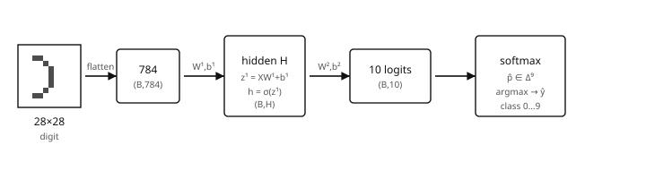

## Contents

-   [Introduction and overview](#intro)
-   [1. Empirical MNIST path (from the notebook)](#ch1)
-   [2. Forward, loss, training loop — what breaks](#ch2)
-   [3. Gradients and backpropagation with numbers](#ch3)
-   [4. Activations: identity vs sigmoid vs ReLU](#ch4)
-   [5. Optimization in practice (SGD → Adam)](#ch5)
-   [6. Short bridge: attention intuition](#ch6)
-   [7. Where this sits in the LLGA path](#ch7)
-   [Exercises](#ex)
-   [References](#refs)

## Introduction and overview {#intro}

  ------------------- --------------------------------------------------------------------------------------------------------------------------------------------------------------------------------------------------------------
  Module              Refresher Neural Nets — **pedagogical support outside the brochure** (on-ramp to Deep Learning / Graph ML / LLMs)
  Code                *No SynapseS course code* — this is **not** an official catalog UE. Do not invent a code.
  Audience            ~10 years as an engineer, comfortable with Python/NumPy, already trained an MNIST MLP from scratch (e.g. [MNIST_from_scratch.ipynb](https://github.com/knoel99/MNIST)), no nanoGPT / LLM training path yet.
  Indicative volume   ~12–18 h of self-study, placed *before* or lightly alongside [Deep Learning](../m1p1-deep-learning/index.html).
  Status              [Not in brochure]{.badge .pedagogical}[Pedagogical on-ramp]{.badge .refresher} M1 · S1 / period 1
  ------------------- --------------------------------------------------------------------------------------------------------------------------------------------------------------------------------------------------------------

The core of these notes is the empirical path in [knoel99/MNIST](https://github.com/knoel99/MNIST): load digits, flatten, train a NumPy network with identity / sigmoid / ReLU, plot loss and accuracy. Theory is added only where it diagnoses stalls, explosions, or saturation. Empirical first; doctoral vocabulary second.

### What you will be able to do

-   Walk the notebook end-to-end in prose + math + code without opening Colab first.
-   Write shapes $(B,784)\to(B,H)\to(B,10)$ and compute a tiny forward/backward by hand.
-   Compare identity / sigmoid / ReLU the way the notebook does (saturation, sparsity, loss curves).
-   Move from naïve SGD to momentum / Adam with a clear reading of each hyperparameter.
-   Explain one attention line as a $T\times T$ weight matrix — a short bridge to Deep Learning.

::: note
[Extrapolons note]{.tag} If a NumPy MNIST MLP already runs, the gap to Deep Learning is mostly naming failure modes (saturation, bad $\eta$, dead ReLUs) and reading shapes under batching — not starting from zero.
:::

## 1. Empirical MNIST path (from the notebook) {#ch1}

Starting point: `MNIST_from_scratch.ipynb` ([repo](https://github.com/knoel99/MNIST)). The notebook trains a **single linear map** $784\to 10$ with a choice of output activation and **MSE** against one-hot labels (not cross-entropy). Below: the same path in notes form, then a multilayer extension with fully expanded numbers.

### 1.1. Digits → flatten → scores

{fig-alt="Schema of MNIST MLP dimensions" width="100%"}

1.  Load CSV rows: label in column 0, pixels in the rest; reshape a row to $28\times 28$ for visualization (`imshow`, grayscale).
2.  Features: $X\in\mathbb{R}^{n\times 784}$, scaled to $[0,1]$ by `/255.0`.
3.  Targets: one-hot $Y\in\{0,1\}^{n\times 10}$.
4.  Notebook model: $z = XW + b$ with $W\in\mathbb{R}^{784\times 10}$, $b\in\mathbb{R}^{1\times 10}$, then $\hat y = \phi(z)$ for $\phi\in\{\mathrm{id},\sigma,\mathrm{ReLU}\}$.
5.  Loss: $\mathrm{MSE} = \mathrm{mean}\big((\hat y - Y)^2\big)$; train ~1000 epochs, $\eta=0.01$.

Shapes for a mini-batch of size $B$ (multilayer reading used later in Deep Learning):

  Tensor     Shape         Role
  ---------- ------------- ----------------------------
  $X$        $(B, 784)$    flattened pixels
  $W^{(1)}$  $(784, H)$    first affine map
  $z^{(1)}$  $(B, H)$      pre-activations
  $h$        $(B, H)$      after $\phi$
  $W^{(2)}$  $(H, 10)$     classifier
  $z^{(2)}$  $(B, 10)$     logits
  $\hat p$   $(B, 10)$     softmax probabilities

The notebook itself is the shallow case $H$ absent: $W\in\mathbb{R}^{784\times 10}$ only. That is enough to feel activation choice; depth comes in §2–3 with a tiny $2\to 2\to 2$ net.

```python
# Notebook spirit: shapes after load / normalize / one-hot
# X_train: (n, 784), y_train: (n, 10)
print(X_train.shape, y_train.shape)  # e.g. (60000, 784), (60000, 10)
```

### 1.2. MSE helper and the training skeleton

```python
import numpy as np

def mean_squared_error(y_true, y_pred):
    return np.mean(np.square(y_true - y_pred))

def sigmoid(z):
    return 1.0 / (1.0 + np.exp(-z))

def relu(z):
    return np.maximum(z, 0.0)

# One forward step (notebook: single layer)
def forward_linear(X, W, b, activation="identity"):
    z = X @ W + b                       # (B, 10)
    if activation == "sigmoid":
        return sigmoid(z), z
    if activation == "relu":
        return relu(z), z
    return z, z                         # identity
```

Optional: after training, the notebook can `np.save` weights. Reading them back is a good “what train produced” check:

```python
W = np.load("identity_weights.npy")   # expected (784, 10)
b = np.load("identity_biases.npy")    # expected (1, 10)
print(W.shape, b.shape, W.mean(), b.ravel()[:3])
```

### 1.3. What the notebook compares empirically

Three clones, same data, 1000 epochs, $\eta=0.01$:

-   `activation='identity'` — unbounded linear scores; MSE pushes toward $\{0,1\}$ one-hot but nothing clamps outputs.
-   `activation='sigmoid'` — outputs in $(0,1)$; gradients die when $|z|$ is large ($\sigma'(z)=\sigma(z)(1-\sigma(z))\to 0$).
-   `activation='relu'` — sparse nonnegativity; dead units if pre-activations stay negative.

Plots in the notebook (`plot_training_insights`, `plot_compare_loss`, accuracy-over-test-prefix) typically show **different loss trajectories and different test behavior** across the three — use those curves as the ground truth for *this* setup rather than memorizing a single accuracy number. A brief GPU/CuPy appendix exists in the notebook; it is optional acceleration, not the conceptual core.

::: note
[Extrapolons note]{.tag} Cross-entropy + softmax is the usual classifier loss in Deep Learning. The notebook’s MSE + per-output activation is pedagogically useful: every derivative stays elementary. §2 adds CE when bridging to standard practice.
:::

## 2. Forward, loss, training loop — what breaks {#ch2}

### 2.1. Tiny numerical forward (2 → 2 → 2)

Take one sample $x = (1.0,\ 0.5)$, ReLU hidden, linear logits (no softmax yet):

$$
W^{(1)} = \begin{pmatrix} 0.3 & -0.2 \\ 0.1 & 0.4 \end{pmatrix},\quad
b^{(1)} = (0.1,\ -0.1),\quad
W^{(2)} = \begin{pmatrix} 0.5 & 0.2 \\ -0.3 & 0.6 \end{pmatrix},\quad
b^{(2)} = (0.0,\ 0.1).
$$

Term-by-term:

$$
\begin{aligned}
z^{(1)}_1 &= 1.0\cdot 0.3 + 0.5\cdot 0.1 + 0.1 = 0.45,\\
z^{(1)}_2 &= 1.0\cdot(-0.2) + 0.5\cdot 0.4 + (-0.1) = -0.1,\\
h &= \mathrm{ReLU}(z^{(1)}) = (0.45,\ 0.0),\\
z^{(2)}_1 &= 0.45\cdot 0.5 + 0\cdot(-0.3) + 0 = 0.225,\\
z^{(2)}_2 &= 0.45\cdot 0.2 + 0\cdot 0.6 + 0.1 = 0.19.
\end{aligned}
$$

Softmax:

$$
e^{0.225}\approx 1.2523,\quad e^{0.19}\approx 1.2092,\quad
\hat p \approx \Big(\frac{1.2523}{2.4615},\ \frac{1.2092}{2.4615}\Big) \approx (0.5087,\ 0.4913).
$$

### 2.2. Losses: MSE (notebook) and CE (practice)

::: def
[Definition 2.1 — Empirical risk]{.tag} $$\hat{\mathcal{R}}(\theta) = \frac1n \sum_{i=1}^n \ell\big(f_\theta(x_i), y_i\big).$$
:::

-   Notebook: $\ell = (\hat y - y)^2$ averaged over all entries.
-   Classifier practice: $\ell = -\sum_k y_k \log \hat p_k$ with $\hat p=\mathrm{softmax}(z)$. Then $\nabla_z \ell = \hat p - y$ (one-hot $y$).

{fig-alt="Three gradient regimes" width="100%"}

::: ex
[Experiment 2.2 — executable $\eta$ stress test]{.tag} On the same NumPy MLP (or the notebook’s single layer), run **5 epochs** at fixed seed for each:

| Setting | Expected behavior |
|---------|-------------------|
| $\eta=3$ | loss jumps / NaNs — **explosion** |
| $\eta=10^{-3}$ | slow but stable decrease — may look flat early |
| $\eta=0.01$ (notebook default) | visible descent on MNIST MSE |
| Adam, $\mathrm{lr}=10^{-3}$ | often smoother than raw SGD at the same lr |

Write three sentences: which curve matches which panel of the schema above; what changed when swapping ReLU↔sigmoid at fixed $\eta=0.01$ (link to §4).
:::

## 3. Gradients and backpropagation with numbers {#ch3}

### 3.1. One-layer backprop table (notebook algebra)

For $\hat y=\phi(XW+b)$ and $\mathcal{L}=\mathrm{mean}((\hat y-Y)^2)$:

$$
\frac{\partial\mathcal{L}}{\partial z} = \underbrace{\frac{2}{|Y|}(\hat y-Y)}_{\text{d\_loss}} \odot \phi'(z),\qquad
\frac{\partial\mathcal{L}}{\partial W} = X^\top \frac{\partial\mathcal{L}}{\partial z},\qquad
\frac{\partial\mathcal{L}}{\partial b} = \sum_{\text{batch}} \frac{\partial\mathcal{L}}{\partial z}.
$$

Concrete **scalar** numbers (batch size 1, two outputs). Let $x=(1,\ 0)$, $W=\begin{pmatrix}0.5&0.1\\0.2&-0.4\end{pmatrix}$, $b=(0,0)$, $\phi=\mathrm{id}$, target $y=(1,0)$:

| Step | Value |
|------|-------|
| $z = xW+b$ | $(0.5,\ 0.1)$ |
| $\hat y=\phi(z)$ | $(0.5,\ 0.1)$ |
| $\hat y-y$ | $(-0.5,\ 0.1)$ |
| $d_z = 2/2\,(\hat y-y)$ | $(-0.5,\ 0.1)$ |
| $dW = x^\top d_z$ | $\begin{pmatrix}-0.5&0.1\\0&0\end{pmatrix}$ |
| update $W\leftarrow W-\eta\,dW$ ($\eta=0.01$) | $\begin{pmatrix}0.505&0.099\\0.2&-0.4\end{pmatrix}$ |

With **sigmoid**, multiply $d_z$ by $\sigma'(z)=\sigma(z)(1-\sigma(z))$ entrywise before the $X^\top$ product — that is exactly where saturation kills learning.

### 3.2. Two-layer chain (ReLU) with the §2.1 numbers

Target one-hot $y=(1,0)$, CE for illustration: $\delta^{(2)}=\hat p-y\approx(-0.4913,\ 0.4913)$.

$$
\begin{aligned}
\nabla_{W^{(2)}}\mathcal{L} &= h^\top \delta^{(2)}
  = \begin{pmatrix}0.45\\0\end{pmatrix}\begin{pmatrix}-0.4913&0.4913\end{pmatrix}
  = \begin{pmatrix}-0.2211&0.2211\\0&0\end{pmatrix},\\
\delta^{(1)} &= \big(\delta^{(2)} (W^{(2)})^\top\big)\odot \mathbf{1}_{z^{(1)}>0}
  = \big((-0.4913,\ 0.4913)\,W^{(2)\top}\big)\odot(1,0).
\end{aligned}
$$

Compute $\delta^{(2)} W^{(2)\top}$:
$$
(-0.4913,\ 0.4913)
\begin{pmatrix}0.5 & -0.3 \\ 0.2 & 0.6\end{pmatrix}
=
(-0.1474,\ 0.4422).
$$
Apply the ReLU mask $(1,0)$ ⇒ $\delta^{(1)}\approx(-0.1474,\ 0)$. Then $\nabla_{W^{(1)}}=x^\top\delta^{(1)}$.

```python
delta2 = (p - y_onehot) / B
dW2 = h.T @ delta2
delta1 = (delta2 @ W2.T) * (z1 > 0)   # ReLU'
dW1 = x.T @ delta1
```

::: note
[Engineer reading]{.tag} The computation graph is a DAG; backprop is reverse-topology VJP. Debugging still asks: which edge multiplies the gradient by ~0?
:::

## 4. Activations: identity vs sigmoid vs ReLU {#ch4}

{fig-alt="Activation curves" width="100%"}

::: def
[Definition 4.1 — Common activations]{.tag} $\mathrm{ReLU}(z)=\max(z,0)$, $\sigma(z)=(1+e^{-z})^{-1}$, identity $\mathrm{id}(z)=z$. Derivatives: $\mathrm{ReLU}'=\mathbf{1}_{z>0}$, $\sigma'=\sigma(1-\sigma)$, $\mathrm{id}'=1$.
:::

Qualitative map to the notebook ([MNIST_from_scratch](https://github.com/knoel99/MNIST)):

| Activation | Curve behavior | Training symptom to watch |
|------------|----------------|---------------------------|
| identity | linear | outputs not bounded; MSE still defined |
| sigmoid | flat for $\|z\|\gg 0$ | slow updates when saturated; loss may stall |
| ReLU | zero on negatives | sparse hidden/output activity; “dead” channels if always ≤0 |

`plot_training_insights` also tracks selected pixel→class weights over epochs — useful to see whether learning concentrates on stroke pixels (center) vs background (corners). Prefer the notebook’s own loss/accuracy figures over memorized percentages; re-run locally if a number is needed for a report.

### 4.1. Initialization

If $W_{ij}\sim\mathcal{N}(0,1)$ at large width, pre-activations explode (variance ∝ fan-in). **He** (ReLU): $\mathrm{Var}=2/\mathrm{fan\_in}$. **Xavier** (tanh/sigmoid): $1/\mathrm{fan\_in}$ (or $2/(\mathrm{fan\_in}+\mathrm{fan\_out})$).

```python
rng = np.random.default_rng(0)
W1 = rng.normal(0, np.sqrt(2 / 784), size=(784, 128))  # He
W2 = rng.normal(0, np.sqrt(2 / 128), size=(128, 10))
```

## 5. Optimization in practice (SGD → Adam) {#ch5}

::: def
[Definition 5.1 — Mini-batch SGD]{.tag} $$\theta_{t+1} = \theta_t - \eta \nabla_\theta \hat{\mathcal{R}}_{B_t}(\theta_t).$$
:::

**Momentum**: $v\leftarrow\mu v+\nabla$, $\theta\leftarrow\theta-\eta v$. **Adam**: first/second moments + bias correction — a sensible default once shapes are trusted; still not an excuse to ignore $\eta$ (Experiment 2.2).

```python
def adam(param, grad, m, v, t, lr=1e-3, beta1=0.9, beta2=0.999, eps=1e-8):
    m = beta1 * m + (1 - beta1) * grad
    v = beta2 * v + (1 - beta2) * (grad * grad)
    mhat = m / (1 - beta1 ** t)
    vhat = v / (1 - beta2 ** t)
    return param - lr * mhat / (np.sqrt(vhat) + eps), m, v
```

## 6. Short bridge: attention intuition {#ch6}

Goal: *not* to train an LLM. Only see that attention is a $T\times T$ pattern of weights.

::: def
[Definition 6.1 — Attention (single head)]{.tag} $$\mathrm{Attention}(Q,K,V)=\mathrm{softmax}\Big(\frac{QK^\top}{\sqrt{d}}\Big)V.$$
:::

{fig-alt="4x4 attention weights" width="60%"}

```python
def attention(Q, K, V):
    d = Q.shape[1]
    scores = (Q @ K.T) / np.sqrt(d)
    weights = softmax(scores[None, :, :])[0]
    return weights @ V, weights
```

A transformer block ≈ LayerNorm → attention → residual → LayerNorm → MLP → residual. Same CE family as classification; attention adds routing across positions.

## 7. Where this sits in the LLGA path {#ch7}

  Stage             Module                                        What this refresher prepares
  ----------------- --------------------------------------------- -------------------------------------
  P1 refreshers     Stats · CS                                    Already in place
  P1 core           Machine Learning                              Empirical risk, regularization, SGD
  **Here**          **Refresher Neural Nets (not in brochure)**   Solid MLP + attention intuition
  P1 key elective   Deep Learning                                 CNNs, RNNs, real transformers
  P2                Graph ML · NLP                                Message passing ↔ attention
  M2                Large Language Models                         Pretrain, alignment, scaling

::: recap
[Recap]{.tag} The notebook path (digits → flatten → activation choice → MSE train → plots) is the empirical spine. Expanded forwards/backprops and one attention heatmap are enough to open Deep Learning without cloning nanoGPT.
:::

::: {#ex}
:::

### Exercises

1.  **MNIST shapes.** For $B=64$, $H=256$, write shapes of $x,W^{(1)},z^{(1)},h,W^{(2)},\hat p$ and FLOPs order of magnitude for one forward.

    ::: sol
    $x:(64,784)$, $W^{(1)}:(784,256)$, $z^{(1)},h:(64,256)$, $W^{(2)}:(256,10)$, $\hat p:(64,10)$. Dominant cost $\approx 64\cdot(784\cdot 256+256\cdot 10)\approx 1.3\cdot 10^7$ mul-adds.
    :::

2.  **Numerical one-layer step.** With $x=(1,0)$, $W=\begin{pmatrix}0.5&0.1\\0.2&-0.4\end{pmatrix}$, identity, $y=(1,0)$, $\eta=0.01$, recompute the updated $W$ from the table in §3.1.

    ::: sol
    $W\leftarrow\begin{pmatrix}0.505&0.099\\0.2&-0.4\end{pmatrix}$.
    :::

3.  **Softmax-CE gradient.** Show $\nabla_z \ell = p-y$ for one-hot $y$; check with finite differences on a 3-vector.

    ::: sol
    Direct differentiation of $-\sum_k y_k\log p_k$ with $p=\mathrm{softmax}(z)$ yields $p-y$.
    :::

4.  **Hand backprop (scalar).** $y=\sigma(w_2\sigma(w_1 x))$, $\mathcal{L}=\tfrac12(y-t)^2$, at $x=1,t=0,w_1=w_2=1$. Compute $\partial\mathcal{L}/\partial w_1$ and $\partial\mathcal{L}/\partial w_2$.

    ::: sol
    $y\approx 0.675$, $\partial\mathcal{L}/\partial w_2\approx 0.108$, $\partial\mathcal{L}/\partial w_1\approx 0.029$.
    :::

5.  **Saturation.** Bad $\mathcal{N}(0,1)$ init + sigmoid on a deep stack; then fix with He/ReLU. Report whether $\|\delta^{(\ell)}\|$ recovers.

    ::: sol
    Large variance saturates $\sigma$; He+ReLU restores nonzero ReLU' on a positive fraction of units.
    :::

6.  **Experiment 2.2 write-up.** Attach the three loss curves ($\eta=3$, $10^{-3}$, Adam $10^{-3}$) and label explosion / slow / smooth.

    ::: sol
    Match panels of `schema-grad-regimes.svg`; Adam often reduces early noise vs SGD at the same lr.
    :::

7.  **Toy attention.** $T=5$, $d=16$; force $K_2$ aligned with $Q_0$; check row 0 of weights concentrates on column 2.

    ::: sol
    Large score $(Q_0\cdot K_2)/\sqrt{d}$ dominates the softmax row.
    :::

8.  **(Optional)** Load saved `*_weights.npy` from a notebook run; print norms per output column — which digit class has largest $\|W_{:,k}\|$?

    ::: sol
    Depends on the run; the exercise is the measurement protocol, not a fixed ranking.
    :::

## References {#refs}

-   Goodfellow, Bengio, Courville, *Deep Learning*, MIT Press, 2016.
-   Nielsen, *Neural Networks and Deep Learning* (online).
-   Zhang et al., *Dive into Deep Learning*.
-   Vaswani et al., *Attention Is All You Need*, NeurIPS 2017.
-   Sibling notes: [Deep Learning](../m1p1-deep-learning/index.html) · [Refresher CS](../m1p1-refresher-cs/index.html) · [Refresher Statistics](../m1p1-refresher-statistics/index.html).
-   Empirical starting point: [knoel99/MNIST](https://github.com/knoel99/MNIST) (`MNIST_from_scratch.ipynb`).
