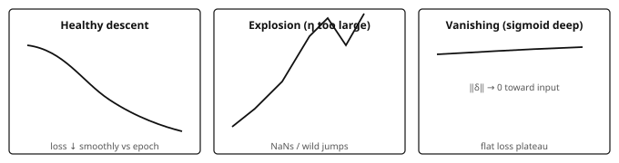
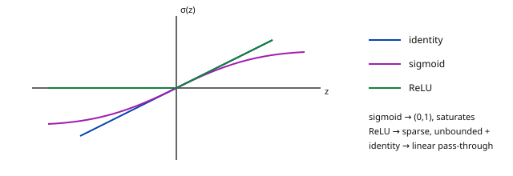
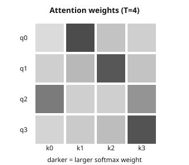

## Introduction and overview {#intro}

[Not in the official curriculum]{.badge .pedagogical} [Independent refresher]{.badge .refresher}

Independent study support, not an official curriculum module or a Deep Learning equivalence. The Year 1 / Period 1 placement is a suggested reading slot. The [reading route](#reading-route) below is a reading recommendation, not an enrolment rule.

### The question this page answers

**What changes between a working affine MNIST classifier and a trainable layered model — and how do shapes, losses and gradients reveal what is happening?**

Start with an observable distinction: scores $(0.5,0.1)$ already predict class 0 by `argmax`, but against the one-hot target $(1,0)$ their MSE is

$$
\frac{(0.5-1)^2+(0.1-0)^2}{2}=0.13.
$$

A gradient step can reduce that loss without changing the predicted class. Loss curves and accuracy answer different questions.

The empirical spine is the public [knoel99/MNIST](https://github.com/knoel99/MNIST) repository: load digits, normalize pixels, flatten, train an affine NumPy classifier with alternative output activations, and inspect loss and accuracy. The calculations below make that path explicit before extending it.

::: note
[Starting point]{.tag} The reference notebook trains an **affine MNIST classifier with no hidden layer**, using **MSE and alternative output activations**. The multilayer examples below extend that starting point. They prepare the transition to Deep Learning; they do not replace practice with layered models, automatic differentiation or sequence prediction.
:::

### What you will be able to do

-   Follow the notebook’s data preparation, parameter shapes, scores, MSE, updates and `argmax` evaluation.
-   Distinguish its $(B,784)\to(B,10)$ map from a multilayer extension $(B,784)\to(B,H)\to(B,10)$.
-   Compute a tiny forward/backward by hand, including the loss-reduction factor.
-   Compare identity / sigmoid / ReLU through saturation, sparsity and measured loss curves.
-   Read SGD, momentum and Adam updates, then interpret one attention line as a $T\times T$ weight matrix.

Recognizing names such as saturation or exploding gradients helps with diagnosis. **Composing, training and evaluating new layered architectures is additional learning**, not merely a vocabulary change.

## Before you start {#before-start}

This page assumes working Python/NumPy and basic matrix multiplication, not prior practice with an MLP or a language model. Use these three tasks to decide where to enter.

| Positioning task | If it is uncertain |
|------------------|--------------------|
| For $B=64$, give the shapes of $X$, $W$, $b$ and $XW+b$ in an affine $784\to10$ classifier. Explain bias broadcasting. | Read [§1.1: notebook shapes](#mnist-scores); use [Refresher CS](../m1p1-refresher-cs/index.html) for implementation foundations. |
| Recover the MSE $0.13$ above and take one parameter update. Which entries does `mean` average? | Work through [§3.1: affine backpropagation and reduction](#affine-backprop). |
| Explain why lower training MSE need not improve held-out accuracy, and why ten sigmoid scores need not sum to one. | Read [§1.3: empirical comparisons](#notebook-comparison) and [§2.2: losses](#losses); revisit [Refresher Statistics](../m1p1-refresher-statistics/index.html) if evaluation concepts are unclear. |

The affine notebook provides practice with normalization, parameter matrices, NumPy updates, loss curves, `argmax` and train/test comparison. It does **not** establish practice with learned hidden representations, autodiff, training/evaluation states, logits-based cross-entropy, or sequences. Tokenization, shifted targets, causal masking and language-model training remain later learning tasks.

## Reading route {#reading-route}

| Your immediate goal | Selective route | Evidence before moving on |
|---------------------|-----------------|---------------------------|
| Check an existing affine MNIST implementation | [§1](#ch1) → [§3.1](#affine-backprop) → [§4](#ch4) | Explain the scores, reproduce Exercise 2, and match the MSE derivative to its reduction. |
| Prepare to enter Deep Learning | [§2](#ch2) → [§3.2](#two-layer-backprop) → [§4.1](#initialization) → [§5](#ch5) | Work Exercises 1–4 and report a controlled learning-rate comparison. |
| Get a first attention intuition | [§6](#ch6), after the softmax calculation in §2 | Explain row normalization and solve Exercise 7; no sequence-training claim follows from this alone. |
| Choose the next module | [§7: exit routes](#ch7) | Use the ML, DL or Graph ML route according to the missing skill, rather than reading every refresher in order. |

The full route is an estimate of **about 12–18 hours of self-study**, including exercises and reruns. It is not an official workload or a required duration.

## Contents

-   [Introduction and overview](#intro)
-   [Before you start](#before-start)
-   [Reading route](#reading-route)
-   [1. Empirical MNIST path (from the notebook)](#ch1)
-   [2. Forward, loss, training loop — what breaks](#ch2)
-   [3. Gradients and backpropagation with numbers](#ch3)
-   [4. Activations: identity vs sigmoid vs ReLU](#ch4)
-   [5. Optimization in practice (SGD → Adam)](#ch5)
-   [6. Short bridge: attention intuition](#ch6)
-   [7. Connections, limits and exit routes](#ch7)
-   [Exercises](#ex)
-   [Sources, scope and references](#refs)

## 1. Empirical MNIST path (from the notebook) {#ch1}

Starting point: `MNIST_from_scratch.ipynb` ([public repository](https://github.com/knoel99/MNIST)). The notebook trains a **single affine map** $784\to10$ with a choice of output activation and **MSE** against one-hot labels, not cross-entropy. Below: that path in notes form, then a separate multilayer extension with fully expanded numbers.

### 1.1. Digits → flatten → scores {#mnist-scores}

{fig-alt="MNIST dimensions: the reference notebook has an affine map with no hidden layer; hidden layers and the logit/softmax head belong to the extension." width="100%"}

Keep the two readings separate:

| Path | Computation | Training / prediction |
|------|-------------|-----------------------|
| **Reference notebook: no hidden layer** | pixels → flatten → affine map → optional identity / sigmoid / ReLU output activation → **scores** | MSE against one-hot labels / `argmax` of scores |
| **Multilayer classification extension** | pixels → flatten → affine + hidden nonlinearity → affine classifier → **logits** | softmax cross-entropy / `argmax` of logits or softmax probabilities |

1.  Load CSV rows: label in column 0, pixels in the rest; reshape a row to $28\times28$ for visualization (`imshow`, grayscale).
2.  Features: $X\in\mathbb{R}^{n\times784}$, scaled to $[0,1]$ by `/255.0`.
3.  Targets: one-hot $Y\in\{0,1\}^{n\times10}$.
4.  Notebook model: $z=XW+b$ with $W\in\mathbb{R}^{784\times10}$, $b\in\mathbb{R}^{1\times10}$, then $\hat y=\phi(z)$ for $\phi\in\{\mathrm{id},\sigma,\mathrm{ReLU}\}$. Identity means no additional output nonlinearity.
5.  Loss: $\mathrm{MSE}=\mathrm{mean}\big((\hat y-Y)^2\big)$; the notebook comparison uses about 1000 epochs and $\eta=0.01$.
6.  Prediction: $\hat c_i=\arg\max_k\hat y_{ik}$; compare with the integer labels to compute accuracy.

The outputs $\hat y$ are **scores**, not necessarily logits or a probability distribution. Sigmoid bounds each score in $(0,1)$ but does not make a row sum to one. `argmax` does not require normalized probabilities.

Here $n$ is the number of examples in a dataset, $B$ the mini-batch size, and $C=10$ the number of classes. Notebook shapes for one mini-batch:

| Tensor | Shape | Role |
|--------|-------|------|
| $X$ | $(B,784)$ | flattened, normalized pixels |
| $W$ | $(784,10)$ | affine classifier weights |
| $b$ | $(1,10)$ | bias broadcast across the batch |
| $z=XW+b$ | $(B,10)$ | pre-activation outputs |
| $\hat y=\phi(z)$ | $(B,10)$ | scores used by MSE and `argmax` |
| $Y$ | $(B,10)$ | one-hot targets |

For comparison, the **multilayer extension** used later has hidden width $H$:

| Tensor | Shape | Role |
|--------|-------|------|
| $X$ | $(B,784)$ | flattened pixels |
| $W^{(1)}$ | $(784,H)$ | first affine map |
| $b^{(1)}$ | $(1,H)$ | hidden bias |
| $z^{(1)}$ | $(B,H)$ | hidden pre-activations |
| $h$ | $(B,H)$ | hidden representation after $\phi$ |
| $W^{(2)}$ | $(H,10)$ | classifier weights |
| $b^{(2)}$ | $(1,10)$ | classifier bias |
| $z^{(2)}$ | $(B,10)$ | logits for the CE head |
| $\hat p$ | $(B,10)$ | softmax probabilities |

The notebook itself has **no $H$ and no hidden layer**. Depth comes in §2–3 with a tiny $2\to2\to2$ network.

~~~python
# Notebook data shapes after load / normalize / one-hot:
# X_train: (n, 784), y_train: (n, 10)
print(X_train.shape, y_train.shape)  # e.g. (60000, 784), (60000, 10)
~~~

::: note
[Two independent changes]{.tag} Adding hidden layers and switching from MSE to cross-entropy are separate modelling choices. An affine classifier can use cross-entropy; a multilayer network can use MSE. The worked extension below changes both so that their roles can be examined explicitly.
:::

### 1.2. MSE helper and the training skeleton

~~~python
import numpy as np

def mean_squared_error(y_true, y_pred):
    return np.mean(np.square(y_true - y_pred))

def sigmoid(z):
    return 1.0 / (1.0 + np.exp(-z))

def relu(z):
    return np.maximum(z, 0.0)

# One forward step: affine map, no hidden layer.
def forward_linear(X, W, b, activation="identity"):
    z = X @ W + b                       # (B, 10)
    if activation == "sigmoid":
        return sigmoid(z), z
    if activation == "relu":
        return relu(z), z
    return z, z                         # identity
~~~

The training loop repeatedly computes scores, evaluates MSE, differentiates through the selected output activation, and updates $W$ and $b$. [§3.1](#affine-backprop) writes those derivatives with an explicit reduction convention.

Optional: after training, the notebook can `np.save` weights. Reading them back is a useful “what did training produce?” check:

~~~python
W = np.load("identity_weights.npy")   # expected (784, 10)
b = np.load("identity_biases.npy")    # expected (1, 10)
print(W.shape, b.shape, W.mean(), b.ravel()[:3])
~~~

### 1.3. What the notebook compares empirically {#notebook-comparison}

Three configurations, same data, 1000 epochs, $\eta=0.01$:

-   `activation='identity'` — unbounded affine scores; MSE pushes toward $\{0,1\}$ one-hot targets, but nothing clamps the outputs.
-   `activation='sigmoid'` — outputs in $(0,1)$; gradients shrink when $|z|$ is large because $\sigma'(z)=\sigma(z)(1-\sigma(z))\to0$.
-   `activation='relu'` — nonnegative scores, with zero output and zero local derivative for negative pre-activations; an output channel can become inactive across many examples.

The notebook’s plots (`plot_training_insights`, `plot_compare_loss`, accuracy-over-test-prefix) make **loss trajectories and test behavior** visible. Read them as evidence for that particular setup, not as a universal ranking of activations or a fixed MNIST accuracy claim. A brief GPU/CuPy appendix is optional acceleration, not the conceptual core.

For a controlled rerun, record the seed, initialization, batch size, loss reduction and split. Use a validation set to select hyperparameters; keep the test set for final reporting rather than repeatedly selecting settings from test-prefix plots.

::: note
[independent note]{.tag} Softmax cross-entropy is common for single-label classification in Deep Learning. The notebook’s MSE with per-output activations remains useful for inspecting elementary derivatives. §2 introduces the CE head separately; it does not reinterpret the notebook as a softmax classifier.
:::

## 2. Forward, loss, training loop — what breaks {#ch2}

### 2.1. Tiny numerical forward (2 → 2 → 2) {#tiny-forward}

This is the **multilayer extension**, not the reference notebook architecture.

Take one sample $x=(1.0,\ 0.5)$, a ReLU hidden layer, and affine output logits for a two-class CE head:

$$
W^{(1)} = \begin{pmatrix} 0.3 & -0.2 \\ 0.1 & 0.4 \end{pmatrix},\quad
b^{(1)} = (0.1,\ -0.1),\quad
W^{(2)} = \begin{pmatrix} 0.5 & 0.2 \\ -0.3 & 0.6 \end{pmatrix},\quad
b^{(2)} = (0.0,\ 0.1).
$$

Term-by-term:

$$
\begin{aligned}
z^{(1)}_1 &= 1.0\cdot 0.3 + 0.5\cdot 0.1 + 0.1 = 0.45,\\
z^{(1)}_2 &= 1.0\cdot(-0.2) + 0.5\cdot 0.4 + (-0.1) = -0.1,\\
h &= \mathrm{ReLU}(z^{(1)}) = (0.45,\ 0.0),\\
z^{(2)}_1 &= 0.45\cdot 0.5 + 0\cdot(-0.3) + 0 = 0.225,\\
z^{(2)}_2 &= 0.45\cdot 0.2 + 0\cdot 0.6 + 0.1 = 0.19.
\end{aligned}
$$

Softmax:

$$
e^{0.225}\approx 1.2523,\quad e^{0.19}\approx 1.2092,\quad
\hat p \approx \Big(\frac{1.2523}{2.4615},\ \frac{1.2092}{2.4615}\Big) \approx (0.5087,\ 0.4913).
$$

For target $y=(1,0)$, the cross-entropy is $-\log\hat p_1\approx0.676$. The model predicts the correct class, but only narrowly.

A stable implementation subtracts the largest logit before exponentiation. This leaves softmax unchanged:

~~~python
def softmax(z, axis=-1):
    shifted = z - np.max(z, axis=axis, keepdims=True)
    exp_z = np.exp(shifted)
    return exp_z / np.sum(exp_z, axis=axis, keepdims=True)
~~~

### 2.2. Losses: MSE (notebook) and CE (classification extension) {#losses}

::: def
[Definition 2.1 — Empirical risk]{.tag} For $n$ labelled examples and model parameters $\theta$,
$$
\hat{\mathcal{R}}(\theta) = \frac1n \sum_{i=1}^n \ell\big(f_\theta(x_i), y_i\big).
$$
The per-example loss $\ell$ must specify how output coordinates are reduced.
:::

-   **Notebook MSE:** squared score errors, averaged over all $B\times C$ entries in a batch:
    $$
    \mathcal{L}_{\mathrm{MSE}}=\frac{1}{BC}\sum_{i=1}^{B}\sum_{k=1}^{C}(\hat y_{ik}-Y_{ik})^2.
    $$
-   **Single-label classifier CE:** for one example,
    $$
    \ell_{\mathrm{CE}}=-\sum_k y_k\log\hat p_k,\qquad
    \hat p=\mathrm{softmax}(z),\qquad
    \nabla_z\ell_{\mathrm{CE}}=\hat p-y.
    $$
    Here $z$ denotes logits and $y$ is one-hot. A batch-mean CE introduces a factor $1/B$, not $1/(BC)$.

The score arrays, objectives and gradient scales differ. Compare accuracy under the same evaluation protocol; do not compare the numerical magnitudes of MSE and CE as though they were the same quantity.

In a framework, a fused cross-entropy function commonly accepts **logits** and computes log-softmax internally. Check the API rather than applying softmax twice.

{fig-alt="Three schematic training regimes: healthy descent, explosion, and vanishing gradients." width="100%"}

::: ex
[Experiment 2.2 — controlled learning-rate stress test]{.tag} Choose either the affine notebook model or the two-layer extension. Keep that architecture and its loss reduction fixed. Run **5 epochs** for each setting, resetting to the same initialization and mini-batch order:

| Setting | Diagnostic hypothesis to test |
|---------|-------------------------------|
| $\eta=3$ | Large-step stress test: loss may jump, diverge or become non-finite. |
| $\eta=10^{-3}$ | Smaller updates may give slow but stable decrease and look flat early. |
| $\eta=0.01$ (notebook default) | Reference setting for the notebook’s MNIST MSE comparison. |
| Adam, $\mathrm{lr}=10^{-3}$ | Adaptive updates may give a smoother or faster trajectory than SGD at the same nominal learning rate. |

Record loss, accuracy and gradient norms; keep the data split, batch size and reduction visible. These outcomes are **hypotheses, not guaranteed labels**: changing the loss scale can change which learning rate is large.

Write three sentences identifying which observed curve resembles each relevant panel above. Then report what changes when swapping ReLU↔sigmoid at fixed $\eta=0.01$; connect the result to §4. A flat loss alone does not distinguish a tiny step size from saturation.
:::

## 3. Gradients and backpropagation with numbers {#ch3}

### 3.1. One-layer backprop table (notebook algebra) {#affine-backprop}

For $\hat y=\phi(XW+b)$ and $\mathcal{L}=\mathrm{mean}((\hat y-Y)^2)$, let $Y$ contain $B\times C$ entries. Then $|Y|=BC$ and

$$
\frac{\partial\mathcal{L}}{\partial \hat y}
=\frac{2}{BC}(\hat y-Y).
$$

The output activation adds its local derivative:

$$
\frac{\partial\mathcal{L}}{\partial z} = \underbrace{\frac{2}{|Y|}(\hat y-Y)}_{\text{d\_loss}} \odot \phi'(z),\qquad
\frac{\partial\mathcal{L}}{\partial W} = X^\top \frac{\partial\mathcal{L}}{\partial z},\qquad
\frac{\partial\mathcal{L}}{\partial b} = \sum_{\text{batch}} \frac{\partial\mathcal{L}}{\partial z}.
$$

Here $\odot$ is entrywise multiplication. The bias gradient sums over examples because the same bias was broadcast to every row. The averaging is already included in `d_loss`; do not divide by $B$ again when computing $dW$ or $db$.

::: note
[Reduction check, not a bug report]{.tag} For $B=64$ and $C=10$, the prediction-gradient factor is $2/640=0.003125$. A sample mean of **class-summed** squared errors would instead use $2/B$, ten times larger here. Check the full training method against the loss it reports before comparing learning rates. A truncated training-method excerpt does not establish an implementation mismatch: this is a verification to perform, not a confirmed bug in the repository.
:::

Concrete componentwise numbers: batch size 1, two outputs. Let $x=(1,\ 0)$,

$$
W=\begin{pmatrix}0.5&0.1\\0.2&-0.4\end{pmatrix},\qquad
b=(0,0),\qquad
\phi=\mathrm{id},\qquad
y=(1,0).
$$

| Step | Value |
|------|-------|
| $z=xW+b$ | $(0.5,\ 0.1)$ |
| $\hat y=\phi(z)$ | $(0.5,\ 0.1)$ |
| $\hat y-y$ | $(-0.5,\ 0.1)$ |
| $\mathcal{L}=\mathrm{mean}((\hat y-y)^2)$ | $0.13$ |
| $d_z=2/2\,(\hat y-y)$ | $(-0.5,\ 0.1)$ |
| $dW=x^\top d_z$ | $\begin{pmatrix}-0.5&0.1\\0&0\end{pmatrix}$ |
| $db=d_z$ | $(-0.5,\ 0.1)$ |
| update $W\leftarrow W-\eta\,dW$ ($\eta=0.01$) | $\begin{pmatrix}0.505&0.099\\0.2&-0.4\end{pmatrix}$ |
| update $b\leftarrow b-\eta\,db$ | $(0.005,\ -0.001)$ |

After updating **both** $W$ and $b$, the scores become $(0.510,\ 0.098)$ and the MSE becomes

$$
\frac{(-0.490)^2+(0.098)^2}{2}=0.124852.
$$

The loss decreased, while `argmax` stayed on class 0.

With **sigmoid**, first recompute $\hat y=\sigma(z)$: the residual changes too. Then multiply the prediction gradient by $\sigma'(z)=\sigma(z)(1-\sigma(z))$ entrywise before the $X^\top$ product. This is where saturation attenuates the update.

A NumPy backward helper matching the stated all-entry mean:

~~~python
def backward_affine_mse(X, Y, scores, z, activation="identity"):
    d_scores = 2.0 * (scores - Y) / Y.size
    if activation == "sigmoid":
        dz = d_scores * scores * (1.0 - scores)
    elif activation == "relu":
        dz = d_scores * (z > 0)
    else:
        dz = d_scores
    dW = X.T @ dz
    db = np.sum(dz, axis=0, keepdims=True)
    return dW, db
~~~

This helper specifies the convention used in these notes; it is not a transcription of the repository’s complete trainer.

### 3.2. Two-layer chain (ReLU) with the §2.1 numbers {#two-layer-backprop}

Return to the **multilayer CE extension**. For one-hot target $y=(1,0)$,

$$
\delta^{(2)}=\hat p-y\approx(-0.4913,\ 0.4913).
$$

The output-layer derivative and the chain back to the hidden layer are

$$
\begin{aligned}
\nabla_{W^{(2)}}\mathcal{L} &= h^\top \delta^{(2)}
  = \begin{pmatrix}0.45\\0\end{pmatrix}\begin{pmatrix}-0.4913&0.4913\end{pmatrix}
  = \begin{pmatrix}-0.2211&0.2211\\0&0\end{pmatrix},\\
\delta^{(1)} &= \big(\delta^{(2)} (W^{(2)})^\top\big)\odot \mathbf{1}_{z^{(1)}>0}
  = \big((-0.4913,\ 0.4913)\,(W^{(2)})^\top\big)\odot(1,0).
\end{aligned}
$$

Using the rounded values, compute $\delta^{(2)}(W^{(2)})^\top$:

$$
(-0.4913,\ 0.4913)
\begin{pmatrix}0.5 & -0.3 \\ 0.2 & 0.6\end{pmatrix}
\approx
(-0.1474,\ 0.4422).
$$

Apply the ReLU mask $(1,0)$ to obtain $\delta^{(1)}\approx(-0.1474,\ 0)$. Then

$$
\nabla_{W^{(1)}}\mathcal{L}
=x^\top\delta^{(1)}
\approx
\begin{pmatrix}
-0.1474&0\\
-0.0737&0
\end{pmatrix}.
$$

For this one-example calculation, $\nabla_{b^{(2)}}\mathcal{L}=\delta^{(2)}$ and $\nabla_{b^{(1)}}\mathcal{L}=\delta^{(1)}$. The second hidden unit contributes no weight gradient for this sample because its ReLU is inactive.

Batch-mean CE version:

~~~python
# x: (B, 2), h and z1: (B, 2), p and y_onehot: (B, 2)
B = x.shape[0]
delta2 = (p - y_onehot) / B
dW2 = h.T @ delta2
db2 = delta2.sum(axis=0, keepdims=True)
delta1 = (delta2 @ W2.T) * (z1 > 0)   # ReLU'
dW1 = x.T @ delta1
db1 = delta1.sum(axis=0, keepdims=True)
~~~

Compute the whole backward pass with the weights used in the forward pass, then update the parameters. Updating $W^{(2)}$ before computing $\delta^{(1)}$ would mix two parameter states.

::: note
[Computation graph]{.tag} The computation graph is a DAG; backpropagation applies vector–Jacobian products in reverse topological order. A useful debugging question is: which operation multiplies this gradient by nearly zero? This graph of computational dependencies is not the relational data graph studied in Graph ML.
:::

## 4. Activations: identity vs sigmoid vs ReLU {#ch4}

{fig-alt="Identity, sigmoid and ReLU activation curves, with output use in the notebook distinguished from hidden-layer use in the extension." width="100%"}

::: def
[Definition 4.1 — Common activations]{.tag} $\mathrm{ReLU}(z)=\max(z,0)$, $\sigma(z)=(1+e^{-z})^{-1}$, identity $\mathrm{id}(z)=z$. Derivatives: $\mathrm{ReLU}'=\mathbf{1}_{z>0}$, $\sigma'=\sigma(1-\sigma)$, $\mathrm{id}'=1$. At the ReLU kink $z=0$, the code uses derivative 0.
:::

Qualitative map to the notebook ([MNIST_from_scratch](https://github.com/knoel99/MNIST)):

| Activation | Curve behavior | Training symptom to watch |
|------------|----------------|---------------------------|
| identity | linear activation | affine output scores are not bounded; MSE is still defined |
| sigmoid | nearly flat for $\lvert z\rvert\gg1$ | slow updates when saturated; loss may stall |
| ReLU | zero on negative inputs | sparse output activity in the notebook, or hidden activity in an extension; inactive channels if pre-activations stay nonpositive |

`plot_training_insights` also tracks selected pixel→class weights over epochs — useful for checking whether learning concentrates on stroke pixels near the center rather than background corners. Prefer the notebook’s own loss/accuracy figures over memorized percentages; rerun locally if a number is needed for a report.

Output activation and hidden nonlinearity have different roles. Stacking affine maps with **identity hidden activations** still gives a single affine map:

$$
(XW^{(1)}+b^{(1)})W^{(2)}+b^{(2)}
=
X(W^{(1)}W^{(2)})+(b^{(1)}W^{(2)}+b^{(2)}).
$$

A hidden nonlinearity prevents this collapse and allows a richer representation. Learning to train that representation is an extension beyond choosing an activation on the notebook’s ten outputs.

### 4.1. Initialization {#initialization}

If $W_{ij}\sim\mathcal{N}(0,1)$, pre-activation variance can grow with fan-in. Under an independent, unit-variance input approximation,

$$
\mathrm{Var}(z_j)\approx \mathrm{fan\_in}\,\mathrm{Var}(W_{ij}).
$$

At fan-in 784, unit-variance weights give a scale near variance 784, or standard deviation 28 — enough to push many sigmoid outputs into saturation.

Common scale choices:

-   **He** for ReLU: $\mathrm{Var}(W_{ij})=2/\mathrm{fan\_in}$.
-   **Xavier** for tanh/sigmoid: $\mathrm{Var}(W_{ij})=1/\mathrm{fan\_in}$, or $2/(\mathrm{fan\_in}+\mathrm{fan\_out})$.

~~~python
rng = np.random.default_rng(0)
W1 = rng.normal(0, np.sqrt(2 / 784), size=(784, 128))  # He for ReLU
W2 = rng.normal(0, np.sqrt(2 / 128), size=(128, 10))   # illustrative head scale
~~~

The second line is an illustrative classifier initialization, not a rule that every affine output head requires He scaling. These variance arguments control initial scale under assumptions; they do not guarantee healthy gradients throughout a deep model.

## 5. Optimization in practice (SGD → Adam) {#ch5}

::: def
[Definition 5.1 — Mini-batch SGD]{.tag}
$$
\theta_{t+1} = \theta_t - \eta \nabla_\theta \hat{\mathcal{R}}_{B_t}(\theta_t).
$$
Here $B_t$ is the set of examples in the current mini-batch, $\theta$ contains all weights and biases, and the batch loss uses the declared reduction.
:::

**Momentum** accumulates a velocity. Writing $g_t$ for the current gradient,

$$
v_{\mathrm{mom}}\leftarrow\mu v_{\mathrm{mom}}+g_t,\qquad
\theta\leftarrow\theta-\eta v_{\mathrm{mom}}.
$$

**Adam** maintains first and second moments with bias correction. It is a useful default once shapes and derivatives are trusted, but it does not remove the need to choose a learning rate or inspect loss scaling.

~~~python
def adam(param, grad, m, v, t, lr=1e-3, beta1=0.9, beta2=0.999, eps=1e-8):
    m = beta1 * m + (1 - beta1) * grad
    v = beta2 * v + (1 - beta2) * (grad * grad)
    mhat = m / (1 - beta1 ** t)
    vhat = v / (1 - beta2 ** t)
    return param - lr * mhat / (np.sqrt(vhat) + eps), m, v
~~~

Read the state and hyperparameters literally:

-   `lr` is the step-size multiplier.
-   `beta1` controls smoothing of the gradient; `beta2` controls smoothing of its elementwise square.
-   `m` and `v` are persistent, parameter-shaped states. Adam’s `v` is a second-moment estimate, not the momentum velocity above.
-   `t` starts at 1 and counts optimizer steps; use the same step number for all parameters updated together.
-   `eps` protects the denominator; it is not a general cure for unstable training.

Initialize `m` and `v` to zero for each parameter, retain the returned states between steps, and reset them between independent experimental runs. Return to Experiment 2.2 to compare observed behavior rather than assuming Adam must win.

## 6. Short bridge: attention intuition {#ch6}

Goal: **not** to train an LLM. Only see how attention creates a $T\times T$ pattern of weights and uses it to mix values.

For example, a row of weights $(0.1,0.2,0.6,0.1)$ produces the weighted combination $0.1V_0+0.2V_1+0.6V_2+0.1V_3$. The third position contributes most; the weights in that row sum to one.

Let $T$ be the number of positions, $d$ the query/key dimension, and $d_v$ the value dimension:

$$
Q,K\in\mathbb{R}^{T\times d},\qquad
V\in\mathbb{R}^{T\times d_v}.
$$

::: def
[Definition 6.1 — Attention (single head)]{.tag}
$$
\mathrm{Attention}(Q,K,V)=\mathrm{softmax}\Big(\frac{QK^\top}{\sqrt{d}}\Big)V.
$$
Softmax acts across key positions in each row. The weight matrix has shape $(T,T)$ and the output has shape $(T,d_v)$.
:::

{fig-alt="A schematic 4 by 4 attention heatmap showing weights across positions." width="60%"}

Using the stable row-wise softmax helper from §2:

~~~python
def attention(Q, K, V):
    d = Q.shape[1]
    scores = (Q @ K.T) / np.sqrt(d)   # (T, T)
    weights = softmax(scores, axis=-1)
    return weights @ V, weights
~~~

A common **pre-normalized** transformer block is approximately LayerNorm → attention → residual → LayerNorm → MLP → residual. Learned projections, multiple heads, batching and these surrounding operations require further practice in Deep Learning.

Token prediction uses the same CE family as classification, but adds a sequence task: tokenization, per-position targets, target shifting, causal masking and sequence evaluation. None of those is supplied by the affine MNIST notebook or by this attention function.

Attention provides an intuition for weighted aggregation. Whether an explicit relational graph improves a text model is a separate empirical question — central to the Graph × LLM reading route, not answered by an attention heatmap.

## 7. Connections, limits and exit routes {#ch7}

The following is an **Reading recommendation**, not a statement of official prerequisites, elective status or curriculum equivalence.

### Exit checkpoint

Before leaving for layered-model work, check that you can:

1.  Separate **notebook scores → MSE / `argmax`** from **extension logits → softmax CE**, and explain the $2/(BC)$ MSE factor: [§1.1](#mnist-scores), [§2.2](#losses), [§3.1](#affine-backprop), Exercise 2.
2.  Reproduce the tiny forward and hidden ReLU mask, with correctly shaped gradients: [§2.1](#tiny-forward), [§3.2](#two-layer-backprop), Exercises 1–4.
3.  Report a controlled learning-rate comparison without inferring generalization from training loss alone: [§1.3](#notebook-comparison), [Experiment 2.2](#losses), Exercise 6.

These are **entry checks for further study**, not evidence of completing Deep Learning.

| Reading stage | Exit destination and purpose | What this refresher supplies — and what remains |
|---------------|-----------------------------|------------------------------------------------|
| Refreshers on demand | [Refresher Statistics](../m1p1-refresher-statistics/index.html) · [Refresher CS](../m1p1-refresher-cs/index.html) | Revisit uncertainty, evaluation or implementation only where the positioning tasks expose a gap. Neither refresher is assumed complete. |
| Evaluation first | [Machine Learning entry on the course map](../../index.html) | Carry empirical risk and a reproducible affine baseline. Develop validation, regularization, model comparison and leakage controls. |
| Layered models next | [Deep Learning — continue from manual gradients to trained representations](../m1p1-deep-learning/index.html) | Carry the two-layer calculation and optimizer diagnostics. Implement and evaluate layered models with autodiff, training/evaluation states and appropriate architectures. |
| Relational branch | [Graph ML entry on the course map](../../index.html) | Carry batched affine maps, nonlinear composition and gradient checks. Learn data-graph representations, message passing, relational splits and feature-only baselines. |
| Text branch, coordinated with Graph ML | [NLP entry on the course map](../../index.html) | Carry softmax/CE and the optional attention intuition. Learn text representations, tokenization, sequence targets and sequence evaluation. |
| Graph × LLM continuation | [Large Language Models and Advanced GNN entries on the course map](../../index.html) | Build on the two branches before evaluating coupling choices, graph expressivity, scaling and language-model objectives. This refresher is not a direct substitute for those steps. |

For a concrete **next Deep Learning experiment**, implement the $2\to2\to2$ example with automatic differentiation and compare its gradients to §3.2 before scaling up. Then train a hidden-layer MNIST model under a fixed split and compare it with the affine baseline. Reproduce the computation first; ask whether the added representation improves held-out results second.

For **Graph ML**, keep the same discipline: compare a feature-only baseline with relational aggregation under an appropriate fixed split. A graph can introduce leakage or complexity without adding predictive signal. Later Graph × LLM work should test whether relational information improves over a text-only baseline, including cases where it does not.

Optimal Transport and Geometric DL can provide complementary tools when the problem calls for them. OT, TDA and RL are not universal prerequisites for LLMs, privacy or tool-using agents. Further graph-generation, engineering and security reading should be selected around the system being evaluated. Internship, transverse and exit pages serve as places to synthesize independent work proposals, not as obligations created by this refresher.

::: recap
[Recap]{.tag} The empirical spine is **digits → flatten → affine map → optional output activation → scores → MSE training / `argmax` evaluation**. The expanded multilayer forward/backward and attention heatmap extend that starting point. Use the checkpoints to enter ML, DL or Graph ML selectively; continue practising layered models, autodiff and sequences rather than treating this on-ramp as their replacement.
:::

## Exercises {#ex}

1.  **MNIST shapes.** For $B=64$, $H=256$, write shapes of $x,W^{(1)},z^{(1)},h,W^{(2)},\hat p$ and the FLOPs order of magnitude for one forward in the **multilayer extension**. Contrast this with the affine notebook model.

    ::: sol
    $x:(64,784)$, $W^{(1)}:(784,256)$, $z^{(1)},h:(64,256)$, $W^{(2)}:(256,10)$, $\hat p:(64,10)$.

    The dominant cost is
    $$
    64\cdot(784\cdot256+256\cdot10)
    \approx1.3\cdot10^7
    $$
    multiply-adds, or about $2.6\cdot10^7$ FLOPs if a multiplication and an addition count separately.

    The notebook instead uses $W:(784,10)$, $b:(1,10)$ and scores $(64,10)$, with no hidden tensor. Its dominant affine cost is $64\cdot784\cdot10=501{,}760$ multiply-adds. Bias additions and activation costs are smaller here.
    :::

2.  **Numerical one-layer step.** With $x=(1,0)$, $W=\begin{pmatrix}0.5&0.1\\0.2&-0.4\end{pmatrix}$, $b=(0,0)$, identity, $y=(1,0)$ and $\eta=0.01$, recompute the updated $W$ from §3.1. State the MSE reduction. What prediction-gradient factor would an all-entry mean use for $B=64$, $C=10$?

    ::: sol
    Here $B=1$, $C=2$, so
    $$
    d_z=\frac{2}{2}(-0.5,0.1)=(-0.5,0.1),\qquad
    dW=\begin{pmatrix}-0.5&0.1\\0&0\end{pmatrix}.
    $$
    Thus
    $$
    W\leftarrow\begin{pmatrix}0.505&0.099\\0.2&-0.4\end{pmatrix}.
    $$
    The loss averages over both output entries. If the bias is updated too, $b\leftarrow(0.005,-0.001)$.

    For $B=64$, $C=10$, the factor is $2/(BC)=2/640=0.003125$. It is already included before multiplying by $X^\top$.
    :::

3.  **Softmax-CE gradient.** Show $\nabla_z\ell=p-y$ for one-hot $y$; check with finite differences on a 3-vector.

    ::: sol
    With $p=\mathrm{softmax}(z)$,
    $$
    \frac{\partial p_k}{\partial z_j}=p_k(\mathbf{1}_{k=j}-p_j).
    $$
    Direct differentiation gives
    $$
    \frac{\partial\ell}{\partial z_j}
    =-\sum_k y_k(\mathbf{1}_{k=j}-p_j)
    =-y_j+p_j\sum_k y_k
    =p_j-y_j.
    $$

    For $z=(0.2,-0.1,0.4)$ and $y=(0,0,1)$,
    $$
    p\approx(0.337585,\ 0.250089,\ 0.412327),\qquad
    \nabla_z\ell\approx(0.337585,\ 0.250089,\ -0.587673).
    $$

    ~~~python
    z = np.array([0.2, -0.1, 0.4], dtype=float)
    y = np.array([0.0, 0.0, 1.0])

    def ce_from_logits(z, y):
        shifted = z - np.max(z)
        log_p = shifted - np.log(np.exp(shifted).sum())
        return -np.sum(y * log_p)

    eps = 1e-5
    finite_difference = np.zeros_like(z)
    for j in range(z.size):
        step = np.zeros_like(z)
        step[j] = eps
        finite_difference[j] = (
            ce_from_logits(z + step, y) - ce_from_logits(z - step, y)
        ) / (2 * eps)

    analytic = softmax(z) - y
    print(analytic, finite_difference)
    print(np.allclose(analytic, finite_difference, atol=1e-7))
    ~~~

    This is one example. For a batch-mean CE, divide each example’s logit gradient by $B$.
    :::

4.  **Hand backprop (scalar).** $y=\sigma(w_2\sigma(w_1x))$, $\mathcal{L}=\tfrac12(y-t)^2$, at $x=1,t=0,w_1=w_2=1$. Compute $\partial\mathcal{L}/\partial w_1$ and $\partial\mathcal{L}/\partial w_2$.

    ::: sol
    Let $h=\sigma(w_1x)\approx0.7311$, so $y=\sigma(w_2h)\approx0.675$.

    $$
    \frac{\partial\mathcal{L}}{\partial w_2}
    =(y-t)y(1-y)h\approx0.108,
    $$
    $$
    \frac{\partial\mathcal{L}}{\partial w_1}
    =(y-t)y(1-y)w_2h(1-h)x\approx0.029.
    $$

    The extra local derivative $h(1-h)$ explains why the first weight receives a smaller gradient in this example.
    :::

5.  **Saturation.** Use a bad $\mathcal{N}(0,1)$ initialization with sigmoid on a deep stack; then try He initialization with ReLU. Report whether $\|\delta^{(\ell)}\|$ recovers across layers. Keep the data and widths fixed.

    ::: sol
    Large pre-activation variance can saturate $\sigma$, making its derivative nearly zero. He scaling with ReLU aims to control activation variance and retain nonzero local derivatives on a positive fraction of units.

    Gradient norms may improve, but recovery is not guaranteed at every depth or learning rate. Plot norms by layer rather than declaring the issue fixed. This comparison changes both initialization and activation; separate controls are needed to attribute the improvement to either one alone.
    :::

6.  **Experiment 2.2 write-up.** Attach the three stress-test loss curves ($\eta=3$, $10^{-3}$, Adam $10^{-3}$), and keep the $\eta=0.01$ notebook baseline for context. Label observed explosion / slow descent / smooth descent only where the measurements support those descriptions.

    ::: sol
    Compare the curves with `schema-grad-regimes.svg`. Report the architecture, seed, batch size, reduction and split alongside them.

    Adam may produce smoother early progress than SGD at the same nominal learning rate, but this is not guaranteed. If $\eta=3$ remains stable, report that result rather than forcing an “explosion” label. If a curve is flat, use gradient norms and activation statistics to distinguish small steps from saturation. Five epochs are a diagnostic window, not a generalization study.
    :::

7.  **Toy attention.** $T=5$, $d=16$; force $K_2$ to align positively with $Q_0$ and make its score larger than the other scores. Check that row 0 of the weights concentrates on column 2. Would that connection be allowed under a causal mask?

    ::: sol
    A large score $(Q_0\cdot K_2)/\sqrt{d}$ dominates its softmax row. Alignment alone is insufficient if other keys have still larger dot products.

    For example, if the five row scores are $(0,0,5,0,0)$, then
    $$
    A_{0,2}=\frac{e^5}{e^5+4}\approx0.9738.
    $$
    Under a causal mask, query position 0 cannot attend to future position 2, so that weight would be zero. The helper in §6 is unmasked attention, not a complete autoregressive model.
    :::

8.  **(Optional)** Load saved `*_weights.npy` from a notebook run; print norms per output column. Which digit class has the largest $\|W_{:,k}\|$?

    ::: sol
    For $W$ of shape $(784,10)$:

    ~~~python
    column_norms = np.linalg.norm(W, axis=0)
    print(column_norms)
    print("Largest-norm output column:", np.argmax(column_norms))
    ~~~

    The ranking depends on the run; the exercise is the measurement protocol, not a fixed answer. A larger column norm does not by itself establish better class accuracy or calibration.
    :::

## Sources, scope and references {#refs}

### Provenance and support status

| Source or scope | What it establishes here |
|-----------------|--------------------------|
| **Brochure status** | Refresher Neural Nets is independent support outside the brochure, not a listed module with an asserted credit value or equivalence. |
| **Curriculum context** | Related module names locate further study. Official status, timing, prerequisites and assessments belong to the published curriculum, not to the reading order proposed on this page. |
| **Reading recommendations** | The suggested early placement, selective routes, exit checks and approximately 12–18 hours for the full route are self-study recommendations, not enrolment requirements or official workload. |
| **Empirical starting point** | [knoel99/MNIST](https://github.com/knoel99/MNIST), especially `MNIST_from_scratch.ipynb`: affine MNIST classification, alternative output activations, MSE, manual NumPy training and evaluation plots. Inspect the complete training method when checking reduction conventions. |
| **Additions** | The worked $2\to2\to2$ extension, CE comparison, explicit backward tables, schematic figures, optimizer diagnostics, attention bridge and exercises. Hand calculations and schematic curves are not measured benchmark results. |

### References

-   Goodfellow, Bengio, Courville, *Deep Learning*, MIT Press, 2016.
-   Nielsen, *Neural Networks and Deep Learning* (online).
-   Zhang et al., *Dive into Deep Learning*.
-   Vaswani et al., *Attention Is All You Need*, NeurIPS 2017.
-   Sibling notes: [Deep Learning](../m1p1-deep-learning/index.html) · [Refresher CS](../m1p1-refresher-cs/index.html) · [Refresher Statistics](../m1p1-refresher-statistics/index.html).
-   Empirical starting point: [knoel99/MNIST](https://github.com/knoel99/MNIST) (`MNIST_from_scratch.ipynb`).
-   [Course map](../../index.html): continue to Machine Learning, Graph ML, NLP and the coordinated Graph × LLM reading path.
