## Introduction and overview {#intro}

**Independent study notes** organised around the catalog label “Refresher in Statistics”, Year 1 · Period 1 — not an official syllabus or course-selection plan.

[Undergraduate refresher]{.badge .refresher}[Preparation for ML]{.badge .mandatory}

### The question this page answers {#question}

**When does a number computed on a finite sample justify a claim about future data?**

A test with 99% sensitivity can still leave only a 17% probability of disease after a positive result when prevalence is 1% and specificity is 95%: the denominator matters. A sample mean can look stable while its uncertainty estimate is wrong because observations share a source. Both problems return when evaluating a classifier or asking whether adding a graph actually helps a language model.

The approach is **empirical first**: calculate the counts, simulate the estimator, inspect the residuals — then state the model and its assumptions.

### Source labels and study budget

-   **Catalog record:** the SynapseS 2026–2027 sheet for `APM_51438_EP` reports **12 h CTD**; total workload and ECTS are not displayed, so none is asserted ([details](#sources-scope)).
-   **Suggested independent-work budget:** about **36 h** for a full pass — an adjustable study estimate, not a teaching allocation or ECTS equivalence.
-   **Working background:** basic algebra and calculus, vectors and matrices, Python/NumPy. See the [Refresher in Computer Science](../m1p1-refresher-cs/index.html) if arrays are the obstacle.

### What you will be able to do

-   Handle probabilities, random variables, common distributions and random-vector notation.
-   State the LLN and CLT, and recognize when their assumptions fail.
-   Build estimators by moments or maximum likelihood; evaluate bias, variance, MSE.
-   Construct confidence intervals and tests; distinguish what is concluded from what is not.
-   Fit and diagnose a linear regression.
-   Compute Bayesian updates; separate posterior uncertainty from frequentist coverage.
-   Name the statistical tool behind an ML formula and the extra assumptions it needs.

## Before you start {#before-start}

Try the three positioning checks below before choosing a route. A correct answer includes the reasoning or the assumption, not just the final number.

1.  **Conditioning.** A population of 10,000 people has a disease prevalence of 1%, and a test has sensitivity 99% and specificity 95%. How many true and false positives should you expect, and what fraction of the positive results concern infected people? If the denominator is unclear, read [Bayes' formula and the worked tree](#bayes).
2.  **Sampling uncertainty.** You observe independent Gaussian variables with known $\sigma=2$, sample size $n=25$ and mean $\bar x=10.4$. Compute a 95% confidence interval for the mean, and say what happens to its width at $n=100$. Would the same calculation be justified for 25 strongly related nodes of a single graph? Review [convergence and the CLT](#ch4) and [confidence intervals](#confidence-intervals).
3.  **Likelihood and evaluation.** For Bernoulli observations $(1,0,1,1,0)$, write the likelihood and find its maximizer. Does a lower training negative log-likelihood establish that a larger model predicts better? Review [MLE derivations](#mle-examples), [ERM](#erm) and [cross-entropy](#likelihood-cross-entropy).

::: sol
[Positioning answers]{.tag}

1.  The expected counts are $99$ true positives and $495$ false positives, so the fraction of positives that are infected is $99/(99+495)=1/6\approx 0.167$ — not the sensitivity.
2.  The standard error is $2/\sqrt{25}=0.4$ and the interval is $[9.616,11.184]$. At $n=100$ the width halves. Related nodes do not provide 25 independent observations, so the covariance terms cannot be dropped.
3.  The likelihood is $L(p)=p^3(1-p)^2$, maximized at $\hat p=3/5=0.6$. A lower training loss alone is insufficient, because the selection used the training data: evaluate on held-out units.
:::

## Reading route {#reading-route}

This page is a **reading proposal**, not a compulsory linear course.

-   **Core — prepare for Machine Learning.** Repair any gaps in [conditioning](#ch1) and [moments](#moments), and keep the [distribution table](#ch3) as a reference. Then work through [LLN/CLT](#ch4), [estimation](#ch5), [confidence intervals](#confidence-intervals), [p-values](#multiple-testing), [least squares](#least-squares), [regression diagnostics](#regression-diagnostics) and [the bridge to ML](#ch10). Useful checks are exercises 1, 3, 5, 10, 11 and 15.
-   **Deepen — as the next problem requires.** Follow the proof sketches, [Gaussian conditioning](#gaussian-conditioning), [Fisher information](#fisher), the delta method, the [bootstrap](#bootstrap), [Bayesian statistics](#ch8) and [missing data](#ch9). Exercises 4, 6, 8, 9 and 12–14 support these extensions.
-   **Skip or defer — when the checks already pass.** Do not restart from σ-algebras just because they come first: if the three positioning checks are secure, go directly to [chapter 10](#ch10) and attempt the [exit checkpoint](#exit). Exact ANOVA, the full distribution table and the missing-data papers can remain references until needed.

When a section is weak, reproduce its numerical example, run the code, and then attempt the corresponding exercise before reading the solution. The completion criterion is evidence you can reproduce — a calculation, a simulation, a failure mode — not hours logged.

## Contents

-   [Introduction and overview](#intro)
    -   [The question this page answers](#question)
-   [Before you start](#before-start)
-   [Reading route](#reading-route)
-   [1. The language of probability](#ch1)
    -   [Bayes' formula](#bayes)
-   [2. Random variables](#ch2)
    -   [Expectation, moments and MGFs](#moments)
    -   [Conditional expectation](#conditional-expectation)
-   [3. Common probability distributions](#ch3)
    -   [Gaussian conditioning](#gaussian-conditioning)
-   [4. Convergence and limit theorems](#ch4)
    -   [Empirical quantiles and the bootstrap](#bootstrap)
-   [5. Parametric estimation](#ch5)
    -   [Score and Fisher information](#fisher)
    -   [MLE derivations](#mle-examples)
-   [6. Confidence intervals and tests](#ch6)
    -   [Confidence intervals](#confidence-intervals)
    -   [p-values and multiple testing](#multiple-testing)
-   [7. Linear regression](#ch7)
    -   [Least squares](#least-squares)
    -   [Goodness of fit and diagnostics](#regression-diagnostics)
-   [8. Bayesian statistics](#ch8)
    -   [Credible interval vs confidence interval](#credible-vs-confidence)
-   [9. Missing data: mechanisms, baselines and research](#ch9)
    -   [Missingness mechanisms](#missingness)
    -   [Selected research](#missing-data-research)
-   [10. From statistics to machine learning](#ch10)
    -   [Empirical risk minimization](#erm)
    -   [Likelihood to cross-entropy](#likelihood-cross-entropy)
-   [Exercises](#ex)
-   [Exit checkpoint and connections](#exit)
    -   [Graph × LLM transfer check](#exit-checkpoint)
    -   [Where to go next—and what remains](#connections)
-   [Sources and scope](#sources-scope)
-   [References](#refs)

## 1. The language of probability {#ch1}

Before the σ-algebra: a number. A spam filter with 95% recall on mail that is only 2% spam yields, per 10,000 messages, ≈190 caught spam but ≈490 false positives if specificity is 95%. The model is not malfunctioning: the **conditional probability** was misread. Likewise, 99% aggregate accuracy can hide 20% error on a rare class. ML is a calculus of uncertainty; this chapter gives the vocabulary to avoid swapping denominators.

::: note
[What breaks if you skip this chapter]{.tag} Three confusions to avoid: swapping $P(A\mid B)$ for $P(B\mid A)$ (the medical-test and spam mistakes), believing that pairwise independence implies mutual independence, and reading a p-value as the probability that $H_0$ is true. These traps return in A/B tests, classifier calibration and LLM evaluation.
:::

::: def
[Definition 1.1 — Measurable space]{.tag} A **measurable space** is a pair $(\Omega, \mathcal{F})$ where $\Omega$ is the set of possible outcomes (the *sample space*) and $\mathcal{F} \subseteq 2^\Omega$ is a **σ-algebra**: a family of subsets of $\Omega$ containing $\Omega$, stable under complementation and countable unions. The elements of $\mathcal{F}$ are the **events**: exactly the questions to which the model allows a probabilistic answer.
:::

::: note
[The σ-algebra as “available information”]{.tag} (i) *Technically*, on $[0,1]$ with length, non-measurable subsets exist (Vitali): length cannot be defined on *all* subsets. (ii) *Conceptually*, $\mathcal{F}$ encodes information: if the observer of a die roll only sees the parity, the relevant σ-algebra is $\{\varnothing, \{1,3,5\}, \{2,4,6\}, \Omega\}$. This reading powers filtrations, conditioning and the missing-data models of chapter 9.
:::

::: def
[Definition 1.2 — Probability]{.tag} A **probability** on $(\Omega,\mathcal{F})$ is a map $\mathbb{P} : \mathcal{F} \to [0,1]$ such that $\mathbb{P}(\Omega)=1$ and, for any family $(A_n)$ of *pairwise disjoint* events:
$$
\mathbb{P}\Big(\bigcup_{n} A_n\Big) = \sum_{n} \mathbb{P}(A_n) \qquad (\sigma\text{-additivity}).
$$
The triple $(\Omega, \mathcal{F}, \mathbb{P})$ is a **probability space**.
:::

::: prop
[Proposition 1.3 — Immediate properties]{.tag} For all events $A, B$: $\mathbb{P}(A^c) = 1 - \mathbb{P}(A)$; $A \subseteq B \Rightarrow \mathbb{P}(A) \leq \mathbb{P}(B)$ (monotonicity); **union bound**: $\mathbb{P}(A \cup B) \leq \mathbb{P}(A) + \mathbb{P}(B)$; and for an increasing sequence $(A_n) \uparrow A$: $\mathbb{P}(A_n) \uparrow \mathbb{P}(A)$ (increasing sequential continuity).
:::

::: proof
For the **complement**, write $\Omega = A \sqcup A^c$; σ-additivity gives $1 = \mathbb{P}(A) + \mathbb{P}(A^c)$.

For **monotonicity**, decompose $B = A \sqcup (B \setminus A)$ with $\mathbb{P}(B\setminus A) \geq 0$.

For the **union bound**, decompose $A \cup B = A \sqcup (B \setminus A)$ and note that $B \setminus A \subseteq B$.

For **increasing continuity**, set $C_1 = A_1$ and $C_n = A_n \setminus A_{n-1}$. The $C_n$ are disjoint, their union is $A$, and $\sum_{k \leq n} \mathbb{P}(C_k) = \mathbb{P}(A_n)$; σ-additivity concludes. Decreasing continuity follows by taking complements. [∎]{.qed}
:::

### 1.1. Conditioning and the law of total probability

::: def
[Definition 1.4 — Conditional probability]{.tag} If $\mathbb{P}(B) > 0$: $\mathbb{P}(A \mid B) = \dfrac{\mathbb{P}(A \cap B)}{\mathbb{P}(B)}$. The map $A \mapsto \mathbb{P}(A \mid B)$ is itself a probability on $(\Omega, \mathcal{F})$: the probability rules apply to it.
:::

::: thm
[Theorem 1.5 — Law of total probability]{.tag} If $(B_i)_{i \in I}$ is a finite or countable partition of $\Omega$ into events of nonzero probability, then for every event $A$:
$$
\mathbb{P}(A) \;=\; \sum_{i \in I} \mathbb{P}(A \mid B_i)\,\mathbb{P}(B_i).
$$
:::

::: proof
The sets $A \cap B_i$ are pairwise disjoint (because the $B_i$ are) and their union is $A$ (because $\bigcup_i B_i = \Omega$). By σ-additivity and then by definition of conditioning, $\mathbb{P}(A) = \sum_i \mathbb{P}(A \cap B_i) = \sum_i \mathbb{P}(A \mid B_i)\,\mathbb{P}(B_i)$. [∎]{.qed}
:::

The **multiplication formula** follows directly: $\mathbb{P}(A \cap B) = \mathbb{P}(A \mid B)\mathbb{P}(B)$, iterated for three events as $\mathbb{P}(C \mid A \cap B)\,\mathbb{P}(B \mid A)\,\mathbb{P}(A)$. This is the skeleton of Markov models and LLM autoregression.

### 1.2. Independence

::: def
[Definition 1.6 — Independence (three levels)]{.tag}

-   **Events**: $A$ and $B$ are independent if $\mathbb{P}(A \cap B) = \mathbb{P}(A)\,\mathbb{P}(B)$. A family is *mutually* independent if every finite subfamily factorizes; pairwise is not enough.
-   **Variables**: $X$ and $Y$ are independent if $\mathbb{P}(X \in A, Y \in B) = \mathbb{P}(X \in A)\,\mathbb{P}(Y \in B)$ for all Borel sets; with densities, $f(x,y) = f_X(x) f_Y(y)$ a.e.
-   **σ-algebras**: $\mathcal{G}$ and $\mathcal{H}$ are independent if $\mathbb{P}(G \cap H) = \mathbb{P}(G)\mathbb{P}(H)$ for all $G \in \mathcal{G}, H \in \mathcal{H}$ — the level needed for collections of observations. “The future is independent of the past given the present” requires *conditional* independence.
:::

::: note
[Two classic pitfalls]{.tag} **Independence ≠ incompatibility.** Two disjoint events with nonzero probabilities are *never* independent: $\mathbb{P}(A \cap B) = 0 \neq \mathbb{P}(A)\mathbb{P}(B)$. **Pairwise ≠ mutual.** Two fair dice: $A$ = “the first die is even”, $B$ = “the second die is even”, $C$ = “the sum is even”. Then $\mathbb{P}(A)=\mathbb{P}(B)=\mathbb{P}(C)=\tfrac12$, every pair factorizes ($\mathbb{P}(A \cap B) = \tfrac14$, etc.), but $\mathbb{P}(A \cap B \cap C) = \tfrac14 \neq \tfrac18$: the family is not mutually independent. A naive Bayes classifier makes a stronger assumption than pairwise uncorrelated features: it factorizes their joint law *conditional on the class*.
:::

### 1.3. Bayes' formula {#bayes}

::: thm
[Theorem 1.7 — Bayes' formula]{.tag} If $(B_i)_{i\in I}$ is a finite or countable partition of $\Omega$ into events of nonzero probabilities, then for every event $A$ of nonzero probability:
$$
\mathbb{P}(B_k \mid A) \;=\; \frac{\mathbb{P}(A \mid B_k)\,\mathbb{P}(B_k)}{\sum_{i\in I} \mathbb{P}(A \mid B_i)\,\mathbb{P}(B_i)}.
$$
:::

::: proof
Numerator: $\mathbb{P}(A \mid B_k)\mathbb{P}(B_k) = \mathbb{P}(A \cap B_k) = \mathbb{P}(B_k \mid A)\mathbb{P}(A)$. Denominator: law of total probability (theorem 1.5) applied to $\mathbb{P}(A)$. Divide. [∎]{.qed}
:::

::: ex
[Example 1.8 — Medical test: keep the denominator visible]{.tag} A disease affects 1% of the population — this is the *prior*. A test has a sensitivity of 99% ($\mathbb{P}(+ \mid M) = 0.99$) and a specificity of 95% ($\mathbb{P}(- \mid M^c) = 0.95$, hence $\mathbb{P}(+ \mid M^c) = 0.05$). A patient tests positive, and Bayes' formula gives
$$
\mathbb{P}(M \mid +) = \frac{0.99 \times 0.01}{0.99 \times 0.01 + 0.05 \times 0.99} = \frac{0.0099}{0.0594} \approx 0.167.
$$
Only 17%! Out of 10,000 people, expect about 99 true positives but also about 495 false positives. Intuition fails when it ignores the **prevalence**; Bayes' formula puts it back in the denominator automatically.
:::

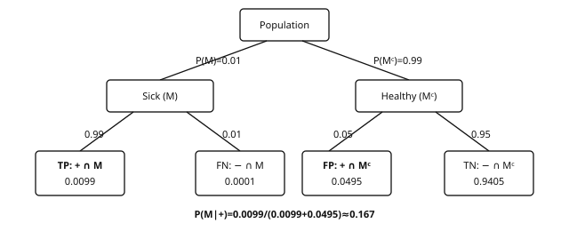{fig-alt="Bayes medical test probability tree" width="100%"}

::: ex
[Example 1.9 — Anti-spam filter (naive Bayes, with numbers)]{.tag} Suppose 40% of emails are spam, that the word “free” appears in 70% of spam emails and in 5% of legitimate emails. With the partition $\{S, S^c\}$, Bayes' formula gives
$$
\mathbb{P}(S \mid \text{word}) = \frac{0.7 \times 0.4}{0.7 \times 0.4 + 0.05 \times 0.6} = \frac{0.28}{0.31} \approx 0.90.
$$
With several words assumed independent given the class, the likelihoods multiply: this is the *naive Bayes* classifier, a useful text baseline. Note the generative direction of the reasoning: estimate $\mathbb{P}(\text{email} \mid S)$ from class-conditional counts, then invert it with Bayes to obtain the quantity of interest, $\mathbb{P}(S \mid \text{email})$.
:::

::: ex
[Example 1.10 — Classification: Bayes rule]{.tag} To classify an input $x$ among $K$ classes under the 0–1 loss, the optimal prediction is
$$
\hat{y}(x) \;=\; \arg\max_k\; \mathbb{P}(y = k \mid x) \;\overset{\text{Bayes}}{=}\; \arg\max_k\; \underbrace{p(x \mid y = k)}_{\text{class-conditional}}\; \underbrace{\mathbb{P}(y = k)}_{\text{prior}}.
$$
This predictor is called the **Bayes rule**; it minimizes the population classification error, and its error rate is the **Bayes error**, the lowest achievable with this information. The true conditional law is usually unknown: logistic regression and softmax classifiers estimate it. An autoregressive language model also estimates next-token probabilities, but generation may sample instead of taking an argmax, and sequence-level objectives need not coincide with token-level 0–1 loss.
:::

### 1.4. Simpson's paradox

::: ex
[Example 1.11 — A correlation that reverses]{.tag} A hospital tests two protocols, A and B. Results (patients cured / treated):

  Group          Protocol A           Protocol B
  -------------- -------------------- ---------------------
  Mild cases     **95 / 100 = 95%**   470 / 500 = 94%
  Severe cases   **80 / 200 = 40%**   8 / 50 = 16%
  **Overall**    175 / 300 = 58%      **478 / 550 = 87%**

A is better *within each subgroup*, but B is better *overall*: A received mostly severe cases (200/300), B mostly mild cases (500/550). Severity is a **confounding factor** the global table mixes in.
:::

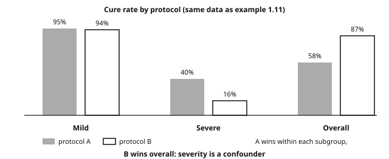{fig-alt="Simpson paradox grouped bars" width="100%"}

::: note
[Simpson, fairness and ML]{.tag} An aggregate association does not establish a causal effect. A model “neutral on average” may behave differently within subgroups. Inspect subgroup composition and data collection before concluding; adjustment should follow the study design and causal assumptions, not a blanket rule. These issues return in ML evaluation and chapter 9.
:::

::: recap
Key takeaways — chapter 1

-   A σ-algebra is both the set of events and a level of information, and a probability is a σ-additive measure with total mass 1.
-   The law of total probability splits an event according to a partition, and Bayes' formula inverts the conditioning without dropping the prior.
-   Mutual independence is strictly stronger than pairwise independence, and independence is not incompatibility.
-   Simpson's paradox shows that an aggregated association can reverse under stratification, so inspect the population composition and possible confounding before concluding.
:::

## 2. Random variables {#ch2}

::: def
[Definition 2.1 — Random variable]{.tag} A **real random variable** is a measurable map $X : \Omega \to \mathbb{R}$ (i.e. $X^{-1}(B) \in \mathcal{F}$ for every Borel set $B$). It is **discrete** if its image is at most countable, **with a density** if there exists $f \geq 0$ with $\int f = 1$ such that $\mathbb{P}(X \in A) = \int_A f(x)\,dx$. The **distribution** of $X$ is the pushforward measure $\mathbb{P}_X$: probabilities and expectations involving $X$ alone depend on this distribution, not on the particular underlying sample space.
:::

A standard *model* for a dataset is an $n$-tuple $X_1, \dots, X_n$ that is **iid** (independent, identically distributed) according to an unknown distribution $P$. This is an assumption to check, not a property automatically shared by rows, graph nodes, tokens or repeated measurements.

### 2.1. Cumulative distribution function

::: def
[Definition 2.2]{.tag} $F(t) = \mathbb{P}(X \leq t)$, defined on $\mathbb{R}$.
:::

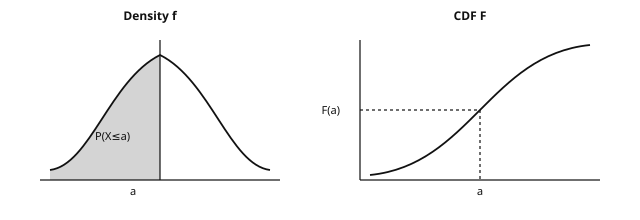{fig-alt="Density and CDF" width="100%"}

::: thm
[Theorem 2.3 — Characteristic properties]{.tag} $F$ is nondecreasing, right-continuous with left limits, with $\lim_{t \to -\infty} F(t) = 0$ and $\lim_{t \to +\infty} F(t) = 1$. Conversely, any function satisfying these properties is the CDF of a unique distribution. Furthermore $\mathbb{P}(a \lt X \leq b) = F(b) - F(a)$ and $\mathbb{P}(X = a) = F(a) - F(a^-)$: **$F$ entirely determines the distribution**.
:::

::: proof
For **monotonicity**, $s \leq t$ implies $\{X \leq s\} \subseteq \{X \leq t\}$, so $F(s) \leq F(t)$.

For the **difference formula**, decompose $\{X \leq b\} = \{X \leq a\} \sqcup \{a \lt X \leq b\}$ and apply additivity.

For **right-continuity**, the events $\{X\leq t+1/m\}$ decrease to $\{X\leq t\}$.

For the **limits**, $\{X \leq n\} \uparrow \Omega$ and $\{X \leq -n\} \downarrow \varnothing$.

For the **point mass**, $\{a - \tfrac1m \lt X \leq a\} \downarrow \{X = a\}$.

The converse follows from the measure extension theorem, admitted here. [∎]{.qed}
:::

::: note
[Usage: the inverse simulation method]{.tag} If $U \sim \mathcal{U}[0,1]$ and $F$ is continuous, strictly increasing on its support, then $X = F^{-1}(U)$ has distribution $F$, since $\mathbb{P}(F^{-1}(U) \leq x) = \mathbb{P}(U \leq F(x)) = F(x)$. A generalized inverse extends the method; rejection sampling is the other classic route.
:::

### 2.2. Variables with a density: change of variables

::: thm
[Theorem 2.4 — The Jacobian formula]{.tag} Let $X$ have density $f_X$ on an open set $D \subseteq \mathbb{R}^d$ and let $g : D \to \mathbb{R}^d$ be a $C^1$-diffeomorphism onto its image. Then $Y = g(X)$ has density
$$
f_Y(y) \;=\; f_X\big(g^{-1}(y)\big)\,\left|\det J_{g^{-1}}(y)\right|,
$$
where $J_{g^{-1}}$ is the Jacobian matrix of $g^{-1}$.
:::

::: proof
**Case $d=1$, $g$ increasing.** For every $t$ in the image, $\mathbb{P}(Y \leq t) = \mathbb{P}(g(X) \leq t) = \mathbb{P}(X \leq g^{-1}(t)) = F_X(g^{-1}(t))$; differentiating (chain rule) gives $f_Y(t) = f_X(g^{-1}(t)) \cdot (g^{-1})'(t)$.

If $g$ is decreasing, the direction of the inequality reverses and the derivative is negative: the absolute value restores the formula.

**Vector case.** The change-of-variables theorem for multiple integrals brings in $|\det J|$: local volume is dilated by the Jacobian factor, and a density must compensate inversely for the mass to remain 1. [∎]{.qed}
:::

::: ex
[Example 2.5 — Two transformations to know how to redo]{.tag}

**(a) Exponential by inversion.** Let $U \sim \mathcal{U}[0,1]$ and start from the target CDF $F_X(x) = 1 - e^{-\lambda x}$ for $x \geq 0$. Its inverse is $F^{-1}(u) = -\tfrac1\lambda\ln(1-u)$, so the variable
$$
X = -\tfrac{1}{\lambda}\ln(1-U)
$$
follows an $\mathcal{E}(\lambda)$ distribution. Since $1-U$ is also uniform on $[0,1]$, one equivalently writes $X = -\tfrac1\lambda \ln U$.

**(b) Gaussian standardization.** Let $X \sim \mathcal{N}(\mu, \sigma^2)$ with $\sigma>0$ and $Y = \tfrac{X-\mu}{\sigma}$. Here $g^{-1}(y) = \sigma y + \mu$ and $(g^{-1})'(y) = \sigma$, so the change-of-variables formula gives
$$
f_Y(y) = \tfrac{1}{\sigma\sqrt{2\pi}}\, e^{-\frac{(\sigma y + \mu - \mu)^2}{2\sigma^2}} \cdot \sigma = \tfrac{1}{\sqrt{2\pi}}\, e^{-y^2/2},
$$
which is the standard Gaussian density: $Y \sim \mathcal{N}(0,1)$.
:::

### 2.3. Expectation, moments, moment generating function {#moments}

::: def
[Definition 2.6 — Expectation]{.tag} Discrete: $\mathbb{E}[X] = \sum_x x\, p(x)$ if $\sum |x| p(x) \lt \infty$. With a density: $\mathbb{E}[X] = \int x f(x)\,dx$ if $\int |x| f(x)\,dx \lt \infty$. More generally $\mathbb{E}[h(X)] = \int h \,d\mathbb{P}_X$ when the expectation is defined—the *transfer formula*.
:::

::: prop
[Proposition 2.7 — Linearity, positivity, Tonelli]{.tag} For integrable variables, $\mathbb{E}[aX+bY] = a\,\mathbb{E}[X]+b\,\mathbb{E}[Y]$ *with no independence assumption*. Positivity: $X \geq 0 \Rightarrow \mathbb{E}[X] \geq 0$. **Tonelli/Fubini**: for $h \geq 0$ measurable (then integrable $h$), $\iint h\,d\mathbb{P}_X d\mathbb{P}_Y$ can be computed in either order. Consequence: $X \perp Y$ integrable $\Rightarrow \mathbb{E}[XY] = \mathbb{E}[X]\mathbb{E}[Y]$.
:::

::: prop
[Proposition 2.8 — Variance and moments]{.tag} $\mathrm{Var}(X) = \mathbb{E}[(X-\mathbb{E}X)^2] = \mathbb{E}[X^2] - (\mathbb{E}X)^2$; $\mathrm{Var}(aX+b) = a^2\mathrm{Var}(X)$; $\mathrm{Var}(aX+bY) = a^2\mathrm{Var}(X) + b^2\mathrm{Var}(Y) + 2ab\,\mathrm{Cov}(X,Y)$. The **$k$-th moment** is $\mathbb{E}[X^k]$; centered normalized moments of order 3 and 4 are *skewness* and *kurtosis*.
:::

::: ex
[Example 2.8b — Discrete $X$, every step visible]{.tag} Let $X\in\{1,2,3\}$ with probabilities $\tfrac12,\tfrac13,\tfrac16$:
$$
\mathbb{E}[X] = 1\cdot\tfrac12 + 2\cdot\tfrac13 + 3\cdot\tfrac16 = \tfrac53,
\qquad
\mathbb{E}[X^2] = 1\cdot\tfrac12 + 4\cdot\tfrac13 + 9\cdot\tfrac16 = \tfrac{10}{3},
$$
$$
\mathrm{Var}(X) = \tfrac{10}{3} - \big(\tfrac53\big)^2 = \tfrac{30-25}{9} = \tfrac59.
$$
Check: $\mathbb{E}[(X-\tfrac53)^2] = (1-\tfrac53)^2\cdot\tfrac12 + (2-\tfrac53)^2\cdot\tfrac13 + (3-\tfrac53)^2\cdot\tfrac16 = \tfrac59$.
:::

::: def
[Definition 2.9 — Moment generating function (MGF)]{.tag} The moment generating function of $X$ is $M_X(t) = \mathbb{E}[e^{tX}]$, assumed finite on an open neighborhood of $0$; having all polynomial moments alone does not guarantee this.

Three properties are used throughout. (i) Moments are read off by differentiating: $M_X^{(k)}(0) = \mathbb{E}[X^k]$. (ii) For independent variables the MGF of a sum factorizes: if $X \perp Y$, then $\boxed{M_{X+Y}(t) = M_X(t)\,M_Y(t)}$. (iii) An MGF finite around 0 characterizes the distribution. The standard cases to know are the Bernoulli $1-p+pe^t$, the Poisson $e^{\lambda(e^t-1)}$, the Gaussian $e^{\mu t + \sigma^2 t^2/2}$ and the exponential $\tfrac{\lambda}{\lambda - t}$ for $t \lt \lambda$.
:::

::: proof
For (ii), independence gives $\mathbb{E}[e^{t(X+Y)}] = \mathbb{E}[e^{tX}]\,\mathbb{E}[e^{tY}]$. For (i), neighborhood-finiteness justifies differentiating under the expectation, and evaluating at $t=0$ yields the moment. The uniqueness statement (iii) is admitted. [∎]{.qed}
:::

### 2.4. Basic inequalities

::: thm
[Theorem 2.10 — Markov]{.tag} If $X \geq 0$ and $a > 0$: $\mathbb{P}(X \geq a) \leq \dfrac{\mathbb{E}[X]}{a}$.
:::

::: proof
$\mathbb{E}[X] \geq \mathbb{E}[X\,\mathbf{1}_{X \geq a}] \geq a\,\mathbb{P}(X \geq a)$; isolate the probability. [∎]{.qed}
:::

::: ex
[Example 2.10b — Markov with numbers]{.tag} Let $X \geq 0$ with $\mathbb{E}[X]=2$. Markov's inequality bounds
$$
\mathbb{P}(X\geq 10)\;\leq\;\frac{2}{10}=0.2.
$$
Suppose in addition that $\mathrm{Var}(X)=1$. On the same event, the inclusion $\{X\geq10\}\subseteq\{|X-2|\geq8\}$ lets Chebyshev take over:
$$
\mathbb{P}(X\geq10)\;\leq\;\mathbb{P}(|X-2|\geq8)\;\leq\;\frac{1}{64}\approx0.0156.
$$
:::

::: thm
[Theorem 2.11 — Chebyshev (and Bienaymé)]{.tag} If $\mathrm{Var}(X) \lt \infty$ and $t > 0$: $\mathbb{P}\big(|X - \mathbb{E}X| \geq t\big) \leq \dfrac{\mathrm{Var}(X)}{t^2}$.
:::

::: proof
Apply Markov to the nonnegative variable $Y = (X - \mathbb{E}X)^2$ with $a = t^2$: $\mathbb{P}(|X-\mathbb{E}X| \geq t) = \mathbb{P}(Y \geq t^2) \leq \mathbb{E}[Y]/t^2 = \mathrm{Var}(X)/t^2$. [∎]{.qed}
:::

::: thm
[Theorem 2.12 — Cauchy-Schwarz]{.tag} For square-integrable $X,Y$, $|\mathbb{E}[XY]| \leq \sqrt{\mathbb{E}[X^2]\,\mathbb{E}[Y^2]}$, with equality iff $X$ and $Y$ are linearly dependent in $L^2$. In particular $|\rho_{X,Y}| \leq 1$ whenever the correlation is defined.
:::

::: proof
For every $\lambda \in \mathbb{R}$, $0 \leq \mathbb{E}[(X + \lambda Y)^2] = \mathbb{E}[X^2] + 2\lambda\,\mathbb{E}[XY] + \lambda^2\mathbb{E}[Y^2]$. If $\mathbb{E}[Y^2]>0$, this quadratic is nonnegative, hence its discriminant is $\leq 0$: $4\,\mathbb{E}[XY]^2 - 4\,\mathbb{E}[X^2]\mathbb{E}[Y^2] \leq 0$. Equality means some linear combination is zero a.s. The case $\mathbb{E}[Y^2]=0$ is immediate. [∎]{.qed}
:::

### 2.5. Covariance, correlation, independence: untangling

::: def
[Definition 2.13]{.tag} For square-integrable variables, $\mathrm{Cov}(X,Y) = \mathbb{E}[(X-\mathbb{E}X)(Y-\mathbb{E}Y)] = \mathbb{E}[XY] - \mathbb{E}X\,\mathbb{E}Y$. If both standard deviations are positive, $\rho_{X,Y} = \mathrm{Cov}(X,Y)/(\sigma_X\sigma_Y) \in [-1,1]$.
:::

::: prop
[Proposition 2.14 — The direction of the implications]{.tag} Independence implies $\mathrm{Cov}(X,Y) = 0$ whenever the moments exist. The converse is **false**, for three distinct reasons.

-   **Uncorrelated yet dependent.** Take $X$ uniform on $\{-1,0,1\}$ and $Y = X^2$: then $\mathrm{Cov}(X,Y) = 0$ although $Y$ is a deterministic function of $X$. Linear correlation does not detect nonlinear dependencies.
-   **Correlation without a causal link.** Two variables driven by a common third cause can be highly correlated, as in the Simpson reversal of example 1.11.
-   **Extreme correlation is affine.** If both variances are positive, $|\rho| = 1$ holds if and only if $Y = aX+b$ almost surely for some $a\neq0$.
:::

### 2.6. Random vectors and conditional expectation {#conditional-expectation}

For a vector with joint density, **marginals** integrate out the other variables: $f_{X_1}(x_1) = \int f\,dx_2 \dots dx_d$. The **conditional density** is $f_{X\mid Y}(x \mid y) = f(x,y)/f_Y(y)$ when $f_Y(y)>0$, and Bayes reads in densities: $f_{Y\mid X}(y \mid x) \propto f_{X\mid Y}(x\mid y)\, f_Y(y)$.

::: def
[Definition 2.15 — Conditional expectation]{.tag} $\mathbb{E}[X \mid Y = y] = \int x \, f_{X\mid Y}(x\mid y)\,dx$, and $\mathbb{E}[X \mid Y] = g(Y)$. For square-integrable $X$, this is the *best approximation of $X$ by a function of $Y$* in least squares: $\mathbb{E}[(X - h(Y))^2] \geq \mathbb{E}[(X - g(Y))^2]$ for every square-integrable $h(Y)$ — the projection theorem in $L^2$. Tower property: $\mathbb{E}[\mathbb{E}[X \mid Y]] = \mathbb{E}[X]$. Law of total variance:
$$
\mathrm{Var}(X) = \mathbb{E}[\mathrm{Var}(X\mid Y)] + \mathrm{Var}(\mathbb{E}[X \mid Y]),
$$
variance *within* + variance *between* groups — the identity behind ANOVA.
:::

::: note
[Connection with regression]{.tag} The optimal predictor of $Y$ from $X$ under squared loss is the **regression function** $x \mapsto \mathbb{E}[Y \mid X = x]$; the irreducible error is $\mathbb{E}[\mathrm{Var}(Y\mid X)]$. Linear models, networks and forests approximate this object; other losses have other optimal targets.
:::

### 2.7. Generating and manipulating distributions in Python

~~~python
import numpy as np

rng = np.random.default_rng(seed=42)          # modern generator (PCG64)
x = rng.normal(loc=0.0, scale=1.0, size=1000) # 1000 draws from N(0,1)
u = rng.uniform(0, 1, size=100_000)

# Inverse method (theorem 2.4 + section 2.1): uniform U -> exponential
lam = 2.0
expo = -np.log(1.0 - u) / lam
print(expo.mean().round(4), (1/lam))          # ~0.5 = E[X] of E(2)

# Histogram (empirical density) and the model density
import matplotlib.pyplot as plt
plt.hist(x, bins=40, density=True, alpha=.6, label='sample')
grid = np.linspace(-4, 4, 200)
plt.plot(grid, np.exp(-grid**2/2)/np.sqrt(2*np.pi), 'r', label='N(0,1) density')
plt.legend(); plt.show()

print(x.mean(), x.var(ddof=1))   # empirical mean, unbiased variance
print(np.quantile(x, [0.25, 0.5, 0.75]))  # empirical quantiles (chap. 3)
~~~

::: recap
Key takeaways — chapter 2

-   The CDF characterizes the distribution, and inverse-CDF sampling transforms uniforms into samples of any target law.
-   Under a change of variables, $f_Y(y) = f_X(g^{-1}(y))\,|\det J_{g^{-1}}(y)|$; the Jacobian compensates for the local volume change.
-   An MGF finite near 0 yields the moments by differentiation and factorizes over sums of independent variables.
-   Markov's inequality implies Chebyshev's, which in turn proves the finite-variance LLN in chapter 4.
-   Uncorrelated does not mean independent, as the counterexample $Y = X^2$ shows.
:::

## 3. Common probability distributions {#ch3}

These are reusable modeling “bricks”. Know their support, parameters, expectation and variance, and recognize *when* they appear. Use the table as a reference rather than a memorization gate.

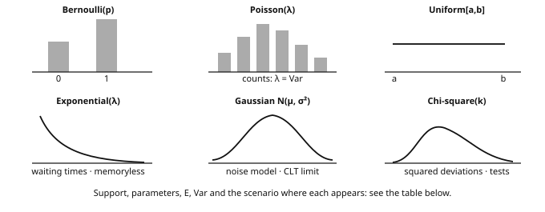{fig-alt="Gallery of common distribution shapes" width="100%"}

  Distribution                                      Parameters                Expectation                         Variance                                                     Typical use in ML
  ------------------------------------------------- ------------------------- ----------------------------------- ------------------------------------------------------------ -------------------------------------------------------------------------------
  Bernoulli $p$                                     $p \in [0,1]$             $p$                                 $p(1-p)$                                                     binary label, classifier
  Binomial $\mathcal{B}(n,p)$                        $n, p$                    $np$                                $np(1-p)$                                                    number of successes / errors over $n$ trials
  Multinomial $\mathrm{Mult}(n,(p_1,\dots,p_K))$      $n$, probabilities $p_k$  $np_k$ (per cell)                    $np_k(1-p_k)$                                                class counts, categorical predictions, $\chi^2$ test
  Geometric $p$                                     $0<p\leq1$                $1/p$                               $(1-p)/p^2$                                                  trials up to and including the first success; rejection sampling
  Hypergeometric                                    $N,K,n$                   $nK/N$                              $n\frac{K}{N}(1-\frac{K}{N})\frac{N-n}{N-1}$                    sampling without replacement
  Uniform $\mathcal{U}[a,b]$                         $a<b$                     $\tfrac{a+b}{2}$                    $\tfrac{(b-a)^2}{12}$                                        initialization, inverse-method simulation
  Exponential $\mathcal{E}(\lambda)$                 $\lambda>0$               $1/\lambda$                         $1/\lambda^2$                                                lifetimes, queues, Poisson waiting times
  Poisson $\mathcal{P}(\lambda)$                     $\lambda>0$               $\lambda$                           $\lambda$                                                    event counts, Poisson regression
  Gamma $\Gamma(a,b)$ (shape $a$, scale $b$)          $a,b>0$                   $ab$                                $ab^2$                                                       aggregated durations, conjugate priors on precision
  Beta $\mathrm{Beta}(a,b)$                          $a,b>0$                   $\tfrac{a}{a+b}$                    $\tfrac{ab}{(a+b)^2(a+b+1)}$                                  distribution of an unknown probability; Bernoulli conjugate prior
  Gaussian $\mathcal{N}(\mu,\sigma^2)$               $\mu,\sigma^2>0$          $\mu$                               $\sigma^2$                                                   noise, Gaussian posterior models, diffusion
  Chi-square $\chi^2_k$                              $k\in\mathbb{N}_{>0}$     $k$                                 $2k$                                                         goodness-of-fit tests, squared deviations, empirical variance
  Student $t_k$                                     $k>0$                     $0\ (k>1)$                          $\tfrac{k}{k-2}\ (k>2)$                                       confidence intervals in small Gaussian samples
  Fisher $\mathcal{F}(d_1,d_2)$                      $d_1,d_2>0$               $\tfrac{d_2}{d_2-2}\ (d_2>2)$       $\tfrac{2d_2^2(d_1+d_2-2)}{d_1(d_2-2)^2(d_2-4)}\ (d_2>4)$     comparison of variances, ANOVA

Conventions: **Gamma uses shape and scale** throughout these notes; the Laplace (double-exponential) distribution is distinct from Poisson and exponential — its link to $\ell_1$ regularization appears in chapter 8.

::: def
[Definition 3.1 — Multivariate Gaussian distribution]{.tag} $X \sim \mathcal{N}(\mu, \Sigma)$ with $\mu \in \mathbb{R}^d$ and $\Sigma$ a symmetric positive definite covariance matrix has density
$$
f(x) = \frac{1}{(2\pi)^{d/2}\,(\det\Sigma)^{1/2}} \exp\!\Big(-\tfrac12 (x-\mu)^\top \Sigma^{-1} (x-\mu)\Big).
$$
For a **jointly Gaussian** vector, uncorrelated components ($\Sigma$ diagonal) are independent—a guarantee that does not hold for arbitrary distributions. An equivalent characterization is that every linear combination $a^\top X$ is a real Gaussian. This characterization also covers degenerate Gaussian vectors with positive semidefinite covariance, which need not have a density on all of $\mathbb{R}^d$.
:::

::: ex
[Example 3.0b — Bernoulli and exponential, plug-in numbers]{.tag}

**(Bernoulli).** A coin has unknown bias $p$, and the observations $x_{1:5}=(1,0,1,1,0)$ contain $s=3$ successes in $n=5$ trials. The likelihood and the log-likelihood are
$$
L(p)=p^3(1-p)^2,
\qquad
\ell(p)=3\log p + 2\log(1-p).
$$
Setting the derivative to zero gives the maximizer:
$$
\ell'(p)=\frac{3}{p}-\frac{2}{1-p}=0
\;\Longleftrightarrow\;
3(1-p)=2p
\;\Longleftrightarrow\;
\hat p_{\mathrm{MLE}}=\frac{3}{5}=0.6.
$$
The second derivative $\ell''(0.6)=-3/(0.6)^2-2/(0.4)^2<0$ confirms that this is a maximum.

**(Exponential).** The density is $f(x)=\lambda e^{-\lambda x}$ for $x>0$, and the sample is $(1.2,\,0.4,\,2.0)$ hours. The likelihood is $\lambda^3 e^{-\lambda(1.2+0.4+2.0)}=\lambda^3 e^{-3.6\lambda}$, and the score equation gives
$$
\frac{3}{\lambda}-3.6=0
\qquad\Longleftrightarrow\qquad
\hat\lambda_{\mathrm{MLE}}=\frac{3}{3.6}=\frac{5}{6}\approx 0.833 \text{ per hour.}
$$
The plug-in estimate of the mean is $\widehat{\mathbb{E}[X]}=1/\hat\lambda=1.2$ hours, which matches the sample mean $(1.2+0.4+2.0)/3=1.2$.
:::

### 3.1. Gaussians: marginals and conditionals {#gaussian-conditioning}

::: thm
[Theorem 3.2 — Gaussian conditioning]{.tag} Let $(X, Y)$ be a Gaussian vector with mean $(\mu_X, \mu_Y)$ and block covariance $\Sigma = \begin{pmatrix} \Sigma_{XX} & \Sigma_{XY} \\ \Sigma_{YX} & \Sigma_{YY}\end{pmatrix}$, with $\Sigma_{XX}$ invertible. Then:

-   **Gaussian marginals**: $X \sim \mathcal{N}(\mu_X, \Sigma_{XX})$ (projections of a Gaussian vector are Gaussian—by the linear characterization);
-   **Gaussian conditional**:
$$
Y \mid X = x \;\sim\; \mathcal{N}\big(\mu_Y + \Sigma_{YX}\Sigma_{XX}^{-1}(x - \mu_X),\;\; \Sigma_{YY} - \Sigma_{YX}\Sigma_{XX}^{-1}\Sigma_{XY}\big).
$$
The conditional mean is *affine in $x$* and the conditional covariance is *constant*.
:::

::: proof
One can complete the square in the joint density, or construct an independent residual. Set $A = \Sigma_{YX}\Sigma_{XX}^{-1}$ and the random vector $Z = Y - \mu_Y - A(X-\mu_X)$. The vector $\binom{X-\mu_X}{Z}$ is an affine transformation of the Gaussian $(X,Y)$, hence Gaussian. Its cross-covariance is
$$
\mathrm{Cov}(X-\mu_X,Z)
= \Sigma_{XY}-\Sigma_{XX}A^\top
= \Sigma_{XY}-\Sigma_{XX}\Sigma_{XX}^{-1}\Sigma_{XY}
=0.
$$
Joint Gaussianity turns zero cross-covariance into independence. Thus $Z$ is independent of $X$, and
$$
Z\sim\mathcal{N}\big(0,\Sigma_{YY}-\Sigma_{YX}\Sigma_{XX}^{-1}\Sigma_{XY}\big).
$$
Rearrange $Y=\mu_Y+A(X-\mu_X)+Z$ and then condition on $X=x$: the first two terms become a constant, while the residual distribution stays unchanged. [∎]{.qed}
:::

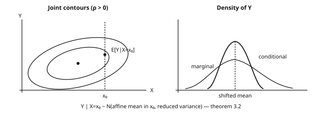{fig-alt="Gaussian conditioning: joint contours and conditional density" width="100%"}

::: note
[Where this theorem is reused]{.tag} Gaussian regression, Kalman filtering, Gaussian processes and latent-variable models all use it, as do the linear-Gaussian forward transitions of diffusion models — though learned reverse transitions are not exactly Gaussian. In one sentence: *conditioning a jointly Gaussian vector shifts the mean affinely and reduces the covariance by $\Sigma_{YX}\Sigma_{XX}^{-1}\Sigma_{XY}$.*
:::

### 3.2. Sums of variables: stability under convolution

::: thm
[Theorem 3.3 — Sums of independent variables]{.tag} If $X \perp Y$ and densities exist, the density of $X+Y$ is the **convolution product** $f_{X+Y}(z) = \int f_X(x) f_Y(z-x)\,dx$; use sums for discrete mass functions. Via the MGF (definition 2.9): $M_{X+Y} = M_X M_Y$. Families **closed under sums of independent variables** include:

  Family                                                            Sum                                                     MGF verification
  ----------------------------------------------------------------- ------------------------------------------------------- ------------------------------------------------------------
  $\mathcal{B}(n_1,p)$, $\mathcal{B}(n_2,p)$                          $\mathcal{B}(n_1+n_2,p)$                                $(1-p+pe^t)^{n_1+n_2}$
  $\mathcal{P}(\lambda_1)$, $\mathcal{P}(\lambda_2)$                  $\mathcal{P}(\lambda_1+\lambda_2)$                       $e^{(\lambda_1+\lambda_2)(e^t-1)}$
  $\Gamma(a_1,b)$, $\Gamma(a_2,b)$                                   $\Gamma(a_1+a_2,b)$ (same scale)                         $(1-bt)^{-(a_1+a_2)}$
  $\mathcal{N}(\mu_1,\sigma_1^2)$, $\mathcal{N}(\mu_2,\sigma_2^2)$    $\mathcal{N}(\mu_1+\mu_2,\sigma_1^2+\sigma_2^2)$         $e^{(\mu_1+\mu_2)t+(\sigma_1^2+\sigma_2^2)t^2/2}$
  $\chi^2_{k_1}$, $\chi^2_{k_2}$                                    $\chi^2_{k_1+k_2}$                                      special case of gamma

A sample mean is a *scaled* sum; it need not belong to the same named family as the observations (a scaled binomial is not generally binomial). For iid variables with finite variance, its expectation stays constant and its variance is divided by $n$.
:::

::: ex
[Example 3.4 — Gaussian sum, in one line of MGF]{.tag} For independent $X \sim \mathcal{N}(\mu_1,\sigma_1^2)$ and $Y \sim \mathcal{N}(\mu_2,\sigma_2^2)$, the MGF of the sum factorizes and recombines:
$$
M_{X+Y}(t) = e^{\mu_1 t + \sigma_1^2 t^2/2}\cdot e^{\mu_2 t + \sigma_2^2 t^2/2}
= e^{(\mu_1+\mu_2)t + (\sigma_1^2+\sigma_2^2)t^2/2}.
$$
This is the MGF of $\mathcal{N}(\mu_1+\mu_2, \sigma_1^2+\sigma_2^2)$. Variances add, so the standard deviation of the sum is $\sqrt{\sigma_1^2+\sigma_2^2}$, not $\sigma_1+\sigma_2$; averaging $n$ independent observations produces the $1/\sqrt n$ reduction of chapter 4.
:::

### 3.3. Order statistics

::: prop
[Proposition 3.5 — Distributions of the minimum and the maximum]{.tag} For $X_1, \dots, X_n$ iid with cumulative distribution function $F$:
$$
\mathbb{P}(\max_i X_i \leq t) = F(t)^n, \qquad \mathbb{P}(\min_i X_i \leq t) = 1 - \big(1 - F(t)\big)^n.
$$
More generally $X_{(k)}$ (the $k$-th smallest) serves to define **quantiles**: one convention for the empirical quantile of order $q\in(0,1]$ is $X_{(\lceil qn \rceil)}$. Software may interpolate between adjacent order statistics.
:::

::: proof
$\{\max \leq t\} = \bigcap_i \{X_i \leq t\}$ and the events are independent: product of the $n$ probabilities $F(t)$. Likewise $\{\min > t\} = \bigcap_i \{X_i > t\}$, with probability $(1-F(t))^n$. [∎]{.qed}
:::

::: ex
[Example 3.6 — Maximum of uniforms and quantiles in code]{.tag} If $X_i \sim \mathcal{U}[0,1]$, $\max_i X_i$ has density $n t^{n-1}$ on $(0,1)$, the derivative of $t^n$: it is a $\mathrm{Beta}(n,1)$ distribution with expectation $\frac{n}{n+1}$. With $n = 9$ trials, the expected best score is already 0.9. Selection pushes a maximum toward the extreme. If the scores are noisy validation measurements, this also illustrates why selecting the best reported score does not by itself demonstrate an improvement in population performance.

~~~python
import numpy as np
rng = np.random.default_rng(0)
x = rng.uniform(0, 1, size=(10_000, 9))
print(x.max(axis=1).mean().round(3))   # ~0.900 = n/(n+1)
q = np.quantile(rng.normal(size=100_000), [0.05, 0.25, 0.5, 0.75, 0.95])
print(q.round(3))                    # ~[-1.645 -0.674 0 0.674 1.645]
~~~
:::

::: note
[The Gaussian and ML]{.tag} The Gaussian appears as regression noise, weight initialization, a diffusion building block and a conjugate prior — roles explained by linear stability, the CLT and affine conditioning. None makes Gaussianity a default truth about a dataset.
:::

::: recap
Key takeaways — chapter 3

-   For each family in the table, know the expectation, the variance and a modeling scenario where it appears.
-   Jointly Gaussian vectors have Gaussian marginals and Gaussian conditionals, with a conditional mean affine in the conditioning value.
-   Densities of independent sums are convolutions, and the families closed under such sums are the binomial with shared $p$, the Poisson, the gamma with shared scale, the Gaussian and the $\chi^2$.
-   The maximum has CDF $F^n$ and the minimum has CDF $1-(1-F)^n$; empirical quantiles follow by ordering the sample, possibly with interpolation.
:::

## 4. Convergence and limit theorems {#ch4}

ML optimizes on a *finite* sample and hopes for good performance on future data. Limit theorems describe how empirical averages behave under a sampling model — they do not by themselves justify selecting a predictor after inspecting that sample (chapter 10).

::: def
[Definition 4.1 — Modes of convergence]{.tag} Let $(X_n)$ and $X$ be real random variables.

-   **Almost sure (a.s.)**: $\mathbb{P}\big(\lim X_n = X\big) = 1$;
-   **In probability**: $\forall \varepsilon > 0,\; \mathbb{P}(|X_n - X| > \varepsilon) \to 0$;
-   **In $L^p$**, $p>0$: $\mathbb{E}|X_n - X|^p \to 0$;
-   **In distribution**: $F_{X_n}(t) \to F_X(t)$ at every continuity point of $F_X$.
:::

::: prop
[Proposition 4.2 — Implications (and their proofs)]{.tag} Almost sure $\Rightarrow$ in probability $\Rightarrow$ in distribution; $L^p$ $\Rightarrow$ in probability. The converses are false in general.
:::

::: proof
For **$L^p \Rightarrow$ probability**, apply Markov's inequality to $|X_n-X|^p$.

For **a.s. $\Rightarrow$ probability**, consider $A_n(\varepsilon) = \bigcup_{k \geq n}\{|X_k - X| > \varepsilon\}$, a decreasing sequence of events whose intersection — "deviations larger than $\varepsilon$ occur infinitely often" — has probability zero under a.s. convergence. Since $\{|X_n - X| > \varepsilon\} \subseteq A_n$, we get $\mathbb{P}(|X_n - X| > \varepsilon) \leq \mathbb{P}(A_n) \to 0$.

For **probability $\Rightarrow$ distribution**, take a continuity point $t$ and bound
$$
F(t-\varepsilon) - \mathbb{P}(|X_n-X|>\varepsilon) \;\leq\; F_n(t) \;\leq\; F(t+\varepsilon) + \mathbb{P}(|X_n-X|>\varepsilon),
$$
then let $\varepsilon\downarrow0$.

For the **counterexamples**, take independent variables equal to $n$ with probability $1/n$ and to $0$ otherwise. They converge in probability to $0$, yet $\mathbb{E}|X_n|=1$ rules out $L^1$ convergence, and Borel-Cantelli (using $\sum 1/n = \infty$) shows the jumps occur infinitely often, ruling out a.s. convergence. Finally, $X_n=(-1)^n Z$ with $Z$ symmetric and nondegenerate has a constant distribution but converges in no stronger sense. [∎]{.qed}
:::

::: thm
[Theorem 4.3 — (Weak) law of large numbers]{.tag} Let $(X_n)$ be iid with $\mathbb{E}|X_1| < \infty$ and $\mu = \mathbb{E}X_1$. Then
$$
\bar{X}_n = \frac{1}{n}\sum_{i=1}^n X_i \;\xrightarrow[n\to\infty]{\mathbb{P}}\; \mu .
$$
:::

::: proof
Under the stronger finite-variance assumption $\sigma^2 < \infty$: $\mathbb{E}[\bar X_n] = \mu$ by linearity, and by independence $\mathrm{Var}(\bar X_n) = \sigma^2/n$.

Chebyshev then gives $\mathbb{P}(|\bar X_n - \mu| \geq \varepsilon) \leq \sigma^2/(n\varepsilon^2) \to 0$. The integrable-only version follows by truncation, or from the iid strong law. [∎]{.qed}
:::

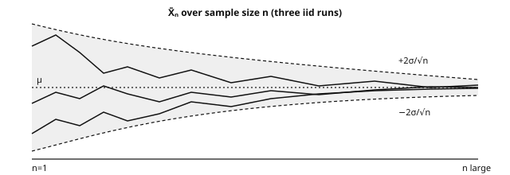{fig-alt="LLN sample paths in a shrinking funnel" width="100%"}

::: thm
[Theorem 4.4 — Central limit theorem (CLT)]{.tag} Let $(X_n)$ be iid, $\mu = \mathbb{E}X_1$, $0<\sigma^2 = \mathrm{Var}(X_1) < \infty$. Then
$$
\frac{\bar{X}_n - \mu}{\sigma / \sqrt{n}} \;\xrightarrow[n\to\infty]{(\text{dist.})}\; \mathcal{N}(0,1).
$$
In other words: $\bar X_n \approx \mathcal{N}\big(\mu, \tfrac{\sigma^2}{n}\big)$ for sufficiently large $n$, with approximation quality depending on the distribution.
:::

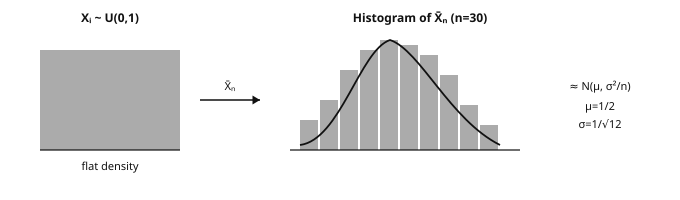{fig-alt="CLT schematic" width="100%"}

::: ex
[Example 4.4b — Fair die, written CLT table]{.tag} Fair die: $\mu=3.5$, $\sigma^2=35/12\approx 2.9167$. For $n$ iid rolls, theory gives $\mathrm{sd}(\bar X_n)=\sigma/\sqrt{n}$. One Monte Carlo run (2000 repeats, seed 0) versus theory:

  $n$   Empirical mean of $\bar X_n$   Empirical sd   Theory $\sigma/\sqrt{n}$
  ----- ----------------------------- -------------- ------------------------
  1     3.579                         1.690          1.708
  5     3.489                         0.747          0.764
  20    3.492                         0.382          0.382
  100   3.502                         0.171          0.171

By $n=20$ the observed standard deviation closely matches the $1/\sqrt n$ calculation. The Gaussian *shape* is the CLT contribution; the variance identity itself is exact under independence and finite variance.
:::

::: proof
**MGF sketch** (extra assumption: the MGF exists around 0). With $Z_i = \frac{X_i - \mu}{\sigma}$ and $S_n = \frac1{\sqrt n}\sum_i Z_i$, Taylor expansion gives $M_Z(t/\sqrt n) = 1+\frac{t^2}{2n}+o(1/n)$, and independence yields
$$
M_{S_n}(t) = \Big(1 + \frac{t^2}{2n} + o\Big(\frac1n\Big)\Big)^{\!n} \to e^{t^2/2},
$$
the MGF of $\mathcal{N}(0,1)$, using $(1+a/n)^n\to e^a$.

For the stated finite-variance theorem, the characteristic function $\varphi_Z(t/\sqrt n)=1-t^2/(2n)+o(1/n)$ (always existing) tends to $e^{-t^2/2}$, and Lévy's continuity theorem concludes. The limit is Gaussian regardless of the initial shape, *within the assumptions*. [∎]{.qed}
:::

::: prop
[Proposition 4.5 — The $1/\sqrt n$ rate, with orders of magnitude]{.tag} The standard deviation of an iid sample mean is $\sigma/\sqrt n$. Concretely:

  $n$                      10    100   10,000   1,000,000
  ------------------------ ----- ----- -------- -----------
  error reduction factor   3.2   10    100      1,000

Dividing this sampling standard error by 2 requires **4 times more independent observations**; dividing it by 10 requires 100 times more. This explains the value of variance-reduction methods such as importance sampling and antithetic variables in Monte Carlo estimation. It is not a universal rate for every learning problem, nor a remedy for bias or distribution shift.
:::

::: thm
[Theorem 4.6 — Delta method]{.tag} If $\sqrt n (\bar X_n - \mu) \to \mathcal{N}(0, \sigma^2)$ in distribution and $g$ is $C^1$ near $\mu$ with $g'(\mu) \neq 0$, then
$$
\sqrt n\,\big(g(\bar X_n) - g(\mu)\big)
\;\xrightarrow{(\text{dist.})}\;
\mathcal{N}\big(0,\; \sigma^2\,g'(\mu)^2\big).
$$
:::

::: proof
A Taylor expansion gives $g(\bar X_n) = g(\mu) + g'(\mu)(\bar X_n - \mu) + o(|\bar X_n - \mu|)$. After multiplication by $\sqrt n$, the remainder is $o_p(1)$, and the CLT together with Slutsky's lemma concludes on the linearized term.

As an example, for $g=\log$ with $\mu>0$,
$$
\sqrt n\,(\log\bar X_n-\log\mu)\;\xrightarrow{(\text{dist.})}\;\mathcal{N}\big(0,\ \sigma^2/\mu^2\big),
$$
and the logit of a probability estimator behaves the same way away from the boundaries 0 and 1. [∎]{.qed}
:::

### 4.1. Empirical quantiles and the bootstrap {#bootstrap}

The **empirical CDF** $F_n(t) = \frac1n \sum_i \mathbf{1}_{X_i \leq t}$ is a plug-in estimator of $F$; Glivenko-Cantelli strengthens the LLN: $\sup_t |F_n(t)-F(t)|\to0$ a.s. Quantiles follow by inversion.

To approximate uncertainty for a nonlinear statistic (median, ratio, AUC), the **nonparametric bootstrap** resamples $B$ times *with replacement*, recomputes the statistic, and reads off the bootstrap quantiles:

~~~python
import numpy as np
rng = np.random.default_rng(0)
x = rng.standard_t(df=3, size=200)  # symmetric, heavy-tailed distribution

B = 5_000
boot_med = np.array([np.median(rng.choice(x, size=len(x), replace=True))
                     for _ in range(B)])
lo, hi = np.quantile(boot_med, [0.025, 0.975])
print(f"95% bootstrap CI of the median: [{lo:.3f}, {hi:.3f}]")
# Percentile interval = [2.5%, 97.5%] bootstrap quantiles; an approximation,
# not exact in finite samples. Validity depends on the statistic (bootstrap
# can fail for extrema) and on the independence structure: time series and
# related graph observations may need block or cluster resampling instead.
~~~

::: ex
[Example 4.7 — Numerical verification of the CLT]{.tag}

~~~python
import numpy as np
rng = np.random.default_rng(0)
for n in [1, 5, 30, 200]:
    # 5000 repetitions of the mean of n independent uniforms [0,1]
    means = rng.uniform(0, 1, size=(5000, n)).mean(axis=1)
    std = means.std()
    print(f"n={n:4d}  observed std = {std:.4f} "
          f"(theory 1/sqrt(12 n) = {1/np.sqrt(12*n):.4f})")
~~~

The observed standard deviation approaches $1/\sqrt{12n}$. Uniforms behave well by $n=30$ here, but there is no universal “30 samples is enough” rule: heavy tails, rare events and dependence break that shortcut.
:::

::: note
[When the row count is not the information count]{.tag} In general,
$$
\mathrm{Var}(\bar X_n)
=\frac{1}{n^2}\left(\sum_i\mathrm{Var}(X_i)
+2\sum_{i<j}\mathrm{Cov}(X_i,X_j)\right).
$$
The iid result drops the covariance terms; questions from one document, linked graph nodes or repeated device measurements retain them. Define the deployment target, split unit and uncertainty unit before reporting an iid standard error.
:::

::: recap
Key takeaways — chapter 4

-   Almost sure convergence implies convergence in probability, which implies convergence in distribution; $L^p$ convergence also implies convergence in probability, and none of the converses hold in general.
-   The finite-variance LLN proof combines Chebyshev's inequality with the identity $\mathrm{Var}(\bar X_n)=\sigma^2/n$.
-   The CLT states that standardized fluctuations approach a Gaussian; the MGF sketch needs an extra assumption, while the characteristic-function proof only needs finite variance.
-   The delta method propagates a limit through a derivative, and the bootstrap approximates a sampling distribution by resampling, subject to validity conditions.
-   Independence and the sampling unit are part of the calculation, not optional footnotes.
:::

## 5. Parametric estimation {#ch5}

Assume the data distribution belongs to a family $\{p_\theta:\theta\in\Theta\}$ and seek $\theta$ from an iid sample. This chapter develops bias/variance, likelihood and information; chapter 6 turns them into intervals and tests.

::: def
[Definition 5.1 — Estimator, bias, squared risk]{.tag} An **estimator** $\hat\theta_n = g(X_1,\dots,X_n)$ is a statistic used to estimate $\theta$. Its **bias** is $b(\hat\theta) = \mathbb{E}_\theta[\hat\theta] - \theta$, and its **squared risk** (mean squared error, MSE) is $\mathbb{E}_\theta[(\hat\theta - \theta)^2]$.
:::

::: thm
[Theorem 5.2 — Bias-variance decomposition]{.tag}
$$
\mathbb{E}[(\hat\theta - \theta)^2]
= \underbrace{\big(\mathbb{E}[\hat\theta] - \theta\big)^2}_{\text{bias}^2}
+ \underbrace{\mathrm{Var}(\hat\theta)}_{\text{variance}}.
$$
:::

::: proof
Set $m=\mathbb{E}[\hat\theta]$ and write $\hat\theta-\theta=(\hat\theta-m)+(m-\theta)$. Expand the square and take expectations:
$$
\mathbb{E}[(\hat\theta-m)^2]
+2(m-\theta)\underbrace{\mathbb{E}[\hat\theta-m]}_{=0}
+(m-\theta)^2
=\mathrm{Var}(\hat\theta)+b(\hat\theta)^2.
$$
The cross term vanishes by the definition of the expectation. [∎]{.qed}
:::

::: ex
[Example 5.3 — Why $n-1$: bias of the empirical variance]{.tag} Consider the biased empirical variance $S_n^2 = \frac1n\sum_i (X_i - \bar X_n)^2$. The key identity is
$$
\sum_i (X_i-\bar X_n)^2=\sum_i(X_i-\mu)^2-n(\bar X_n-\mu)^2,
$$
and taking expectations gives $(n-1)\sigma^2$, so
$$
\mathbb{E}[S_n^2]=\frac{n-1}{n}\,\sigma^2<\sigma^2.
$$
The downward bias comes from estimating $\mu$ with the same observations. Dividing by $n-1$ instead of $n$ removes it — though unbiasedness of $s^2$ does not transfer to its square root $s$.
:::

::: def
[Definition 5.4 — Likelihood and maximum likelihood (MLE)]{.tag} The **likelihood** of an iid sample is $L(\theta) = \prod_{i=1}^n p_\theta(X_i)$ (density or mass), viewed as a function of $\theta$ for the observed data. The **log-likelihood** is $\ell(\theta) = \sum_i \log p_\theta(X_i)$. A **maximum likelihood estimator** is $\hat\theta_{\mathrm{MLE}} \in \arg\max_\theta \ell(\theta)$ when a maximizer exists.
:::

::: ex
[Example 5.0b — Gaussian MLE with a 4-point sample]{.tag} Consider the observations $x=(2.0,\,2.5,\,1.5,\,2.0)$ and a $\mathcal{N}(\mu,\sigma^2)$ model with both parameters unknown. The MLE of the mean is the sample mean:
$$
\hat\mu = \bar x = \frac{2+2.5+1.5+2}{4} = 2.0.
$$
The MLE of the variance divides by $n$:
$$
\hat\sigma^2_{\mathrm{MLE}} = \frac1n\sum_i (x_i-\bar x)^2
  = \frac{(0)^2+(0.5)^2+(-0.5)^2+(0)^2}{4} = 0.125.
$$
The unbiased estimator $s^2$ divides by $n-1=3$ instead, giving $s^2=0.5/3\approx0.1667$. At the MLE, the log-likelihood equals $\ell=-\tfrac n2\log(2\pi\hat\sigma^2)-\tfrac n2$.
:::

### 5.1. Score and Fisher information {#fisher}

::: def
[Definition 5.5 — Score]{.tag} The **score** is the derivative of the log-likelihood of one observation: $s(\theta) = \nabla_\theta \log p_\theta(X)$. For an iid sample, the score is $\sum_i s_i(\theta)$.
:::

::: thm
[Theorem 5.6 — Two properties of the score]{.tag} Under regularity, including a suitable common support and justified differentiation under the integral:
$$
\text{(i)}\;\; \mathbb{E}_\theta[s(\theta)] = 0,\qquad
\text{(ii)}\;\; \mathrm{Var}_\theta[s(\theta)]
= \mathbb{E}_\theta[-\nabla^2_\theta\log p_\theta(X)]
=:I(\theta).
$$
For a vector parameter, $\mathrm{Var}$ denotes the covariance matrix. $I(\theta)$ is the **Fisher information**: score variability, equivalently the negative expected curvature of the log-likelihood.
:::

::: proof
For (i), start from the identity $\int p_\theta(x)\,dx = 1$, valid for every $\theta$, and differentiate under the integral sign:
$$
0=\int\nabla_\theta p_\theta(x)\,dx
=\int\frac{\nabla_\theta p_\theta(x)}{p_\theta(x)}\,p_\theta(x)\,dx
=\mathbb{E}_\theta[\nabla_\theta\log p_\theta(X)].
$$

For (ii), differentiate $\int\nabla_\theta p_\theta\,dx=0$ a second time. Using the product identity $\nabla^2p=(\nabla^2\log p)\,p+(\nabla\log p)(\nabla\log p)^\top p$, we obtain
$$
0=\mathbb{E}_\theta[\nabla^2_\theta\log p_\theta(X)]
+\mathbb{E}_\theta\big[\nabla_\theta\log p_\theta(X)\,
\nabla_\theta\log p_\theta(X)^\top\big].
$$

Therefore $\mathbb{E}[ss^\top]=-\mathbb{E}[\nabla^2\log p]=I(\theta)$, and the zero mean established in (i) makes this matrix the score covariance. [∎]{.qed}
:::

::: thm
[Theorem 5.7 — Cramér-Rao bound]{.tag} For a scalar parameter and a regular unbiased estimator $\hat\theta$, with positive finite information:
$$
\mathrm{Var}(\hat\theta)\;\geq\;\frac{1}{I_n(\theta)},
\qquad I_n(\theta)=nI(\theta)\quad\text{(iid sample)}.
$$
Within this class, variance cannot be smaller than the inverse information. The efficiency ratio is $1/(I_n\,\mathrm{Var}(\hat\theta))$. The bound does not say that every biased estimator has a larger MSE.
:::

::: thm
[Theorem 5.8 — Asymptotic properties of the MLE]{.tag} Under regularity (correct specification, identifiability, fixed-dimensional interior parameter, smoothness, nonsingular information), the MLE is *consistent* and *asymptotically normal*:
$$
\sqrt n(\hat\theta_n-\theta^\star)
\xrightarrow{(\text{dist.})}
\mathcal{N}\big(0,I(\theta^\star)^{-1}\big).
$$
Boundary parameters, singular models, misspecification or growing dimension need separate analysis — no automatic guarantee for every neural-network likelihood.
:::

### 5.2. MLE of the usual distributions, fully derived {#mle-examples}

::: ex
[Example 5.9 — Gaussian MLE]{.tag} For $X_i\sim\mathcal{N}(\mu,\sigma^2)$, the log-likelihood is
$$
\ell(\mu,\sigma^2)=-\frac n2\log(2\pi\sigma^2)-\frac1{2\sigma^2}\sum_i(X_i-\mu)^2.
$$
Setting the $\mu$-derivative to zero, $\frac1{\sigma^2}\sum_i(X_i-\mu)=0$, yields $\hat\mu_{\mathrm{MLE}}=\bar X_n$. Setting the $\sigma^2$-derivative to zero then yields
$$
\hat\sigma^2_{\mathrm{MLE}}=\frac1n\sum_i(X_i-\bar X_n)^2.
$$
This is exactly the biased estimator of example 5.3: dividing by $n-1$ corrects the bias but can increase the MSE, so unbiasedness and minimum risk are different objectives.
:::

::: ex
[Example 5.10 — Exponential MLE]{.tag} The exponential log-likelihood is $\ell(\lambda)=n\log\lambda-\lambda\sum_iX_i$. Its derivative vanishes when
$$
\ell'(\lambda)=\frac n\lambda-\sum_iX_i=0
\qquad\Longleftrightarrow\qquad
\boxed{\hat\lambda=\frac1{\bar X_n}}.
$$
Since $\ell''(\lambda)<0$, this is the maximum. The estimator is nonlinear and biased, because $\mathbb{E}[1/\bar X_n]\neq1/\mathbb{E}[\bar X_n]$; it is nonetheless consistent by the LLN, and the delta method describes its fluctuations.
:::

::: ex
[Example 5.11 — Bernoulli MLE]{.tag} With $k=\sum_iX_i$ successes, the log-likelihood is $\ell(p)=k\log p+(n-k)\log(1-p)$. For $0<k<n$, setting the derivative to zero gives
$$
\ell'(p)=\frac kp-\frac{n-k}{1-p}=0
\qquad\Longleftrightarrow\qquad
\boxed{\hat p=\frac{k}{n}}.
$$
For $k=0$ or $k=n$, the maximizer is the corresponding boundary value. The negative average log-likelihood is exactly the binary cross-entropy of this constant-probability model; conditional Bernoulli models give the usual classification loss.
:::

::: ex
[Example 5.12 — Poisson MLE]{.tag} The Poisson log-likelihood is
$$
\ell(\lambda)=-n\lambda+\Big(\sum_iX_i\Big)\log\lambda-\sum_i\log(X_i!),
$$
and the score equation $-n+\frac{\sum_iX_i}{\lambda}=0$ gives $\boxed{\hat\lambda=\bar X_n}$, with $\lambda=0$ as the degenerate boundary case. The corresponding negative log-likelihood is the standard loss for count data such as events or clicks.
:::

::: note
[MLE = loss minimization]{.tag} Maximizing $\ell$ = minimizing $\frac1n\sum_i-\log p_\theta(X_i)$: with fixed Gaussian variance, scaled squared error; for Bernoulli outcomes, binary cross-entropy. Chapter 10 makes the conditional version explicit.
:::

### 5.3. Method of moments and plug-in

::: def
[Definition 5.13 — Method of moments]{.tag} The method of moments equates theoretical moments to the empirical ones $m_k=\frac1n\sum_iX_i^k$ and solves for the parameters; for a Gaussian this gives $\mu=m_1$ and $\sigma^2=m_2-m_1^2$. Consistency requires the moments to exist, to identify the parameter, and the inverse map to be continuous. These estimators are often less efficient than a regular MLE but easier to compute, and they are useful for initializing iterative methods such as EM.
:::

::: def
[Definition 5.14 — Plug-in principle]{.tag} The plug-in principle estimates a distributional functional $T(F)$ by $T(F_n)$, where $F_n$ is the empirical distribution: the mean, a proportion or a quantile are each estimated by their empirical counterpart. Consistency requires conditions on both the sample and the functional — Glivenko-Cantelli does not make every conceivable functional consistent. The empirical risk of chapter 10 is itself a plug-in construction.
:::

::: recap
Key takeaways — chapter 5

-   The MSE decomposes as bias² + variance, and the proof is the cancellation of a centered cross term.
-   Under regularity the score has zero expectation, and the Fisher information is at once the score covariance and the negative expected curvature.
-   The Cramér-Rao bound limits regular unbiased estimation, while MLE efficiency is an asymptotic result under regularity.
-   Be able to re-derive the Gaussian, exponential, Bernoulli and Poisson MLEs from scratch.
-   Moment and plug-in estimators are useful constructions, provided their identification and continuity conditions are checked.
:::

## 6. Confidence intervals and tests {#ch6}

### 6.1. Confidence intervals: construction by pivot quantity {#confidence-intervals}

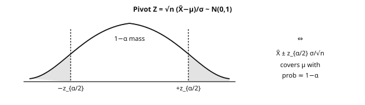{fig-alt="CI via normal pivot" width="100%"}

::: def
[Definition 6.1]{.tag} A **confidence interval** of level $1-\alpha$ for $\theta$ is a statistic $I(X_1,\dots,X_n)$ such that $\mathbb{P}_\theta(\theta\in I)\geq1-\alpha$ for every parameter value in the model. An asymptotic interval replaces this finite-sample guarantee with a limiting one.
:::

::: thm
[Theorem 6.2 — z interval (known variance), construction]{.tag} If $X_i$ are iid $\mathcal{N}(\mu,\sigma^2)$ with $\sigma>0$ known, then
$$
I=\Big[\bar X_n-z_{1-\alpha/2}\frac{\sigma}{\sqrt n},
\;\bar X_n+z_{1-\alpha/2}\frac{\sigma}{\sqrt n}\Big]
$$
is an exact confidence interval of level $1-\alpha$, where $z_q$ is the standard Gaussian quantile: $z_{0.975}\approx1.96$.
:::

::: proof
The **pivot** $T=\frac{\bar X_n-\mu}{\sigma/\sqrt n}$ depends on data and parameter but has a parameter-free distribution: Gaussian stability gives $T\sim\mathcal{N}(0,1)$, so $\mathbb{P}(-z\leq T\leq z)=1-\alpha$ with $z=z_{1-\alpha/2}$.

The event $\{-z\leq T\leq z\}$ *is* $\{\bar X_n\pm z\sigma/\sqrt n \ni \mu\}$: same event, same probability.

The interval is random before sampling; $\mu$ is fixed — the frequentist statement is a property of the procedure, not a posterior probability for $\mu$. [∎]{.qed}
:::

::: prop
[Proposition 6.3 — Student and chi-square]{.tag} Under the same iid Gaussian model:

-   **t interval, unknown variance:** let $S=\sqrt{\frac1{n-1}\sum_i(X_i-\bar X_n)^2}$. Then $\frac{\bar X_n-\mu}{S/\sqrt n}\sim t_{n-1}$. The pivot is a standard Gaussian divided by an independent $\sqrt{\chi^2_{n-1}/(n-1)}$, using orthogonal Gaussian mean and residual components. The interval is $\bar X_n\pm t_{1-\alpha/2,n-1}S/\sqrt n$. It is wider than the z construction at the same estimated scale; $t_k\to\mathcal{N}(0,1)$ as the denominator concentrates at 1.
-   **CI for variance:** $\frac{(n-1)S^2}{\sigma^2}\sim\chi^2_{n-1}$ gives
$$
\Big[\frac{(n-1)S^2}{\chi^2_{1-\alpha/2,n-1}},
\;\frac{(n-1)S^2}{\chi^2_{\alpha/2,n-1}}\Big].
$$
The $\chi^2$ distribution is asymmetric, so the interval need not be symmetric around $S^2$.
:::

::: ex
[Example 6.1b — $z$-interval, step table]{.tag} Suppose $\sigma=2$ is known, with $n=25$, $\bar x=10.4$ and level $95\%$, so the critical value is $z_{0.975}=1.96$. The computation runs in three steps:

  Step   Computation
  ------ ------------------------------------------------------------
  1      SE $=\sigma/\sqrt n=2/5=0.4$
  2      Margin $=1.96\times0.4=0.784$
  3      CI $=10.4\pm0.784=[9.616,11.184]$

The interpretation is that the *procedure* covers $\mu$ in 95% of repeated samples under the model; it is not a posterior statement of the form $\mathbb{P}(\mu\in\mathrm{CI}\mid\text{data})=0.95$. See [the Bayesian contrast](#credible-vs-confidence).
:::

::: ex
[Example 6.3b — $t$-interval vs $z$, same numbers]{.tag} Now suppose $\sigma$ is unknown and estimated by $s=2.0$, with the same $n=25$, $\bar x=10.4$ and level 95%. There are 24 degrees of freedom and $t_{0.975,24}\approx2.064$:

  Step   $z$ (if $\sigma=2$ were known)   $t$ (estimating $\sigma$)
  ------ -------------------------------- ----------------------------
  SE     $2/5=0.4$                       $0.4$
  Crit.  $1.96$                          $2.064$
  CI     $[9.616,11.184]$                 $[9.574,11.226]$

The $t$ interval is slightly wider — the price of estimating $\sigma$ under the Gaussian model.
:::

### 6.2. Hypothesis testing: the Neyman-Pearson framework

A test compares $H_0$ (null hypothesis) with $H_1$ (alternative). Choose a test statistic $T$ and a rejection region $R$:

               We do not reject $H_0$               We reject $H_0$
  ------------ ------------------------------------ -------------------------------------------------
  $H_0$ true   correct                             **type I error** (probability at most the level $\alpha$)
  $H_1$ true   **type II error** (probability $\beta$)  correct (probability $1-\beta$, the **power**)

Power depends on the particular alternative. The **p-value** is the probability, under the null model, of a statistic at least as extreme as the observed one; reject when $p\leq\alpha$. A more stringent threshold lowers power; more independent observations can raise it against a fixed nonzero effect — but cannot repair a biased design or a misspecified null.

::: thm
[Theorem 6.4 — Neyman-Pearson lemma]{.tag} To test two simple hypotheses $H_0:\theta=\theta_0$ and $H_1:\theta=\theta_1$, with densities or mass functions $f_0,f_1$, a most powerful level-$\alpha$ test rejects for large **likelihood ratio** $f_1(X)/f_0(X)$. Choose the threshold $c$ to attain the level; randomization at equality may be needed for discrete data.
:::

::: proof
Let $\varphi=\mathbf{1}_{f_1/f_0>c}$ have exact level $\alpha$ and let $\psi$ be any test with $\mathbb{E}_0[\psi]\leq\alpha$. Pointwise, $(\varphi-\psi)(f_1-cf_0)\geq0$ (both factors change sign together). Integrating:
$$
\mathbb{E}_1[\varphi]-\mathbb{E}_1[\psi]
\geq c\big(\mathbb{E}_0[\varphi]-\mathbb{E}_0[\psi]\big)\geq0.
$$
With boundary randomization, $f_1-cf_0=0$ on the boundary and the same proof works. [∎]{.qed}
:::

::: note
[Scope]{.tag} Optimality holds for the stated pair of simple hypotheses — it motivates many tests but is not universal for composite ones. The t, chi-square and F distributions arise from exact Gaussian calculations or asymptotics. The Bayes classifier compares the same likelihood ratio, weighted by priors and costs.
:::

### 6.3. Tests on means: z, t, Welch

  Test                    Statistic                                              Assumptions                                                   Use
  ----------------------- ------------------------------------------------------ ------------------------------------------------------------- ----------------------------------
  z (one mean)            $\sqrt n(\bar X-\mu_0)/\sigma$                         known $\sigma$; iid Gaussian for exactness, or justified CLT     compare a mean to a reference
  one-sample t            $\sqrt n(\bar X-\mu_0)/S$                              exact $t_{n-1}$ under iid Gaussian sampling                     same, unknown $\sigma$
  paired t                t statistic on $D_i=X_i-Y_i$                          independent pairs; Gaussian differences for exactness          compare two measurements on the same units
  two-sample t (pooled)    $\frac{\bar X-\bar Y}{S_p\sqrt{1/n+1/m}}$              independent Gaussian groups, equal variances                   compare two group means
  Welch                   $\frac{\bar X-\bar Y}{\sqrt{S_X^2/n+S_Y^2/m}}$        independent groups, unequal variances, approximate adjusted df  useful default for two independent means

~~~python
from scipy import stats
import numpy as np
rng = np.random.default_rng(3)
a = rng.normal(10.2, 2.0, 50)      # group A
b = rng.normal( 9.4, 2.4, 60)      # group B (different variance)

t_stat, p_value = stats.ttest_ind(a, b, equal_var=False)   # Welch
print(f"t = {t_stat:.3f}, p = {p_value:.4f}")
# If p < 0.05, reject equality of means at the preselected 5% level.
# p does NOT mean "probability that the means are equal".
~~~

### 6.4. Chi-square tests

::: thm
[Theorem 6.5 — Goodness of fit]{.tag} To test $H_0:X\sim(p_1,\dots,p_K)$ with specified probabilities, let $O_k$ be observed counts and $E_k=np_k$ expected counts. For iid observations,
$$
T=\sum_{k=1}^K\frac{(O_k-E_k)^2}{E_k}
\;\xrightarrow[n\to\infty]{(\text{dist.})}\;\chi^2_{K-1}.
$$
*Sketch:* a vector CLT on multinomial counts; the standardized fluctuations sum to zero, leaving a rank-$K-1$ Gaussian whose squared norm is $\chi^2_{K-1}$. Sparse expected counts degrade the approximation, and fitted probabilities change the degrees of freedom.
:::

::: ex
[Example 6.6 — Is a die fair?]{.tag} A die is rolled 120 times, giving observed counts $(18,20,16,22,24,20)$ where the fair-die model expects 20 everywhere. The statistic is
$$
T=\frac{(18-20)^2+(20-20)^2+(16-20)^2+(22-20)^2+(24-20)^2+(20-20)^2}{20}
=\frac{4+0+16+4+16+0}{20}=2.0.
$$
With 5 degrees of freedom, the p-value is approximately $0.85$: this sample provides no evidence against the fair-die model, which of course does not prove the die is fair.
:::

::: prop
[Proposition 6.7 — Independence on a contingency table]{.tag} For an $r\times c$ table with counts $O_{ij}$ and margins $n_{i\cdot},n_{\cdot j}$, expected counts under independence are $E_{ij}=n_{i\cdot}n_{\cdot j}/n$, and under the usual large-count conditions
$$
T=\sum_{i,j}\frac{(O_{ij}-E_{ij})^2}{E_{ij}}
\;\to\;\chi^2_{(r-1)(c-1)}.
$$
Margin constraints leave $(r-1)(c-1)$ degrees of freedom. For a 2×2 table with cells $a,b,c,d$: $T=\frac{n(ad-bc)^2}{(a+b)(c+d)(a+c)(b+d)}$. Useful for categorical association checks and outcome-frequency audits across slices — a calibration claim needs its own calibration null.
:::

### 6.5. One-way ANOVA

::: thm
[Theorem 6.8 — Decomposition and F test]{.tag} Let $K$ groups have sizes $n_k$, observations $Y_{kj}$, group means $\bar Y_k$ and overall mean $\bar Y$, with $n=\sum_kn_k$. Then
$$
\underbrace{\sum_{k,j}(Y_{kj}-\bar Y)^2}_{\text{SST (total)}}
=
\underbrace{\sum_kn_k(\bar Y_k-\bar Y)^2}_{\text{SSB (between groups)}}
+
\underbrace{\sum_{k,j}(Y_{kj}-\bar Y_k)^2}_{\text{SSW (residual)}}.
$$
The cross term cancels because $\sum_j(Y_{kj}-\bar Y_k)=0$ in each group. Under $H_0$ of equal means, independent Gaussian errors and a common variance,
$$
F=\frac{\mathrm{SSB}/(K-1)}{\mathrm{SSW}/(n-K)}
\sim\mathcal{F}(K-1,n-K).
$$
Reject for large $F$. This compares between-group to within-group variation. ANOVA is also a linear model with group indicators, connecting to chapter 7.
:::

~~~python
import numpy as np
from scipy import stats
rng = np.random.default_rng(0)
g1, g2, g3 = rng.normal(5.0, 1, 30), rng.normal(5.3, 1, 30), rng.normal(5.1, 1, 30)
F, p = stats.f_oneway(g1, g2, g3)
print(f"F = {F:.3f}, p = {p:.4f}")
# Read the simulated result rather than assuming a particular p-value.
# Also inspect group means and effect sizes.
~~~

### 6.6. p-values: correct reading and multiple testing {#multiple-testing}

::: note
[Pitfalls and good practices]{.tag}

-   A p-value is **not** $\mathbb{P}(H_0\mid\text{data})$: “$p=0.03$, so $H_0$ has a 3% chance of being true” reverses the conditioning, exactly like the medical-test mistake.
-   $p>\alpha$ is not proof of no effect (low power); large samples can make negligible effects significant — report effect sizes and intervals.
-   **Multiple testing:** with 20 independent true-null tests at 5%, $\mathbb{P}(\text{at least one false positive})=1-0.95^{20}\approx64\%$. **Bonferroni** tests each of $m$ hypotheses at $\alpha/m$ (union bound, no independence needed; conservative). **Benjamini-Hochberg** controls the false discovery rate under independence or positive dependence. Repeatedly choosing prompts, graph variants or configurations on one evaluation set is the same selection problem — a final p-value does not erase that history.
:::

::: recap
Key takeaways — chapter 6

-   Construct a confidence interval by inverting a pivot with a known distribution, and distinguish exact from asymptotic coverage.
-   The Neyman-Pearson lemma gives likelihood-ratio optimality for a pair of simple hypotheses.
-   Welch's test is a useful default for two independent means, and paired data call for a paired analysis.
-   The $\chi^2$ statistic compares counts with model expectations, while ANOVA compares between-group and within-group variation.
-   A p-value is a null tail probability for a statistic, not a posterior probability of $H_0$.
:::

## 7. Linear regression {#ch7}

A complete predictive baseline in one model: loss, optimization, uncertainty, diagnostics. Write
$$
y=X\beta^\star+\varepsilon,
\qquad X\in\mathbb{R}^{n\times p},\quad
\beta^\star\in\mathbb{R}^p,\quad y,\varepsilon\in\mathbb{R}^n.
$$
$p$ counts all coefficients, intercept included. For inference, treat $X$ as fixed with full column rank, $n>p$, and $\varepsilon\sim\mathcal{N}(0,\sigma^2I_n)$; least-squares *fitting* itself needs no Gaussian noise.

### 7.1. Least squares: the geometry of projection {#least-squares}

::: thm
[Theorem 7.1 — Geometric characterization]{.tag} A minimizer of $\|y-X\beta\|^2$ is characterized by
$$
X^\top(y-X\hat\beta)=0
\qquad\text{(normal equations)}.
$$
The **residual is orthogonal to the columns of $X$**: $\hat y=X\hat\beta$ is the orthogonal projection of $y$ onto $\mathrm{Im}(X)$. The fitted vector is always unique; $\hat\beta$ is unique when the columns of $X$ are independent, in which case $\hat\beta=(X^\top X)^{-1}X^\top y$.
:::

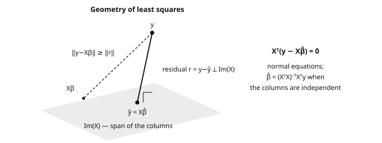{fig-alt="OLS projection geometry" width="100%"}

::: proof
*By computation:* $\|y-X\beta\|^2$ is convex with gradient $2X^\top(X\beta-y)$.

*By geometry:* decompose $y=\Pi y+(I-\Pi)y$ with $\Pi$ the projection onto $\mathrm{Im}(X)$; orthogonality gives
$$
\|y-X\beta\|^2=\|(I-\Pi)y\|^2+\|\Pi y-X\beta\|^2,
$$
where the first term is constant and the second vanishes at $\hat y=\Pi y$.

Hence the residual lies in $\mathrm{Im}(X)^\perp$ — the normal equations — and $\|y\|^2=\|\hat y\|^2+\|y-\hat y\|^2$, the decomposition behind $R^2$. [∎]{.qed}
:::

::: thm
[Theorem 7.2 — Gauss-Markov]{.tag} Under full column rank, $\mathbb{E}[\varepsilon]=0$ and $\mathrm{Cov}(\varepsilon)=\sigma^2I_n$, least squares has minimal covariance among estimators of $\beta^\star$ that are linear in $y$ and unbiased (“BLUE”). Gaussianity is not needed for this comparison. With Gaussian noise, least squares is also the MLE for $\beta^\star$.
:::

::: proof
Write a linear unbiased estimator as $\delta=Cy$, where $CX=I_p$. Set $D=C-(X^\top X)^{-1}X^\top$, so $DX=0$. Then $\delta=\hat\beta+Dy$, and
$$
CC^\top=(X^\top X)^{-1}+DD^\top,
$$
because the cross term $(X^\top X)^{-1}X^\top D^\top=(X^\top X)^{-1}(DX)^\top$ vanishes.

Therefore
$$
\mathrm{Cov}(\delta)
=\mathrm{Cov}(\hat\beta)+\sigma^2DD^\top
\succcurlyeq \mathrm{Cov}(\hat\beta)
=\sigma^2(X^\top X)^{-1}.
$$

The matrix $DD^\top$ is positive semidefinite, so every linear combination has at least as much variance under $\delta$. For Gaussian noise, the log-likelihood in $\beta$ is $-\frac1{2\sigma^2}\|y-X\beta\|^2+\text{const.}$: maximizing it is least squares. [∎]{.qed}
:::

### 7.2. Inference on the coefficients

::: thm
[Theorem 7.3 — Exact distribution of $\hat\beta$ under Gaussian noise]{.tag}
$$
\hat\beta\sim\mathcal{N}\big(\beta^\star,\sigma^2(X^\top X)^{-1}\big),
\qquad
\frac{(n-p)\hat\sigma^2}{\sigma^2}\sim\chi^2_{n-p},
\qquad
\hat\sigma^2=\frac{\|y-X\hat\beta\|^2}{n-p}.
$$
The coefficient estimator and residual variance estimator are independent.
:::

::: proof
$\hat\beta=\beta^\star+(X^\top X)^{-1}X^\top\varepsilon$ is an affine transformation of a Gaussian vector, with covariance $\sigma^2(X^\top X)^{-1}$.

For the residual, $r=(I-H)\varepsilon$ with $H=X(X^\top X)^{-1}X^\top$ an orthogonal projector of rank $n-p$: $\|r\|^2/\sigma^2\sim\chi^2_{n-p}$.

Independence follows from $H(I-H)=0$ (zero cross-covariance, jointly Gaussian). Estimating $p$ coefficients leaves $n-p$ residual dimensions — same mechanism as $n-1$ for one mean. [∎]{.qed}
:::

::: prop
[Proposition 7.4 — t tests and per-coefficient intervals]{.tag}
$$
t_j=\frac{\hat\beta_j}{\hat\sigma\sqrt{[(X^\top X)^{-1}]_{jj}}}
\sim t_{n-p}
\quad\text{under }H_0:\beta_j=0.
$$
A coefficient CI is $\hat\beta_j\pm t_{1-\alpha/2,n-p}\hat\sigma\sqrt{[(X^\top X)^{-1}]_{jj}}$. These are the classical regression-table calculations, conditional on the stated model and design. Choosing features after inspecting their significance requires additional selection-aware analysis.
:::

~~~python
import numpy as np
from scipy import stats
rng = np.random.default_rng(1)
n, p = 200, 3
X = np.column_stack([np.ones(n), rng.uniform(0, 10, n), rng.normal(0, 1, n)])
beta_star = np.array([1.0, 2.0, -0.5])
y = X @ beta_star + rng.normal(0, 2.0, n)

# Least squares + full inference by hand (theorem 7.3)
XtX_inv = np.linalg.inv(X.T @ X)
beta_hat = XtX_inv @ X.T @ y
resid = y - X @ beta_hat
sigma2_hat = resid @ resid / (n - p)
se = np.sqrt(np.diag(XtX_inv) * sigma2_hat)
t_stat = beta_hat / se
pvals = 2 * stats.t.sf(np.abs(t_stat), df=n - p)
print(np.c_[beta_hat, se, t_stat, pvals].round(4))
# A realized |t| near 1 gives a two-sided p near 0.3.
# For a prespecified pure-noise coefficient, however, the null p-value varies:
# it is not guaranteed to be nonsignificant in a particular sample.

# Same estimation with scikit-learn; this does not provide the inference table
from sklearn.linear_model import LinearRegression
print(LinearRegression().fit(X[:, 1:], y).coef_.round(3))
~~~

The explicit inverse mirrors the formulas. For numerical fitting, prefer QR/SVD-based least squares such as `np.linalg.lstsq(X, y, rcond=None)`, especially when columns are nearly dependent.

### 7.3. Goodness of fit and diagnostics {#regression-diagnostics}

::: prop
[Proposition 7.5 — $R^2$ and adjusted $R^2$]{.tag} For in-sample least squares with an intercept,
$$
R^2=1-\frac{\sum_i(y_i-\hat y_i)^2}{\sum_i(y_i-\bar y)^2}
=\frac{\mathrm{SSB}}{\mathrm{SST}},
\qquad
F=\frac{R^2/(p-1)}{(1-R^2)/(n-p)}
$$
(the Gaussian test that all slopes are zero). Adding columns mechanically increases training $R^2$; **adjusted** $R^2=1-(1-R^2)\frac{n-1}{n-p}$ partially corrects, but model selection still needs validation — held-out $R^2$ can be negative.
:::

::: prop
[Proposition 7.6 — Diagnostics to check systematically]{.tag}

-   **Residuals vs fitted values:** look for a structureless scatter with roughly constant spread. A funnel shape indicates heteroscedasticity, which invalidates the classical standard errors unless a variance model or robust correction is used; curvature indicates a misspecified conditional mean.
-   **QQ-plot of residuals:** this checks the Gaussian assumption behind the exact t/F inference, remembering that fitted residuals are constrained and are not iid draws.
-   **Leverages:** the values $h_{ii}=[H]_{ii}$ lie in $[0,1]$ and sum to $p$. The heuristic $h_{ii}>2p/n$ flags unusual predictor values to *inspect*, not to delete automatically; studentized residuals and Cook's distance combine leverage and residual size.
-   **Multicollinearity:** nearly dependent columns inflate $(X^\top X)^{-1}$ and destabilize the coefficients. The remedies are to remove or combine redundant predictors, or to use ridge regularization.
:::

::: prop
[Proposition 7.7 — Confidence interval vs prediction interval]{.tag} For a new predictor vector $x_0\in\mathbb{R}^p$, the CI for the mean $x_0^\top\beta^\star$ is
$$
\hat y_0\pm t_{1-\alpha/2,n-p}\hat\sigma
\sqrt{x_0^\top(X^\top X)^{-1}x_0}.
$$
For an independent future observation with the same Gaussian noise model, the prediction interval adds individual noise:
$$
\hat y_0\pm t_{1-\alpha/2,n-p}\hat\sigma
\sqrt{1+x_0^\top(X^\top X)^{-1}x_0}.
$$
The “$1+$” makes it wider. Predicting an average outcome is not the same uncertainty problem as predicting an individual outcome.
:::

::: recap
Key takeaways — chapter 7

-   Least squares is an orthogonal projection, so the residual is orthogonal to every column of $X$.
-   Gauss-Markov makes OLS the best linear unbiased estimator under second-moment assumptions, and Gaussian noise additionally makes it the MLE.
-   Gaussian coefficients combined with an independent $\chi^2_{n-p}$ residual statistic yield the classical t tests.
-   A confidence interval for the mean is not a prediction interval, and diagnostics plus held-out evaluation should precede any performance claim.
:::

## 8. Bayesian statistics {#ch8}

After 8 successes in 10 trials, the empirical frequency is 0.8 but a uniform Beta prior gives a posterior mean of 0.75: the difference is a modeling choice about uncertainty, not an arithmetic disagreement. The frequentist treats the parameter as fixed; the Bayesian represents uncertainty about it with a prior and updates that distribution with the data. This chapter is optional deepening, useful for posterior inference, latent-variable models and uncertainty analysis.

::: def
[Definition 8.1 — Prior, posterior]{.tag}
$$
\pi(\theta\mid X_1,\dots,X_n)
=\frac{L(\theta)\pi(\theta)}{\int L(u)\pi(u)\,du}
\qquad(\text{posterior}\propto\text{likelihood}\times\text{prior}),
$$
when the evidence (the denominator, independent of $\theta$) is positive and finite. Sequential updating reuses today's posterior as tomorrow's prior.
:::

### 8.1. Conjugacy: Bernoulli-Beta

::: thm
[Theorem 8.2]{.tag} If $\theta\sim\mathrm{Beta}(a,b)$ and $X_i\mid\theta$ are iid Bernoulli($\theta$), then
$$
\theta\mid X_1,\dots,X_n
\sim\mathrm{Beta}(a+k,b+n-k),
\qquad k=\sum_iX_i.
$$
:::

::: proof
Prior $\propto\theta^{a-1}(1-\theta)^{b-1}$ times likelihood $\theta^k(1-\theta)^{n-k}$ gives $\pi(\theta\mid x)\propto\theta^{a+k-1}(1-\theta)^{b+n-k-1}$ — the kernel of a Beta($a+k,b+n-k$) density. The family is closed under the update: **conjugacy**. [∎]{.qed}
:::

::: ex
[Example 8.3 — Sequential updating, with numbers]{.tag} Start from the prior $\mathrm{Beta}(1,1)$ — the uniform, which is a particular choice rather than "knowing nothing". Observing 8 successes in 10 trials updates it to the posterior $\mathrm{Beta}(9,3)$. Its mean is $9/12=0.75$, to be compared with the MLE 0.8, and its 95% equal-tail credible interval, read from the 2.5% and 97.5% quantiles, is approximately $[0.482,0.940]$. Each new observation updates the two counts — the mechanism behind Bayesian bandits.

~~~python
from scipy import stats
post = stats.beta(9, 3)
print(post.mean().round(3), post.ppf([0.025, 0.975]).round(3))
~~~
:::

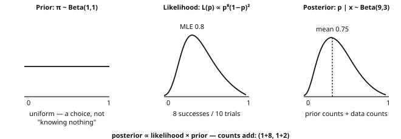{fig-alt="Bayesian updating prior likelihood posterior" width="100%"}

### 8.2. Gaussian-Gaussian conjugacy

::: thm
[Theorem 8.4]{.tag} Model: $X_i\mid\mu$ iid $\mathcal{N}(\mu,\sigma^2)$ with known $\sigma>0$; prior $\mu\sim\mathcal{N}(\mu_0,\tau^2)$, $\tau>0$. Then
$$
\mu\mid\bar X_n
\sim\mathcal{N}\!\left(
\frac{\mu_0/\tau^2+n\bar X_n/\sigma^2}{1/\tau^2+n/\sigma^2},
\;\frac1{1/\tau^2+n/\sigma^2}
\right).
$$
:::

::: proof
Write $p=1/\tau^2$ and $q=n/\sigma^2$ for the **precisions** in this calculation. As a function of $\mu$, the prior times likelihood is proportional to
$$
\exp\Big(-\frac p2(\mu-\mu_0)^2-\frac q2(\mu-\bar X_n)^2\Big).
$$
Complete the square:
$$
-\frac p2(\mu-\mu_0)^2-\frac q2(\mu-\bar X_n)^2
=-\frac{p+q}{2}\Big(\mu-\frac{p\mu_0+q\bar X_n}{p+q}\Big)^2
+\text{const.},
$$
where the constant does not depend on $\mu$. This is a Gaussian kernel with precision $p+q$ and a precision-weighted arithmetic mean. [∎]{.qed}
:::

::: note
[Precisions add up]{.tag} The posterior variance $1/(p+q)$ is smaller than both $1/p$ and $1/q$; with a fixed proper prior, $q=n/\sigma^2$ eventually dominates and the posterior concentrates at $\bar X_n$ with variance $\sigma^2/n$. "The data eventually dominate" holds in this regime — not a universal guarantee for weakly identified or growing-dimensional problems.
:::

### 8.3. Credible interval vs confidence interval {#credible-vs-confidence}

::: def
[Definition 8.5 — Credible interval]{.tag} A $1-\alpha$ credible interval satisfies $\mathbb{P}(\theta\in C\mid\text{data})=1-\alpha$ under the posterior: a probability about $\theta$ given the observed data and model. A confidence interval instead has a repeated-sampling coverage property for fixed $\theta$.
:::

::: ex
[Example 8.6 — The same experiment, two readings]{.tag} Known $\sigma=1$, one observation $x=0.7$. *Frequentist:* $[x-1.96,x+1.96]=[-1.26,2.66]$ belongs to a procedure covering the fixed mean in 95% of repeated samples — not a probability about this particular interval. *Bayesian:* the flat prior gives $\mu\mid x\sim\mathcal{N}(x,1)$, and the same interval satisfies $\mathbb{P}(\mu\in C\mid x)=0.95$. The numbers coincide here; the semantics differ, and with another prior the numbers differ too. Choose the construction for the uncertainty question and report its assumptions.
:::

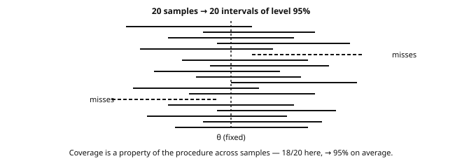{fig-alt="CI coverage across repeated samples" width="100%"}

### 8.4. MAP vs MLE

::: def
[Definition 8.7 — MAP estimator]{.tag} The **maximum a posteriori** estimator maximizes the posterior:
$$
\hat\theta_{\mathrm{MAP}}
\in\arg\max_\theta\big[\log L(\theta)+\log\pi(\theta)\big].
$$
A flat prior makes this coincide with MLE; density modes depend on parameterization. **Example:** Beta(2,2) prior and 3 successes in 4 trials give Beta(5,3), with MAP $2/3$ versus MLE $3/4$.
:::

::: note
[MAP = regularized MLE, for matching penalties]{.tag} In a negative-log objective, $-\log\pi(\theta)$ is a penalty: Gaussian prior → $\ell_2$ (ridge), Laplace prior → $\ell_1$ (lasso). This does not turn every regularization method into posterior inference — data augmentation, early stopping and dropout need their own analysis.
:::

### 8.5. The Bayesian approach in generation

::: note
[Bridge toward later reading]{.tag}

-   **VAE:** the latent posterior $p_\theta(z\mid x)$ is approximated by a variational $q_\phi(z\mid x)$ (often Gaussian) via the ELBO — conjugacy gives intuition, but a nonlinear decoder has no exact conjugate posterior.
-   **Diffusion:** the linear-Gaussian forward steps reuse theorem 3.2; learned reverse dynamics and denoising objectives are not repeated conjugate updates.
-   **Calibration:** posterior intervals describe model-based parameter uncertainty; neither Bayesian wording nor a nominal 95% level guarantees empirical calibration under misspecification or shift.
:::

::: recap
Key takeaways — chapter 8

-   The posterior is proportional to the likelihood times the prior; be able to derive the Beta-Bernoulli and Gaussian-Gaussian updates.
-   Gaussian precisions add, and the posterior mean is the precision-weighted average.
-   A credible probability about a parameter is not the frequentist coverage of a procedure.
-   The MAP estimate connects some regularized objectives to priors, but a point estimate is not a full posterior.
:::

## 9. Missing data: mechanisms, baselines and research {#ch9}

Before choosing an imputer, ask what is missing, why, and whether the target is **population estimation** or **prediction from incomplete inputs**. This research extension is optional: read it when missingness affects the task.

### 9.1. Missingness mechanisms: MCAR, MAR, MNAR {#missingness}

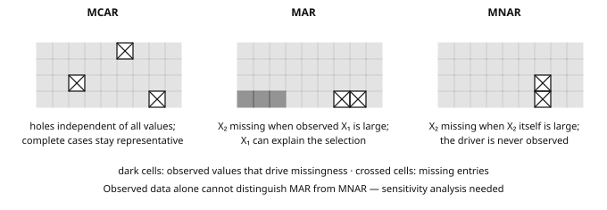{fig-alt="MCAR MAR MNAR missingness mechanisms" width="100%"}

::: def
[Definition 9.1 — Missingness formalism]{.tag} Let $M$ be the **missingness indicator matrix**, with $M_{ij}=1$ if $X_{ij}$ is missing; we observe the pair $(X_{\text{observed}},M)$, never the whole matrix $X$.

-   **MCAR** (*Missing Completely At Random*): $M\perp X$. The missingness depends on neither observed nor unobserved values — think of random sample loss or a sensor failure unrelated to the measured process.
-   **MAR** (*Missing At Random*): $\mathbb{P}(M=m\mid X)$ depends only on the entries *observed* under that pattern; a common shorthand is $M\perp X_{\text{missing}}\mid X_{\text{observed}}$. For example, response rates may depend on age while age itself is observed.
-   **MNAR** (*Missing Not At Random*): the probability of missingness also depends on the missing values themselves — high incomes go unreported, and severely ill patients skip the questionnaire.

MCAR is a special case of MAR. Ignoring the mechanism in likelihood inference requires MAR plus distinctness of the model and missingness parameters, and observed data alone cannot establish MAR rather than MNAR: an MNAR analysis needs additional assumptions, external information or a sensitivity analysis.
:::

### 9.2. The bias of naive solutions: worked examples

::: ex
[Example 9.2 — Row deletion (listwise deletion)]{.tag} Consider 1,000 clients with standardized, jointly Gaussian variables $(X_1,X_2)$ correlated at $\rho=0.6$, and suppose 30% of $X_2$ is missing.

Under MCAR, deleting incomplete rows preserves the population distribution in expectation but keeps only about 700 rows, inflating all estimation variances by approximately $1/0.7=1.43$.

Under a MAR threshold (keep $X_2$ only when $X_1<q_{0.7}\approx0.524$), Gaussian conditioning gives
$$
\mathbb{E}[X_2\mid\text{kept}]
=\rho\,\mathbb{E}[X_1\mid X_1<q_{0.7}]
=-0.6\,\frac{\varphi(q_{0.7})}{0.7}
\approx-0.298:
$$
the mean shifts by almost a third of a standard deviation, and the missing region has no overlap — recovering it needs extrapolation assumptions, not MAR alone.
:::

::: ex
[Example 9.3 — Mean imputation]{.tag} Return to the **MCAR** version and replace each missing $X_2$ by the observed mean, which is close to zero. Three effects follow. First, the mean is approximately preserved. Second, the variance drops to about $0.7$ instead of $1$, because 30% of the mass piles up at zero. Third, only the observed pairs contribute to the covariance, which becomes
$$
\mathrm{Cov}_{\text{imp}}(X_1,X_2)\approx0.7\times0.6=0.42.
$$
The distorted covariance can bias regression coefficients, though not always toward zero — the effect depends on the model and the target. Under MAR these calculations do not even apply, since the observed mean is already biased.
:::

### 9.3. Doing better: regression imputation and beyond

::: prop
[Proposition 9.4 — Regression imputation under additional conditions]{.tag} Under MAR, adequate overlap and a consistently estimated conditional model, the squared-error target for imputing $X_2$ is $\mathbb{E}[X_2\mid X_{\text{observed}}]$: fit on observed rows, predict missing entries. This can recover a marginal mean, but underestimates variation by inserting the conditional center rather than a draw. Refinements: **stochastic imputation** (center + calibrated residual noise), **multiple imputation** (several completed datasets, within/between uncertainty combined), **EM** for latent likelihoods, **MICE** for chained conditionals. With a deterministic missing region (example 9.2) overlap fails and an extrapolation model is additionally needed. Prediction from incomplete inputs remains a different target from complete-data estimation.
:::

### 9.4. Selected research on prediction with missing values {#missing-data-research}

::: note
[Paper 1 — Constant imputation + linear model: non-consistency (AISTATS 2020)]{.tag} ["Linear predictor on linearly-generated data with missing values: non consistency and solutions"](https://arxiv.org/abs/2002.00658), PMLR 108. Even with linear complete-data regression, the optimal predictor from incomplete inputs can need *different affine functions per mask*: with $Y=\beta_1X_1+\beta_2X_2+\varepsilon$ and $X_2$ missing under MCAR (jointly Gaussian predictors), the conditional mean becomes $(\beta_1+\rho\beta_2)X_1$. A single linear predictor after constant imputation is not Bayes consistent — mask interactions are needed.
:::

::: note
[Paper 2 — NeuMiss (NeurIPS 2020)]{.tag} ["NeuMiss networks: differentiable programming for supervised learning with missing values"](https://proceedings.neurips.cc/paper/2020/hash/42ae1544956fbe6e09242e6cd752444c-Abstract.html). Gaussian conditional prediction inverts covariance submatrices selected by the mask; the Neumann expansion $A^{-1}=\eta\sum_k(I-\eta A)^k$ (when $\rho(I-\eta A)<1$) motivates layers that process values and masks jointly. Code: [github.com/dirty-cat/NeuMiss](https://github.com/dirty-cat/NeuMiss).
:::

::: note
[Paper 3 — Which imputation for prediction? (NeurIPS 2021)]{.tag} ["What's a good imputation to predict with missing values?"](https://proceedings.neurips.cc/paper/2021/hash/5fe8fdc79ce292c39c5f209d734b7206-Abstract.html). With a sufficiently rich, consistent downstream regressor, broad classes of impute-then-regress procedures are Bayes optimal for prediction from available information (MCAR, MAR, specified MNAR). Practical hypothesis: a simple imputation with the mask explicitly retained may suffice — compare that baseline before elaborate imputation.
:::

::: note
[Paper 4 — Imputation: diminishing returns (2024)]{.tag} ["Imputation for prediction: beware of diminishing returns"](https://arxiv.org/abs/2407.19804). Benchmarks show when sophisticated imputation adds little over simpler choices — an empirical question about data, capacity, missingness and evaluation. Fit preprocessing inside training folds; keep the simpler baseline unless complexity buys a reproducible benefit.
:::

::: note
[Connection to Graph × LLM]{.tag} Missing metadata in a corpus and unobserved relations in a graph both need an observation model; an unobserved edge is not a negative edge. Transfer the *questions* — what is observed, what is the target, how selection occurs — not an imputation theorem unchanged. The [module catalogue](../../index.html) lists the next destinations.
:::

::: recap
Key takeaways — chapter 9

-   MCAR, MAR and MNAR describe an observation mechanism, not just a data-cleaning inconvenience.
-   Under MCAR, complete cases remain representative for marginal estimation, while other targets may admit other conditions.
-   Mean imputation distorts the variance and the covariance, and conditional-mean imputation still omits the residual variability.
-   Estimating complete-data quantities is a different task from predicting with incomplete inputs.
-   Use the four papers to formulate and test a baseline, keeping their assumptions and finite-sample limits visible.
:::

## 10. From statistics to machine learning {#ch10}

Each statistical pillar becomes a learning question: what is estimated, what loss is minimized, what is random, and what evidence supports performance on new units?

### 10.1. Empirical risk minimization (ERM) {#erm}

::: def
[Definition 10.1 — Risk and empirical risk]{.tag} For a loss $\ell$ and predictor $f_\theta$, the **risk** and **empirical risk** are
$$
\mathcal{R}(\theta)=\mathbb{E}[\ell_\theta(X,Y)],
\qquad
\hat{\mathcal{R}}_n(\theta)=\frac1n\sum_i\ell_\theta(X_i,Y_i).
$$
ERM minimizes the observed average hoping for low population risk (unsupervised: omit $Y$).
:::

::: proof
**Why averages help.** For fixed $\theta$, the LLN gives $\hat{\mathcal{R}}_n(\theta)\to\mathcal{R}(\theta)$, with CLT fluctuations on the scale $\mathrm{sd}(\ell_\theta)/\sqrt n$.

**Where selection enters.** The fitted $\hat\theta$ was selected *after* observing the sample: pointwise convergence does not control $\sup_\theta|\hat{\mathcal{R}}_n(\theta)-\mathcal{R}(\theta)|$.

Uniform convergence and complexity control (or stability) give generalization guarantees; held-out evaluation measures the selected procedure on the target population. Without either, low training loss can be noise fitting. [∎]{.qed}
:::

### 10.2. Bias-variance in prediction, by computation

::: thm
[Theorem 10.2 — Decomposition of the generalization error]{.tag} At a fixed input $x$, let $Y=f(x)+\varepsilon$ with noise variance $\sigma^2$ independent of the training sample, $\hat f$ trained on random data, $\bar f(x)=\mathbb{E}[\hat f(x)]$. Then
$$
\mathbb{E}\big[(Y-\hat f(x))^2\big]
=\underbrace{\sigma^2}_{\text{noise}}
+\underbrace{\big(f(x)-\bar f(x)\big)^2}_{\text{bias}^2}
+\underbrace{\mathrm{Var}(\hat f(x))}_{\text{variance}}.
$$
:::

::: proof
With $g=\hat f(x)-\bar f(x)$ and $b=\bar f(x)-f(x)$: $Y-\hat f(x)=\varepsilon-b-g$, the three terms are independent or constant and centered, so all cross terms vanish — theorem 5.2 plus an irreducible noise term. [∎]{.qed}
:::

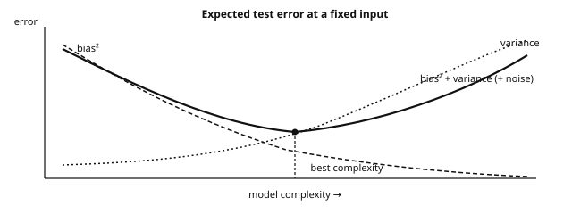{fig-alt="Bias-variance trade-off curves" width="100%"}

::: ex
[Example 10.3 — Seeing the trade-off in simulation]{.tag}

~~~python
import numpy as np
rng = np.random.default_rng(0)

def f(x):                       # true function: modulated sine
    return np.sin(2 * x) + 0.3 * x

n_train, n_rep = 40, 300        # small samples, many repetitions
x_test = np.linspace(-3, 3, 200)
noise = 0.15**2

for deg in range(1, 13):
    preds = np.zeros((n_rep, x_test.size))
    for r in range(n_rep):
        x = rng.uniform(-3, 3, n_train)
        y = f(x) + rng.normal(0, 0.15, n_train)
        c = np.polyfit(x, y, deg)          # polynomial of degree `deg`
        preds[r] = np.polyval(c, x_test)
    sq_b = ((f(x_test) - preds.mean(axis=0))**2).mean()  # bias²
    v = preds.var(axis=0).mean()                         # variance
    print(f"deg={deg:2d}  bias^2={sq_b:.4f}  var={v:.4f}  "
          f"err={sq_b + v + noise:.4f}")
# Low degree: large bias. High degree: unstable variance, worst at boundaries.
# Select complexity by validation, not by decreasing training error.
~~~

The simulation knows $f$ and repeats the training experiment, so it can separate the two error sources — a single real dataset usually cannot. The pattern motivates regularization and validation; it does not promise a universal U-shaped test curve.
:::

### 10.3. MLE to cross-entropy: the exact bridge {#likelihood-cross-entropy}

::: thm
[Theorem 10.4 — Maximizing likelihood = minimizing empirical cross-entropy]{.tag} For a conditional model $p_\theta(y\mid x)$,
$$
\frac1n\sum_i\log p_\theta(y_i\mid x_i)
=-\,\widehat{\mathrm{CE}}(p_{\text{data}},p_\theta),
$$
with no extra entropy constant: empirical cross-entropy *is* the negative average conditional log-likelihood. Specializing the model recovers the usual losses. Bernoulli labels give the binary cross-entropy
$$
-\frac1n\ell(\theta)
=\frac1n\sum_i\big[-y_i\log\hat p_\theta(x_i)
-(1-y_i)\log(1-\hat p_\theta(x_i))\big],
$$
categorical labels with logits $z_i\in\mathbb{R}^K$ give the softmax loss
$$
-\log p_\theta(y_i\mid x_i)
=-\log\frac{e^{z_{i,y_i}}}{\sum_k e^{z_{i,k}}},
$$
and a Gaussian conditional model with fixed variance gives scaled squared error plus a constant. A probabilistic loss therefore makes the observation-model choice explicit; margin or ranking losses need not be likelihoods.
:::

::: proof
The optimization equivalence is the definition.

The entropy constant only enters the *population* identity, for a discrete target with true conditional law $p^\star$:
$$
\mathrm{CE}(p^\star,p_\theta)
=H(Y\mid X)
+\mathbb{E}_X\!\left[
\mathrm{KL}\big(p^\star(\cdot\mid X)\,\|\,p_\theta(\cdot\mid X)\big)
\right],
$$
whose first term does not depend on $\theta$.

The raw empirical point-mass has infinite KL to a continuous density — that is not the finite-sample justification for Gaussian MLE. [∎]{.qed}
:::

A from-scratch **affine MNIST classifier** is a concrete instance: $x\in\mathbb{R}^{784}$, logits $z=Wx+b$, softmax, categorical cross-entropy — the statistical objective without hidden layers.

### 10.4. Four correspondences to take away

-   **Empirical risk:** LLN/CLT describe a *fixed* predictor's loss; selection-aware arguments address learned ones.
-   **Bias-variance:** estimation error becomes a prediction trade-off plus observation noise (simulation 10.3).
-   **Likelihood → loss:** probabilistic models yield squared-error and cross-entropy; VAEs and diffusion optimize variational bounds or denoising objectives.
-   **Conditioning → prediction:** $\mathbb{E}[Y\mid X]$ is the squared-loss target; LLMs estimate next-token laws conditioned on context — sequence dependence and evaluation come later.

::: recap
Key takeaways — chapter 10

-   ERM is an empirical average of a loss, and selecting a model requires more than a pointwise LLN.
-   The squared prediction error decomposes as noise plus bias² plus variance under the stated independence assumptions.
-   The negative conditional log-likelihood equals the empirical cross-entropy, and the entropy-plus-KL identity has its own scope.
-   This refresher supplies statistical entry tools, not all of ML and DL: optimization, representation learning and dependence-aware evaluation belong to the next modules.
:::

## Exercises {#ex}

1.  **Practical Bayes.** A test detecting a virus affecting 1% of the population has sensitivity 99% and specificity 95%. A patient tests positive. What is the probability of infection? What if two tests are positive, assuming their outcomes are independent *conditional on infection status*?

    ::: sol
    One positive:
    $$
    \mathbb{P}(M\mid+)
    =\frac{0.99\times0.01}{0.99\times0.01+0.05\times0.99}
    \approx0.167.
    $$
    Two positives under the stated conditional independence:
    $$
    \mathbb{P}(M\mid++)
    =\frac{0.99^2\times0.01}{0.99^2\times0.01+0.05^2\times0.99}
    =\frac{0.009801}{0.012276}
    \approx0.798.
    $$
    The probability rises from about 17% to 80%. Repeating the calculation with squared likelihoods is unjustified if the tests share errors beyond their common dependence on infection status.
    :::

2.  **Reverse Simpson.** Build a contingency table with 2 groups and 2 treatments in which treatment A is better overall but worse within each group. Explain the mechanism.

    ::: sol
    Swap the treatment labels in example 1.11:

      Group       A                    B
      ----------- -------------------- -------------------
      Mild        470/500 = 94%        95/100 = 95%
      Severe      8/50 = 16%           80/200 = 40%
      Overall     478/550 ≈ 87%        175/300 ≈ 58%

    A receives many more mild cases, so the aggregate comparison reverses the within-group comparison. Randomization can remove this assignment imbalance in expectation; observational adjustment needs a justified causal model.
    :::

3.  **MLE of the exponential distribution.** For iid $X_i\sim\mathcal{E}(\lambda)$, show that $\hat\lambda_{\mathrm{MLE}}=1/\bar X_n$ and compute its bias.

    ::: sol
    $\ell(\lambda)=n\log\lambda-\lambda\sum_iX_i$ gives $\hat\lambda=n/\sum_iX_i$. With the shape-scale convention,
    $$
    \sum_iX_i\sim\Gamma(n,1/\lambda),
    \qquad
    \bar X_n\sim\Gamma\big(n,1/(n\lambda)\big).
    $$
    For $n>1$, $\mathbb{E}[1/\bar X_n]=n\lambda/(n-1)$, so the bias is $\lambda/(n-1)$. For $n=1$, the estimator has infinite expectation.
    :::

4.  **Poisson MLE and Fisher.** For iid $X_i\sim\mathcal{P}(\lambda)$, $\lambda>0$: (a) derive the MLE; (b) compute Fisher information using both identities of theorem 5.6; (c) check the Cramér-Rao bound.

    ::: sol
    (a) The MLE is $\hat\lambda=\bar X_n$. (b) For one observation the score is $s(\lambda)=X/\lambda-1$, so its variance gives
    $$
    I(\lambda)=\mathrm{Var}(X/\lambda)=\frac{\lambda}{\lambda^2}=\frac1\lambda,
    $$
    and the curvature identity gives the same value: $-\mathbb{E}[\ell''(\lambda)]=\mathbb{E}[X]/\lambda^2=1/\lambda$. (c) Since $\mathrm{Var}(\bar X_n)=\lambda/n=1/(nI(\lambda))$, the unbiased estimator attains the bound in finite samples.
    :::

5.  **Normal approximation.** A factory produces parts of which 8% are defective. In a batch of 500 independent parts, approximate the probability of more than 55 defects.

    ::: sol
    $N\sim\mathcal{B}(500,0.08)$ has mean 40 and variance 36.8. Without continuity correction,
    $$
    \mathbb{P}(N>55)\approx1-\Phi\!\left(\frac{55-40}{\sqrt{36.8}}\right)\approx0.007.
    $$
    Since $N>55$ means $N\geq56$, a continuity correction uses 55.5 and gives approximately 0.0053. Compare both with `scipy.stats.binom.sf(55, 500, 0.08)`; a tail approximation can have appreciable relative error.
    :::

6.  **Change of variable.** If $X\sim\mathcal{N}(0,1)$, determine the densities of $Y=X^2$ and $Z=|X|$.

    ::: sol
    Squaring is not injective: split into positive and negative branches and sum their contributions:
    $$
    f_Y(y)=\frac1{\sqrt{2\pi y}}e^{-y/2},\qquad y>0.
    $$
    This is $\chi^2_1$, equivalently $\Gamma(1/2,2)$ in shape-scale notation. For the half-normal variable, $f_Z(z)=2\varphi(z)$ for $z\geq0$, and zero for $z<0$.
    :::

7.  **Numerical Chebyshev.** Request time has mean 200 ms and standard deviation 40 ms. (a) Bound the probability of exceeding 320 ms without specifying a distribution. (b) Compute it under a Gaussian model.

    ::: sol
    (a) Without any distributional assumption, the inclusion $\{X>320\}\subseteq\{|X-200|\geq120\}$ lets Chebyshev bound
    $$
    \mathbb{P}(X>320)\leq\frac{40^2}{120^2}=\frac19\approx0.111.
    $$
    (b) Under a Gaussian model, $\mathbb{P}(X>320)=1-\Phi(3)\approx0.00135$: the distribution-free bound is about 82 times larger. Chebyshev is conservative here, and the smaller number is only as credible as the Gaussian tail assumption.
    :::

8.  **Stable sums.** Using MGFs, show that the sum of two independent Poissons is Poisson and that two independent gammas with the same scale sum to a gamma. Deduce the sum and mean distributions for iid exponentials.

    ::: sol
    Poisson:
    $$
    e^{\lambda_1(e^t-1)}e^{\lambda_2(e^t-1)}
    =e^{(\lambda_1+\lambda_2)(e^t-1)}.
    $$
    Gamma:
    $$
    (1-bt)^{-a_1}(1-bt)^{-a_2}=(1-bt)^{-(a_1+a_2)}.
    $$
    Thus $\sum_iX_i\sim\Gamma(n,1/\lambda)$ for iid $\mathcal{E}(\lambda)$ variables, and $\bar X_n\sim\Gamma(n,1/(n\lambda))$. Keep scale and rate conventions separate.
    :::

9.  **Applied Neyman-Pearson.** For iid $X_i\sim\mathcal{E}(\lambda)$, derive the likelihood-ratio test of $\lambda=\lambda_0$ against $\lambda=\lambda_1>\lambda_0$.

    ::: sol
    $$
    \frac{L_1}{L_0}
    =\left(\frac{\lambda_1}{\lambda_0}\right)^n
    \exp\left(-(\lambda_1-\lambda_0)\sum_iX_i\right).
    $$
    The ratio increases as $S=\sum_iX_i$ decreases, so reject for $S\leq c$. Under $H_0$, $S\sim\Gamma(n,1/\lambda_0)$ in shape-scale notation. Choose $c$ as its lower $\alpha$ quantile, so $\mathbb{P}_{\lambda_0}(S\leq c)=\alpha$.
    :::

10. **Full t interval in code.** Write `mean_ci(x, alpha=0.05)` returning the t confidence interval for a mean. Over 10,000 Gaussian samples of size 20, check the proportion containing the true mean.

    ::: sol
    ~~~python
    import numpy as np
    from scipy import stats

    def mean_ci(x, alpha=0.05):
        x = np.asarray(x)
        n = len(x)
        m, s = x.mean(), x.std(ddof=1)
        tq = stats.t.ppf(1 - alpha/2, df=n - 1)
        return m - tq*s/np.sqrt(n), m + tq*s/np.sqrt(n)

    rng = np.random.default_rng(0)
    mu, n_rep = 3.0, 10_000
    covered = 0
    for _ in range(n_rep):
        sample = rng.normal(mu, 1.0, 20)
        lo, hi = mean_ci(sample)   # both endpoints from the SAME sample
        covered += (lo <= mu <= hi)

    print(covered / n_rep)         # close to 0.95
    print(np.sqrt(0.95 * 0.05 / n_rep))  # Monte Carlo SE ~0.0022
    ~~~

    Each repetition builds one interval from one sample; the Monte Carlo fluctuation (±0.002 here) explains deviations from exactly 0.95. Next: try skewed or dependent observations and name the assumption that changed.
    :::

11. **Regression by hand.** Derive the normal equations and show uniqueness when the columns of $X$ are linearly independent.

    ::: sol
    Set $\nabla_\beta\|y-X\beta\|^2=2X^\top(X\beta-y)=0$, giving $X^\top X\beta=X^\top y$. For nonzero $a$,
    $$
    a^\top X^\top Xa=\|Xa\|^2>0
    $$
    iff $X$ has independent columns. Thus $X^\top X$ is positive definite and invertible. Reproduce the same result geometrically using theorem 7.1.
    :::

12. **Gauss-Markov in dimension 1.** In $y_i=\mu+\varepsilon_i$, with zero-mean uncorrelated errors of common variance $\sigma^2$, show that the sample mean has minimum variance among linear unbiased estimators $\sum_iw_iy_i$.

    ::: sol
    Unbiasedness requires $\sum_iw_i=1$. Cauchy-Schwarz gives
    $$
    \mathrm{Var}\Big(\sum_iw_iy_i\Big)
    =\sigma^2\sum_iw_i^2
    \geq\sigma^2\frac{(\sum_iw_i)^2}{n}
    =\frac{\sigma^2}{n}
    =\mathrm{Var}(\bar Y).
    $$
    Equality holds iff all weights equal $1/n$. This is the one-parameter case of theorem 7.2.
    :::

13. **Sequential Bayesian updating.** Start with a Beta(2,2) prior on click probability $p$. Observe 3 clicks, then 1 failure, then 6 clicks. Give each posterior, the final 90% credible interval and the MAP estimate. Distinguish the MAP from posterior-predictive click probability.

    ::: sol
    The successive posteriors are Beta(5,2), Beta(5,3) and Beta(11,3). The final MAP is
    $$
    \frac{11-1}{11+3-2}=\frac{10}{12}=\frac56\approx0.833.
    $$
    The posterior-predictive probability of the next click is instead the posterior mean $11/14\approx0.786$. The equal-tail 90% credible interval is `scipy.stats.beta(11, 3).ppf([0.05, 0.95])`, approximately $[0.59,0.93]$. Thompson sampling uses a draw from this posterior, not just its mode.
    :::

14. **Missing data.** In a MAR setting where $X_2$ is more often missing for large $X_1$, explain why consistently estimating and imputing $\mathbb{E}[X_2\mid X_1]$ can recover $\mathbb{E}[X_2]$ but underestimate $\mathrm{Var}(X_2)$. State the required overlap or extrapolation assumption. What addition addresses the missing conditional variance?

    ::: sol
    MAR plus overlap allows the observed rows to identify the conditional law at relevant $X_1$ values, subject to adequate estimation. A deterministic cutoff instead needs a justified extrapolation model, such as a correctly specified linear Gaussian conditional mean.

    Let $m(X_1)=\mathbb{E}[X_2\mid X_1]$. Replacing a missing value by $m(X_1)$ preserves its conditional mean and hence the marginal mean by the tower property. But it removes residual variation around that mean. Stochastic imputation adds a draw from the estimated conditional residual law; calibrated conditional variance, not arbitrary noise, is required. Proper multiple imputation also accounts for uncertainty in the fitted imputation model.
    :::

15. **Code.** Simulate 10,000 Gaussian samples of size 50, plot their sample means with the theoretical density, and check coverage of $\bar X_n\pm1.96s/\sqrt n$.

    ::: sol
    ~~~python
    import numpy as np, matplotlib.pyplot as plt
    from scipy import stats
    rng = np.random.default_rng(0)
    samples = rng.normal(5.0, 2.0, size=(10_000, 50))
    means = samples.mean(axis=1)
    plt.hist(means, bins=60, density=True, alpha=.6)
    grid = np.linspace(4, 6, 300)
    plt.plot(grid, stats.norm(5.0, 2.0/np.sqrt(50)).pdf(grid), 'r')
    plt.show(); plt.close()
    lo, hi = means - 1.96*samples.std(axis=1, ddof=1)/np.sqrt(50), means + 1.96*samples.std(axis=1, ddof=1)/np.sqrt(50)
    print(((lo <= 5.0) & (5.0 <= hi)).mean())   # close to, but below, 0.95

    # Exact Gaussian t procedure, since sigma was estimated
    tq = stats.t.ppf(0.975, df=49)
    se = samples.std(axis=1, ddof=1) / np.sqrt(50)
    lo_t, hi_t = means - tq*se, means + tq*se
    print(((lo_t <= 5.0) & (5.0 <= hi_t)).mean())  # close to 0.95
    ~~~

    Gaussian sample means are exactly Gaussian. With estimated $s$, the z interval covers ≈94.4% here; the exact t critical value is 2.010, not 1.96 — `ddof=1` fixes the variance estimator, not the critical value.
    :::

## Exit checkpoint and connections {#exit}

Leave the **core route** with three pieces of evidence:

1.  A conditioning calculation with the denominator visible (exercise 1).
2.  A reproducible coverage experiment, one sample per interval, assumptions stated (exercise 10).
3.  A loss/model derivation plus an evaluation argument: why training loss is not held-out performance.

### Graph × LLM transfer check {#exit-checkpoint}

**Toy evaluation, not a reported benchmark.** A text-only baseline and a graph-assisted model answer the same 30 questions in three source groups (10 each). Deployment concerns new groups; questions within a group may be dependent.

  Source group   Text-only correct   Graph-assisted correct   Paired accuracy difference
  -------------- ------------------- ------------------------ ----------------------------
  A              6 / 10              7 / 10                   $+0.10$
  B              7 / 10              8 / 10                   $+0.10$
  C              5 / 10              4 / 10                   $-0.10$
  Total          18 / 30             19 / 30                  $+1/30\approx+0.033$

**Checkpoint.** Compute the overall gain. Does the table establish a reliable improvement on new groups? Specify the split, baseline and uncertainty unit for a larger experiment, and identify a visible failure case.

::: sol
[Expected evidence]{.tag}

-   Accuracy rises from 60% to ≈63.3% — one additional correct answer.
-   No reliable population claim: 30 related questions are not 30 independent units (three groups only), and marginal counts hide which questions changed.
-   Split by deployment unit (source groups); keep preprocessing, graph construction and model selection from leaking held-out information; evaluate both models on the same questions.
-   Keep a text-only baseline and a graph control (shuffled/removed edges); report paired gains with group-level uncertainty — not a row bootstrap.
-   Group C already refutes "the graph always helps": inspect its relations before adding complexity.
:::

### Where to go next—and what remains {#connections}

| Destination | What this page supplies | What remains |
|---|---|---|
| [Machine Learning](../m1p1-machine-learning/index.html) | Empirical risk, likelihood losses, bias/variance, regression, uncertainty interpretation. | Validation, regularization, optimization, model selection — a pointwise CLT is not a generalization guarantee. |
| [Deep Learning](../m1p1-deep-learning/index.html) (after ML) | Conditional log-likelihood, cross-entropy, random-vector notation, optional Bayesian foundations. | Batched derivatives, chain rule, representation learning — the NN refresher is entry preparation, not DL equivalence. |
| [Graph ML via the catalogue](../../index.html) | Independence checks, observation mechanisms, absent ≠ negative evidence. | Relational baselines, message passing, transductive/inductive protocols. |
| [Probability / Monte Carlo](../m1p1-probability-monte-carlo/index.html) | Probability spaces, convergence, elementary simulation. | Measure-theoretic depth, dependent sampling, as needed. |
| [Statistical Learning Theory](../m1p1-statistical-learning-theory/index.html) | LLN/CLT, inequalities, pointwise vs uniform. | Finite-sample concentration and complexity bounds. |

Main route: **refreshers as needed → Machine Learning → Deep Learning**, then the graph and language branches. Bayesian inference, missing-data research and further probability are selective extensions, not universal prerequisites. Return to the [reading route](#reading-route) when a module exposes a gap.

## Sources and scope {#sources-scope}

**Source layers stay separate:** catalog information and this site's study recommendations are not the same thing. Consult official sources for enrolment and assessment requirements.

The record used is the **SynapseS 2026–2027 sheet for `APM_51438_EP`** (captured as supplied; the live catalog was not rechecked):

| Field | Catalog-reported | Boundary for these notes |
|---|---|---|
| Teaching volume | **12 h CTD** | A reported volume, not the study-time estimate. |
| Total workload / ECTS | Not displayed | No total or credit value is inferred or asserted. |
| Period / language | Period 1, 17 Sep–18 Dec 2026; English | Source labels, not a reading schedule. |
| Objectives / syllabus / prerequisites | “Not disclosed” | The outline and targets here are this site's choices; non-disclosure does **not** mean no prerequisites — use the positioning checks. |
| Assessment | Grade /20; resit with higher grade kept; unit acquired ≥ 10 | Recorded information only; the exercises here are independent self-assessment. |

The ≈**36 h independent-work budget** is an optional full-pass estimate — neither a conversion of the 12 h CTD nor an ECTS allocation. The chapter sequence, simulations, ML bridge, transfer check and selected papers are editorial study choices, not official prerequisites or equivalences.

## References {#refs}

**Reading recommendations**, not a prescribed catalog bibliography. Choose a reference for a specific gap rather than treating the list as additional compulsory reading.

-   L. Wasserman, *All of Statistics: A Concise Course in Statistical Inference*, Springer, 2004 — a compact reference across probability, inference and statistical learning.
-   G. Casella, R. Berger, *Statistical Inference*, 2nd ed., Duxbury, 2001 — deeper derivations and conditions for estimation and testing.
-   J. Rice, *Mathematical Statistics and Data Analysis*, 3rd ed., Duxbury, 2007 — a data-oriented complement to the worked examples.
-   C. Robert, *The Bayesian Choice*, Springer, 2007 — optional depth on Bayesian decision theory and inference.
-   A. Gelman, J. Carlin, H. Stern, D. Dunson, A. Vehtari, D. Rubin, *Bayesian Data Analysis*, 3rd ed., CRC Press, 2013 — modeling and posterior analysis beyond conjugate examples.
-   R. Little, D. Rubin, *Statistical Analysis with Missing Data*, 3rd ed., Wiley, 2019 — missingness mechanisms, likelihood methods and multiple imputation.
-   Selected papers for [chapter 9](#missing-data-research):
    -   [Linear predictor on linearly-generated data with missing values: non consistency and solutions](https://arxiv.org/abs/2002.00658), AISTATS 2020.
    -   [NeuMiss networks: differentiable programming for supervised learning with missing values](https://proceedings.neurips.cc/paper/2020/hash/42ae1544956fbe6e09242e6cd752444c-Abstract.html), NeurIPS 2020.
    -   [What's a good imputation to predict with missing values?](https://proceedings.neurips.cc/paper/2021/hash/5fe8fdc79ce292c39c5f209d734b7206-Abstract.html), NeurIPS 2021.
    -   [Imputation for prediction: beware of diminishing returns](https://arxiv.org/abs/2407.19804), 2024.
    -   [Public research publication list](https://marinelm.github.io/) — further bibliography, not authorship or endorsement of these independent notes.
